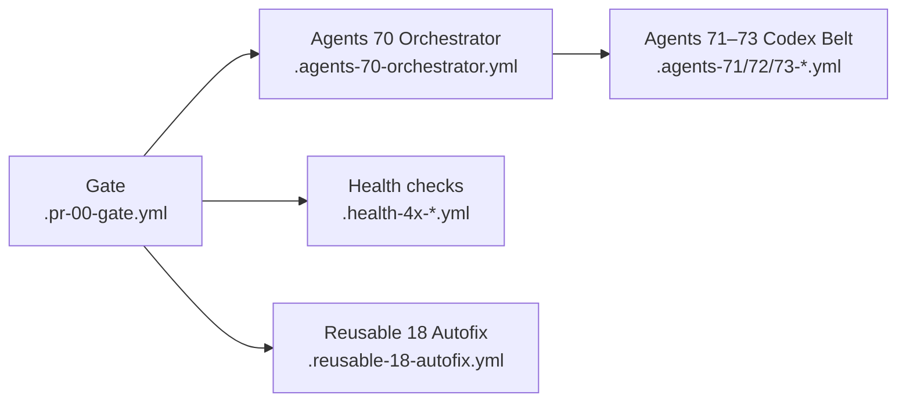
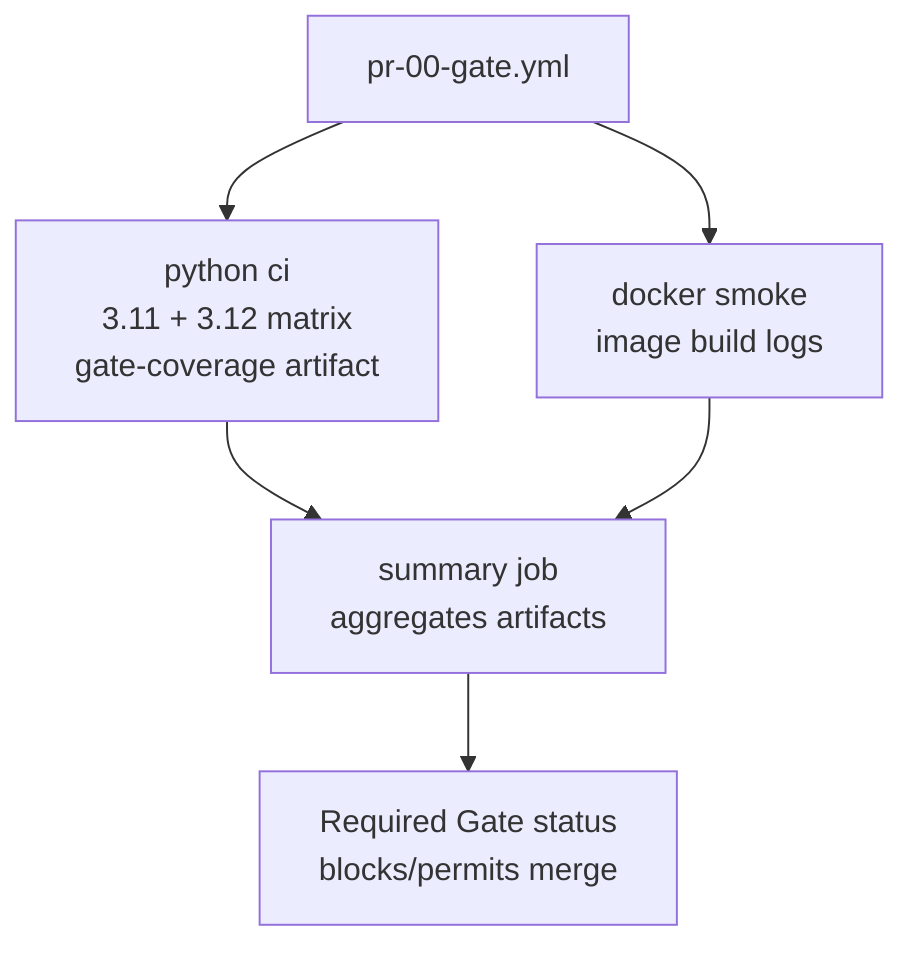

# CI Workflow Layout

This page captures the target layout for the automation that protects pull requests, heals small issues, and keeps the repository health checks aligned. Each section links directly to the workflow definitions so future changes can trace how the pieces fit together.

> ℹ️ **Scope.** This catalog lists active workflows only. Historical entries and
> verification notes live in [ARCHIVE_WORKFLOWS.md](../archive/ARCHIVE_WORKFLOWS.md).

## Target layout



- **PR checks:** [Gate](../../.github/workflows/pr-00-gate.yml) fans out to the reusable Python CI matrix and Docker smoke tests before its inline `summary` job publishes the commit status and PR comment. The **Gate summary job** keeps that follow-up comment updated with the latest artifacts.
- **Autofix path:** When invoked directly, [Reusable 18 Autofix](../../.github/workflows/reusable-18-autofix.yml) can stage hygiene fixes or generate patch artifacts; it is no longer triggered automatically after Gate completes.
- **Agents control plane:** Successful Gate runs dispatch the [Agents 70 Orchestrator](../../.github/workflows/agents-70-orchestrator.yml), which coordinates the [Codex belt](../../.github/workflows/agents-71-codex-belt-dispatcher.yml) hand-off (dispatcher → worker → conveyor) and runs the built-in keepalive sweep unless the repository-level `keepalive:paused` label or `keepalive_enabled` flag disables it. The orchestrator summary exposes whether the pause label was detected and records the exact label name through the `keepalive_pause_label` output so downstream jobs can echo the control state.
- **Health checks:** The [Health 4x suite](../../.github/workflows/health-40-repo-selfcheck.yml), [Health 40 Sweep](../../.github/workflows/health-40-sweep.yml), [Health 41](../../.github/workflows/health-41-repo-health.yml), [Health 42](../../.github/workflows/health-42-actionlint.yml), [Health 43](../../.github/workflows/health-43-ci-signature-guard.yml), [Health 44](../../.github/workflows/health-44-gate-branch-protection.yml), [Health 46 Codex Auth Check](../../.github/workflows/health-codex-auth-check.yml), [Health 50 Security Scan](../../.github/workflows/health-50-security-scan.yml), [Health 70 Validate Sync Manifest](../../.github/workflows/health-70-validate-sync-manifest.yml), and [Health 67 Integration Sync Check](../../.github/workflows/health-67-integration-sync-check.yml) workflows provide scheduled drift detection, enforcement snapshots, auth token monitoring, security scanning, and Integration-Tests synchronization.

Start with the [Workflow System Overview](WORKFLOW_SYSTEM.md) for the
bucket-level summary, the [keep vs retire roster](WORKFLOW_SYSTEM.md#final-topology-keep-vs-retire), and policy checklist. Return
here for the detailed trigger, permission, and operational notes per workflow.

## CI & agents quick catalog

The tables below capture the **active** workflows, their triggers, required
scopes, and whether they block merges. Retired entries move to the
[archived roster](#archived-workflows) once deleted so contributors can locate
history without confusing it with the live inventory.

### Required merge gate

| Workflow | File | Trigger(s) | Permissions | Required? | Purpose |
| --- | --- | --- | --- | --- | --- |
| **Gate** | `.github/workflows/pr-00-gate.yml` | `pull_request`, `workflow_dispatch` | Explicit `contents: read`, `pull-requests: write`, `statuses: write` (doc-only comment + commit status). | **Yes** – aggregate `gate` status must pass. | Fan-out orchestrator chaining the reusable Python CI and Docker smoke jobs. Docs-only or empty diffs skip the heavy legs while Gate posts the friendly notice and reports success. |
| **Minimal invariant CI** | `.github/workflows/pr-11-ci-smoke.yml` | `push`/`pull_request` targeting `phase-2-dev` + `main`, `workflow_dispatch` | `contents: read` | **No** – supplemental smoke test. | Single-runtime import + invariants sweep (`pytest tests/test_invariants.py -q`) that catches regressions quickly while Gate runs the heavier matrix. |

#### Gate job map

Use this map when triaging Gate failures. It illustrates the jobs that run on
every pull request, which artifacts each produces, and how the final `gate`
enforcement step evaluates their results.

| Job ID | Display name | Purpose | Artifacts / outputs | Notes |
| --- | --- | --- | --- | --- |
| `python-ci` | python ci | Invokes `reusable-10-ci-python.yml` once with a 3.11 + 3.12 matrix. Runs Ruff, Mypy (on the pinned runtime), pytest with coverage, and emits structured summaries. | `gate-coverage`, `gate-coverage-summary`, `gate-coverage-trend` (primary runtime). | Single source of lint/type/test/coverage truth. Coverage payloads share the `gate-coverage` artifact under `coverage/runtimes/<python>` for downstream consumers. |
| `docker-smoke` | docker smoke | Builds the project image and executes the smoke command through `reusable-12-ci-docker.yml`. | None (logs only). | Ensures packaging basics work before merge. |
| `summary` | summary | Aggregates lint/type/test/coverage results, computes deltas, uploads `gate-summary.md`, and maintains the consolidated PR comment. | Job summary, `gate-summary.md`, `gate-coverage.json`, `gate-coverage-delta.json`, `gate-coverage-summary.md`. | Posts the required `Gate / gate` status and enforces failure when upstream legs are unhealthy. |



```
pull_request ──▶ Gate ──▶ Summary comment & status
                    └─▶ Reusable test suites (Python matrix & Docker smoke)
```

### Reusable workflow outputs (caller-facing)

| Workflow | Outputs | Notes |
| --- | --- | --- |
| [`reusable-70-orchestrator-init.yml`](../../.github/workflows/reusable-70-orchestrator-init.yml) | `rate_limit_safe`, `has_work`, `token_source`; keepalive controls (`enable_keepalive`, `keepalive_pause_label`, `keepalive_round`, `keepalive_pr`, `keepalive_trace`, `keepalive_max_retries`); readiness/diagnostic toggles (`enable_readiness`, `readiness_agents`, `readiness_custom_logins`, `require_all`, `enable_preflight`, `enable_diagnostic`, `diagnostic_attempt_branch`, `diagnostic_dry_run`, `enable_verify_issue`, `verify_issue_number`, `verify_issue_valid_assignees`); bootstrap/worker controls (`enable_bootstrap`, `bootstrap_issues_label`, `draft_pr`, `dispatcher_force_issue`, `worker_max_parallel`, `conveyor_max_merges`); misc (`codex_user`, `codex_command_phrase`, `enable_watchdog`, `dry_run`, `options_json`). | Drive `reusable-70-orchestrator-main.yml` inputs and gate the run with `has_work`/`rate_limit_safe`. |
| [`reusable-16-agents.yml`](../../.github/workflows/reusable-16-agents.yml) | `readiness_report` (JSON), `readiness_table` (Markdown). | Use in downstream comments or dashboards after readiness probes. |
| [`reusable-10-ci-python.yml`](../../.github/workflows/reusable-10-ci-python.yml) | None (artifacts only). | Consume coverage/metrics artifacts uploaded by the workflow. |
| [`reusable-11-ci-node.yml`](../../.github/workflows/reusable-11-ci-node.yml) | None (artifacts only). | Coverage + junit artifacts when enabled. |
| [`reusable-12-ci-docker.yml`](../../.github/workflows/reusable-12-ci-docker.yml) | None. | Logs only. |
| [`reusable-18-autofix.yml`](../../.github/workflows/reusable-18-autofix.yml) | None. | Patch artifacts + summaries only. |
| [`reusable-codex-run.yml`](../../.github/workflows/reusable-codex-run.yml) | `final-message`. | Standardizes Codex prompt-file runs with sandbox defaults plus commit/push + artifact upload. |
| [`reusable-70-orchestrator-main.yml`](../../.github/workflows/reusable-70-orchestrator-main.yml) | None. | Consumes init outputs; reports via summaries/artifacts. |
| [`reusable-agents-issue-bridge.yml`](../../.github/workflows/reusable-agents-issue-bridge.yml) | None. | Bridge emits PRs/comments only. |
| [`reusable-agents-verifier.yml`](../../.github/workflows/reusable-agents-verifier.yml) | None. | Post-merge verification with CI wait logic; creates follow-up issues in consumer repos. |
| [`reusable-bot-comment-handler.yml`](../../.github/workflows/reusable-bot-comment-handler.yml) | `comments_found`, `comments_count`, `agent_triggered`. | Collects and dispatches agent to address bot review comments. |

## Pull Request Gate

* [`Gate`](../../.github/workflows/pr-00-gate.yml) orchestrates the fast-path vs full CI decision, evaluates coverage artifacts, and reports commit status back to the PR.
* [`Minimal invariant CI`](../../.github/workflows/pr-11-ci-smoke.yml) supplies the lightweight Issue #3651 sweep: install once on Python 3.11 with pip caching, sanity-check imports, and run `pytest tests/test_invariants.py -q` on both pushes and PRs targeting `phase-2-dev` (plus `main`).
* [`Reusable CI (Python)`](../../.github/workflows/reusable-10-ci-python.yml) drives the primary test matrix (lint, type-check, tests, coverage) for PR builds.
    * Tool/test pins come from `.github/workflows/autofix-versions.env`; consumers can copy that file or set the same variables in their caller to override pins. Keep paired packages compatible (for example, align `pydantic` with `pydantic-core`).
    * The workflow now defaults to `hypothesis 6.115.1` and `pydantic-core 2.27.1` when no override file is present to stay Python 3.12 compatible.
* [`Reusable CI (Node)`](../../.github/workflows/reusable-11-ci-node.yml) (`reusable-11-ci-node.yml`) runs lint/format/typecheck/test legs for Node projects with optional multi-version matrices.
* [`Reusable CI (Docker)`](../../.github/workflows/reusable-12-ci-docker.yml) executes the container smoke test whenever Docker-related files change.

The gate uses the shared `.github/scripts/detect-changes.js` helper to decide when documentation-only changes can skip heavy jobs and when Docker smoke tests must run.

## Coverage Guardrails & Follow-ups

* Gate's `summary` job now emits the consolidated PR comment, uploads `gate-summary.md`, and publishes `gate-coverage.json` / `gate-coverage-delta.json` for downstream consumers.
* [`maint-coverage-guard.yml`](../../.github/workflows/maint-coverage-guard.yml) periodically verifies that the latest Gate run meets baseline coverage expectations.
* [`maint-46-post-ci.yml`](../../.github/workflows/maint-46-post-ci.yml) wakes up after Gate completes, validates the workflow syntax with `actionlint`, downloads the Gate artifacts, renders the consolidated CI summary (including coverage deltas), and republishes the Gate commit status while saving a markdown preview for evidence capture.

## Autofix & Maintenance

* [`reusable-codex-run.yml`](../../.github/workflows/reusable-codex-run.yml) exposes a reusable Codex runner with prompt-file input, sandbox/safety defaults, artifact upload, and commit/push handling so keepalive, autofix, and verifier wrappers can share the same execution surface.
* [`reusable-agents-verifier.yml`](../../.github/workflows/reusable-agents-verifier.yml) provides post-merge verification for consumer repos, waits for CI workflows to complete, then builds context and optionally runs Codex to verify acceptance criteria were met and creates follow-up issues when gaps are identified.
* [`reusable-18-autofix.yml`](../../.github/workflows/reusable-18-autofix.yml) provides the shared jobs used by autofix callers to stage, classify, and report automatic fixes.
* [`reusable-20-pr-meta.yml`](../../.github/workflows/reusable-20-pr-meta.yml) detects keepalive round-marker comments in PRs, dispatches the orchestrator when detected, and manages PR body section updates for consumer repositories using the dual-checkout pattern.
* [`maint-45-cosmetic-repair.yml`](../../.github/workflows/maint-45-cosmetic-repair.yml) invokes the reusable autofix pipeline on a schedule to keep cosmetic issues in check.
* [`maint-47-disable-legacy-workflows.yml`](../../.github/workflows/maint-47-disable-legacy-workflows.yml) sweeps the repository to make sure archived GitHub workflows remain disabled in the Actions UI.
* [`maint-50-tool-version-check.yml`](../../.github/workflows/maint-50-tool-version-check.yml) checks PyPI weekly for new versions of CI/autofix tools (black, ruff, mypy, pytest) and creates an issue when updates are available.
* [`maint-51-dependency-refresh.yml`](../../.github/workflows/maint-51-dependency-refresh.yml) regenerates `requirements.lock` using `uv pip compile`, validates tool-pin alignment, and opens a refresh pull request when dependency updates are detected (dry-run friendly).
* [`maint-52-validate-workflows.yml`](../../.github/workflows/maint-52-validate-workflows.yml) dry-parses every workflow with `yq`, runs `actionlint` with the repository allowlist, and fails fast when malformed YAML or unapproved actionlint findings slip in.
* [`maint-62-integration-consumer.yml`](../../.github/workflows/maint-62-integration-consumer.yml) runs daily at 05:05 UTC, on release publication, or by manual dispatch to execute the integration-repo scenarios via the reusable Python CI template and keep the integration failure issue updated.
* [`maint-63-ensure-environments.yml`](../../.github/workflows/maint-63-ensure-environments.yml) ensures agent environments (`agent-standard`, `agent-high-privilege`) exist with appropriate protection rules for environment-gated workflows.
* [`maint-65-sync-label-docs.yml`](../../.github/workflows/maint-65-sync-label-docs.yml) synchronizes `docs/LABELS.md` to consumer repositories weekly (Sundays 00:00 UTC) or via manual dispatch.
* [`maint-66-monthly-audit.yml`](../../.github/workflows/maint-66-monthly-audit.yml) performs comprehensive monthly workflow health audits, collecting statistics and creating actionable tracking issues.
* [`maint-60-release.yml`](../../.github/workflows/maint-60-release.yml) creates GitHub releases automatically when version tags (`v*`) are pushed.
* [`maint-61-create-floating-v1-tag.yml`](../../.github/workflows/maint-61-create-floating-v1-tag.yml) creates or refreshes the floating `v1` tag to point at the latest `v1.x` release, enabling consumers to track major version updates automatically.
* [`maint-keepalive.yml`](../../.github/workflows/maint-keepalive.yml) ensures Codex/autofix configuration stays fresh and pings for outstanding tasks.

## Agents Control Plane

The agent workflows coordinate Codex and chat orchestration across topics:

* [`agents-70-orchestrator.yml`](../../.github/workflows/agents-70-orchestrator.yml) is the thin dispatcher that triggers the orchestrator init and main phases. It calls [`reusable-70-orchestrator-init.yml`](../../.github/workflows/reusable-70-orchestrator-init.yml) for initialization (rate limit checks, token preflight, parameter resolution) and [`reusable-70-orchestrator-main.yml`](../../.github/workflows/reusable-70-orchestrator-main.yml) for the main keepalive and belt operations.
* Required permissions: `actions: write`, `contents: write`, and `pull-requests: write` at the workflow root so nested branch-sync and keepalive post-work steps can request their scopes without startup failure.
* [`agents-keepalive-loop.yml`](../../.github/workflows/agents-keepalive-loop.yml) listens for Gate completion (and the optional `agent:codex` label event) to continue keepalive work in a GitHub-native loop: it inspects PR checklists/config, gates on Gate success, dispatches `reusable-codex-run` with the keepalive prompt, updates a single summary comment, and pauses with a `needs-human` label when tasks complete, limits are reached, or repeated failures occur.
* [`agents-73-codex-belt-conveyor.yml`](../../.github/workflows/agents-73-codex-belt-conveyor.yml) manages task distribution. The orchestrator summary now logs "keepalive skipped" when the pause label is present and surfaces `keepalive_pause_label`/`keepalive_paused_label` outputs for downstream consumers.
* [`agents-autofix-loop.yml`](../../.github/workflows/agents-autofix-loop.yml) triggers on Gate failure (for PRs with `agent:codex` label or `autofix: true` in body) and calls Codex to attempt bounded autofix iterations.
* [`agents-keepalive-branch-sync.yml`](../../.github/workflows/agents-keepalive-branch-sync.yml) issues short-lived sync branches, merges the reconciliation PR automatically, and tears down the branch once the update lands so keepalive can clear branch drift without human intervention.
* [`agents-keepalive-dispatch-handler.yml`](../../.github/workflows/agents-keepalive-dispatch-handler.yml) listens for orchestrator `repository_dispatch` payloads and replays them through the reusable agents topology so keepalive actions stay aligned with branch-sync repairs.
* [`agents-71-codex-belt-dispatcher.yml`](../../.github/workflows/agents-71-codex-belt-dispatcher.yml) and [`agents-72-codex-belt-worker.yml`](../../.github/workflows/agents-72-codex-belt-worker.yml) handle dispatching and execution.
* [`agents-74-pr-body-writer.yml`](../../.github/workflows/agents-74-pr-body-writer.yml) synchronizes PR body sections from source issues and builds status summaries.
* [`agents-pr-meta-v4.yml`](../../.github/workflows/agents-pr-meta-v4.yml) is the canonical PR meta manager, using external scripts to stay under GitHub workflow parser limits. (Supersedes archived v1/v2/v3 versions.)
* [`agents-75-keepalive-on-gate.yml`](../../.github/workflows/agents-75-keepalive-on-gate.yml) implements the keepalive-on-gate consolidation and gate-aware keepalive behavior.
* [`reusable-16-agents.yml`](../../.github/workflows/reusable-16-agents.yml) includes the keepalive sweep, which the orchestrator toggles via the `keepalive_enabled` flag and repository-level `keepalive:paused` label.
* [`agents-63-issue-intake.yml`](../../.github/workflows/agents-63-issue-intake.yml) is the canonical front door. It now listens for `agent:codex` labels directly and routes both label triggers and ChatGPT sync requests through the shared normalization pipeline.
* [`agents-64-pr-comment-commands.yml`](../../.github/workflows/agents-64-pr-comment-commands.yml) processes slash commands in PR comments to trigger workflow actions.
* [`agents-64-verify-agent-assignment.yml`](../../.github/workflows/agents-64-verify-agent-assignment.yml) validates that labelled issues retain an approved agent assignee and publishes the verification outputs.
* [`agents-moderate-connector.yml`](../../.github/workflows/agents-moderate-connector.yml) moderates connector-authored PR comments, enforcing repository allow/deny lists and applying the debugging label when deletions occur.
* [`agents-guard.yml`](../../.github/workflows/agents-guard.yml) applies repository-level guardrails before agent workflows run.
* [`agents-verifier.yml`](../../.github/workflows/agents-verifier.yml) runs on merged PRs (or pushes to the default branch) to assemble acceptance/task context, execute Codex in verifier mode, and open a follow-up issue when the verdict is FAIL.
* [`agents-weekly-metrics.yml`](../../.github/workflows/agents-weekly-metrics.yml) aggregates agent metrics (keepalive, autofix, verifier) on a weekly schedule and generates a markdown summary.
* [`agents-debug-issue-event.yml`](../../.github/workflows/agents-debug-issue-event.yml) dumps the GitHub event context for debugging issue triggers.
* [`autofix.yml`](../../.github/workflows/autofix.yml) detects formatting failures in agent PRs, applies automated fixes via ruff, and pushes autofix branches when the autofix label is present.
* [`reusable-16-agents.yml`](../../.github/workflows/reusable-16-agents.yml) is the composite invoked by the orchestrator to run readiness, bootstrap, diagnostics, keepalive, and watchdog passes.
* [`reusable-agents-issue-bridge.yml`](../../.github/workflows/reusable-agents-issue-bridge.yml) provides reusable agent bootstrap steps for creating PRs from GitHub issues across multiple agent types.

## Repository Health Checks

Scheduled health jobs keep the automation ecosystem aligned:

* [`health-40-repo-selfcheck.yml`](../../.github/workflows/health-40-repo-selfcheck.yml) synthesises a repo-wide self-check report.
* [`health-40-sweep.yml`](../../.github/workflows/health-40-sweep.yml) coordinates the Actionlint + branch-protection sweep (PR trigger gated by workflow-file changes).
* [`health-41-repo-health.yml`](../../.github/workflows/health-41-repo-health.yml) compiles dependency and hygiene signals.
* [`health-42-actionlint.yml`](../../.github/workflows/health-42-actionlint.yml) provides the reusable Actionlint leg for the sweep or ad-hoc rehearsals.
* [`health-43-ci-signature-guard.yml`](../../.github/workflows/health-43-ci-signature-guard.yml) verifies signed workflow runs when required.
* [`health-44-gate-branch-protection.yml`](../../.github/workflows/health-44-gate-branch-protection.yml) ensures branch protection stays aligned with Gate expectations.
* [`health-codex-auth-check.yml`](../../.github/workflows/health-codex-auth-check.yml) checks Codex auth token expiration twice daily and creates issues when refresh is needed.
* [`health-50-security-scan.yml`](../../.github/workflows/health-50-security-scan.yml) runs CodeQL security analysis on Python code (push, PR, weekly schedule).
* [`health-67-integration-sync-check.yml`](../../.github/workflows/health-67-integration-sync-check.yml) validates that Workflows-Integration-Tests repo stays in sync with templates (push, `repository_dispatch`, daily schedule).
* [`health-70-validate-sync-manifest.yml`](../../.github/workflows/health-70-validate-sync-manifest.yml) validates that sync-manifest.yml is complete - ensures all sync-able files are declared (PR, push).
* [`maint-68-sync-consumer-repos.yml`](../../.github/workflows/maint-68-sync-consumer-repos.yml) pushes workflow template updates to registered consumer repos (release, template push, manual dispatch).
* [`maint-69-sync-integration-repo.yml`](../../.github/workflows/maint-69-sync-integration-repo.yml) syncs integration-repo templates to Workflows-Integration-Tests repository (template push, manual dispatch with dry-run support).

Together these workflows define the CI surface area referenced by Gate and the Gate summary job, keeping the automation stack observable, testable, and easier to evolve.

## Self-test Harness

* [`selftest-reusable-ci.yml`](../../.github/workflows/selftest-reusable-ci.yml) exercises `reusable-10-ci-python.yml` across curated scenarios, publishing summaries or PR comments so maintainers can validate reusable changes before they ship.

* [`selftest-ci.yml`](../../.github/workflows/selftest-ci.yml) runs the repository's own test suite (JS + Python tests, linting, YAML validation) on push and PR.
