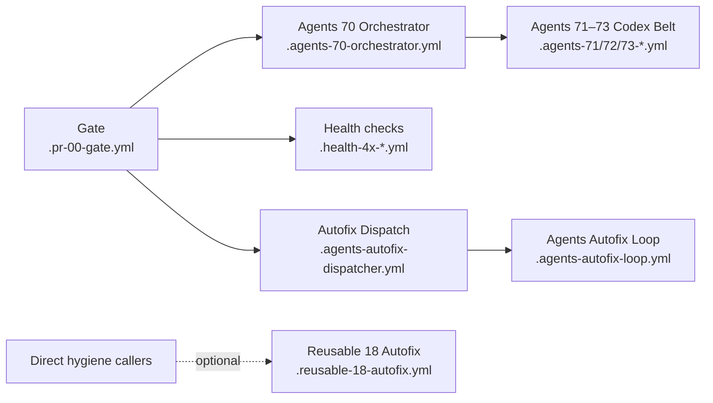
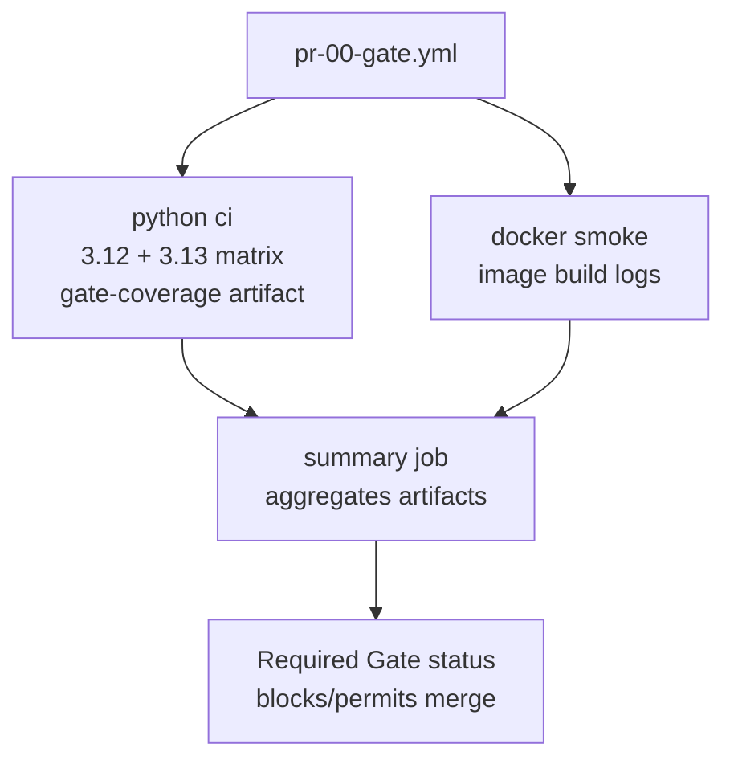

# CI Workflow Layout

This page captures the target layout for the automation that protects pull requests, heals small issues, and keeps the repository health checks aligned. Each section links directly to the workflow definitions so future changes can trace how the pieces fit together.

> ℹ️ **Scope.** This catalog lists active workflows only. Historical entries and
> verification notes live in [ARCHIVE_WORKFLOWS.md](../archive/ARCHIVE_WORKFLOWS.md).

## Target layout


```mermaid
flowchart LR
    gate["Gate\n.pr-00-gate.yml"] --> agents70["Agents 70 Orchestrator\n.agents-70-orchestrator.yml"]
    gate --> healthGuard["Health checks\n.health-4x-*.yml"]
    gate --> autofixDispatch["Autofix Dispatch\n.agents-autofix-dispatcher.yml"]
    autofixDispatch --> autofixLoop["Agents Autofix Loop\n.agents-autofix-loop.yml"]
    directCallers["Direct hygiene callers"] -. optional .-> autofix["Reusable 18 Autofix\n.reusable-18-autofix.yml"]
    agents70 --> agentsBelt["Agents 71–73 Codex Belt\n.agents-71/72/73-*.yml"]
```

Diagram labels that start with `.` are shorthand for files under `.github/workflows/`.

- **PR checks:** [Gate](../../.github/workflows/pr-00-gate.yml) fans out to the reusable Python CI matrix and Docker smoke tests before its inline `summary` job publishes the commit status and PR comment. The **Gate summary job** keeps that follow-up comment updated with the latest artifacts.
- **Autofix path:** When Gate reports a failure, it dispatches `autofix_gate_failure`; [agents-autofix-dispatcher.yml](../../.github/workflows/agents-autofix-dispatcher.yml) receives that event and routes eligible PRs into [agents-autofix-loop.yml](../../.github/workflows/agents-autofix-loop.yml), while [Reusable 18 Autofix](../../.github/workflows/reusable-18-autofix.yml) remains a direct-call helper for hygiene-fix or patch-artifact callers. The diagram edge from Gate to Autofix Dispatch represents this repository dispatch hop, not a direct call into reusable autofix.
- **Agents control plane:** Successful Gate runs dispatch the [Agents 70 Orchestrator](../../.github/workflows/agents-70-orchestrator.yml), which coordinates the [Codex belt](../../.github/workflows/agents-71-codex-belt-dispatcher.yml) hand-off (dispatcher → worker → conveyor) and runs the built-in keepalive sweep unless the repository-level `keepalive:paused` label or `keepalive_enabled` flag disables it. The orchestrator summary exposes whether the pause label was detected and records the exact label name through the `keepalive_pause_label` output so downstream jobs can echo the control state.
- **Health checks:** The [Health 4x suite](../../.github/workflows/health-40-repo-selfcheck.yml), [Health 40 Sweep](../../.github/workflows/health-40-sweep.yml), [Health 41](../../.github/workflows/health-41-repo-health.yml), [Health 42](../../.github/workflows/health-42-actionlint.yml), [Health 43](../../.github/workflows/health-43-ci-signature-guard.yml), [Health 44](../../.github/workflows/health-44-gate-branch-protection.yml), [Health 46 Codex Auth Check](../../.github/workflows/health-codex-auth-check.yml), [Health 50 Security Scan](../../.github/workflows/health-50-security-scan.yml), [Health 67 Integration Sync Check](../../.github/workflows/health-67-integration-sync-check.yml), [Health 68 Consumer Sync Drift Check](../../.github/workflows/health-68-consumer-sync-drift.yml), and [Health 70 Validate Sync Manifest](../../.github/workflows/health-70-validate-sync-manifest.yml) workflows provide scheduled drift detection, enforcement snapshots, auth token monitoring, security scanning, and sync drift detection.

Start with the [Workflow System Overview](WORKFLOW_SYSTEM.md) for the
bucket-level summary, the [keep vs retire roster](WORKFLOW_SYSTEM.md#final-topology-keep-vs-retire), and policy checklist. Return
here for the detailed trigger, permission, and operational notes per workflow.

## CI & agents quick catalog

The tables below capture the **active** workflows, their triggers, required
scopes, and whether they block merges. Retired entries move to the
[archived roster](#archived-workflows) once deleted so contributors can locate
history without confusing it with the live inventory.

### Required merge gate

| Workflow | File | Trigger(s) | Permissions | Required? | Purpose |
| --- | --- | --- | --- | --- | --- |
| **Gate** | `.github/workflows/pr-00-gate.yml` | `pull_request`, `workflow_dispatch` | Explicit `contents: read`, `pull-requests: write`, `statuses: write` (doc-only comment + commit status). | **Yes** – aggregate `gate` status must pass. | Fan-out orchestrator chaining the reusable Python CI and Docker smoke jobs. Docs-only or empty diffs skip the heavy legs while Gate posts the friendly notice and reports success. |
| **Minimal invariant CI** | `.github/workflows/pr-11-ci-smoke.yml` | `push`/`pull_request` targeting `phase-2-dev` + `main`, `workflow_dispatch` | `contents: read` | **No** – supplemental smoke test. | Single-runtime import + invariants sweep (`pytest tests/test_invariants.py -q`) that catches regressions quickly while Gate runs the heavier matrix. |

#### Gate job map

Use this map when triaging Gate failures. It illustrates the jobs that run on
every pull request, which artifacts each produces, and how the final `gate`
enforcement step evaluates their results.

| Job ID | Display name | Purpose | Artifacts / outputs | Notes |
| --- | --- | --- | --- | --- |
| `python-ci` | python ci | Invokes `reusable-10-ci-python.yml` once with a 3.12 + 3.13 matrix. Runs Ruff, Mypy (on the pinned runtime), pytest with coverage, and emits structured summaries. | `gate-coverage`, `gate-coverage-summary`, `gate-coverage-trend` (primary runtime). | Single source of lint/type/test/coverage truth. Coverage payloads share the `gate-coverage` artifact under `coverage/runtimes/<python>` for downstream consumers. |
| `docs-guard` | docs guard | Runs the cheap reusable-workflow documentation guards even when the PR is docs-only. | None (logs only). | Skips cleanly in consumer repos that do not carry the Workflows docs guard tests, but fails the `Gate / gate` status when Workflows docs drift from reusable workflow inputs/outputs. |
| `docker-smoke` | docker smoke | Builds the project image and executes the smoke command through `reusable-12-ci-docker.yml`. | None (logs only). | Ensures packaging basics work before merge. |
| `summary` | summary | Aggregates lint/type/test/coverage results, computes deltas, uploads `gate-summary.md`, and maintains the consolidated PR comment. | Job summary, `gate-summary.md`, `gate-coverage.json`, `gate-coverage-delta.json`, `gate-coverage-summary.md`. | Posts the required `Gate / gate` status and enforces failure when upstream legs are unhealthy. |


```mermaid
flowchart TD
    pr00["pr-00-gate.yml"] --> pythonCi["python ci\n3.12 + 3.13 matrix\n gate-coverage artifact"]
    pr00 --> dockerSmoke["docker smoke\nimage build logs"]
    pythonCi --> summaryJob["summary job\naggregates artifacts"]
    dockerSmoke --> summaryJob
    summaryJob --> status["Required Gate status\nblocks/permits merge"]
```

```
pull_request ──▶ Gate ──▶ Summary comment & status
                    └─▶ Reusable test suites (Python matrix & Docker smoke)
```

### Reusable workflow outputs (caller-facing)

The authoritative output catalog (including types, descriptions, and usage examples) lives in
[`docs/ci/WORKFLOW_OUTPUTS.md`](WORKFLOW_OUTPUTS.md). Use that reference when chaining reusable
workflows or consuming outputs in dependent jobs.

## Pull Request Gate

* [`Gate`](../../.github/workflows/pr-00-gate.yml) orchestrates the fast-path vs full CI decision, evaluates coverage artifacts, and reports commit status back to the PR.
* [`Minimal invariant CI`](../../.github/workflows/pr-11-ci-smoke.yml) supplies the lightweight Issue #3651 sweep: install once on Python 3.12 with pip caching, sanity-check imports, and run `pytest tests/test_invariants.py -q` on both pushes and PRs targeting `phase-2-dev` (plus `main`).
* [`Reusable CI (Python)`](../../.github/workflows/reusable-10-ci-python.yml) drives the primary test matrix (lint, type-check, tests, coverage) for PR builds.
    * Tool/test pins come from `.github/workflows/autofix-versions.env`; consumers can copy that file or set the same variables in their caller to override pins. Keep paired packages compatible (for example, align `pydantic` with `pydantic-core`).
    * The workflow now defaults to `hypothesis 6.115.1` and `pydantic-core 2.27.1` when no override file is present to stay Python 3.12 compatible.
* [`Reusable CI (Node)`](../../.github/workflows/reusable-11-ci-node.yml) (`reusable-11-ci-node.yml`) runs lint/format/typecheck/test legs for Node projects with optional multi-version matrices.
* [`Reusable CI (Docker)`](../../.github/workflows/reusable-12-ci-docker.yml) executes the container smoke test whenever Docker-related files change.

The gate uses the shared `.github/scripts/detect-changes.js` helper to decide when documentation-only changes can skip heavy jobs and when Docker smoke tests must run.

## Coverage Guardrails & Follow-ups

* Gate's `summary` job now emits the consolidated PR comment, uploads `gate-summary.md`, and publishes `gate-coverage.json` / `gate-coverage-delta.json` for downstream consumers.
* [`maint-sync-env-from-pyproject.yml`](../../.github/workflows/maint-sync-env-from-pyproject.yml) keeps `pyproject.toml`, templates, and `requirements.lock` aligned to the canonical `autofix-versions.env` file.
* [`maint-coverage-guard.yml`](../../.github/workflows/maint-coverage-guard.yml) periodically verifies that the latest Gate run meets baseline coverage expectations.
* [`maint-metrics-retention.yml`](../../.github/workflows/maint-metrics-retention.yml) runs `scripts/metrics_retention.py` nightly (02:00 UTC) to enforce the retention policy in `config/retention-policy.json`, uploads `metrics-retention.ndjson` as an artifact, and surfaces the storage reduction percentage in the step summary. When no metrics logs are present, the run succeeds with a zero-file no-op summary.
* [`maint-46-post-ci.yml`](../../.github/workflows/maint-46-post-ci.yml) wakes up after Gate completes, validates the workflow syntax with `actionlint`, downloads the Gate artifacts, renders the consolidated CI summary (including coverage deltas), and republishes the Gate commit status while saving a markdown preview for evidence capture.

## Autofix & Maintenance

* [`reusable-pr-context.yml`](../../.github/workflows/reusable-pr-context.yml) fetches comprehensive PR context via a single GraphQL query (60-80% API reduction vs REST). Returns PR metadata, labels, files, reviews, comments, and CI status as job outputs for downstream consumption.
* [`reusable-codex-run.yml`](../../.github/workflows/reusable-codex-run.yml) exposes a reusable Codex runner with prompt-file input, sandbox/safety defaults, artifact upload, and commit/push handling so keepalive, autofix, and verifier wrappers can share the same execution surface.
* [`reusable-claude-run.yml`](../../.github/workflows/reusable-claude-run.yml) exposes a reusable Claude runner that builds a prompt from a file + optional appendix, runs the configured Claude CLI, and publishes the output and summary as artifacts.
* [`reusable-cursor-run.yml`](../../.github/workflows/reusable-cursor-run.yml) exposes a reusable Cursor runner that builds a prompt from a file + optional appendix, runs the `cursor-agent` CLI headlessly (`-p --force --output-format text`, authenticated via `CURSOR_API_KEY`), and publishes the output and summary as artifacts. Keepalive routes `agent:cursor` PRs here.
* Completion checkpoint comments from `reusable-codex-run.yml` should only run when Codex detected at least one task or acceptance completion, e.g. `if: steps.commit.outputs.changes-made == 'true' && inputs.pr_number != '' && steps.llm_analysis.outputs.has-completions == 'true'`.
* [`reusable-agents-pr-health.yml`](../../.github/workflows/reusable-agents-pr-health.yml) periodically scans open PRs for merge conflicts and failing checks, auto-resolves trivial conflicts via rebase, and dispatches the appropriate coding agent (Codex or Claude) for complex conflict resolution or re-triggered CI failures.
* [`reusable-agents-verifier.yml`](../../.github/workflows/reusable-agents-verifier.yml) provides post-merge verification for consumer repos, waits for CI workflows to complete, then builds context and optionally runs Codex to verify acceptance criteria were met and creates follow-up issues when gaps are identified. **CI-failure hard gate:** the context build (`agents_verifier_context.js`) emits a `ci_failed` output when any polled CI workflow concludes `failure` on the merge commit; the `Set unified verdict` step then floors the verdict at CONCERNS, overriding a PASS, so a merge that breaks `main` can never verify PASS regardless of the LLM's acceptance-criteria review.
* [`reusable-bot-comment-handler.yml`](../../.github/workflows/reusable-bot-comment-handler.yml) collects unresolved review comments from known bot authors (Copilot, CodeRabbit, etc.) and dispatches the configured agent to address them.
* [`reusable-backplane-conformance.yml`](../../.github/workflows/reusable-backplane-conformance.yml) validates a participating repo's emitted run-contract/v1 envelope (producer/bridge) or ingested satellite object (consumer) against the canonical Workflows-owned schemas plus the opt-in participant registry. No-op (`conformant=true`) for repos absent from `config/backplane_participants.json` or with status none/candidate.
* [`reusable-18-autofix.yml`](../../.github/workflows/reusable-18-autofix.yml) provides the shared jobs used by autofix callers to stage, classify, and report automatic fixes.
* [`reusable-20-pr-meta.yml`](../../.github/workflows/reusable-20-pr-meta.yml) detects keepalive round-marker comments in PRs, dispatches the orchestrator when detected, and manages PR body section updates for consumer repositories using the dual-checkout pattern.
* [`reusable-claude-run.yml`](../../.github/workflows/reusable-claude-run.yml) wraps the Anthropic CLI with prompt preparation, optional appendices, retry handling, and structured outputs so policies can invoke Claude consistently across autopilot, keepalive, and verification flows without reimplementing safety scaffolding.
* **GitHub API caching** – `.github/scripts/github-api-cache*.js` caches PR metadata, labels, and file lists for 60s by default to reduce repeated API calls across keepalive and PR-meta runs. Configure TTL via `GITHUB_API_CACHE_TTL_MS` or `GITHUB_API_CACHE_TTL_SECONDS`; the backend defaults to in-memory (`GITHUB_API_CACHE_BACKEND=memory`). Cache entries are invalidated on PR-related webhook events, and hit/miss metrics are logged as `GitHub API cache: hits=...`.
* [`maint-45-cosmetic-repair.yml`](../../.github/workflows/maint-45-cosmetic-repair.yml) invokes the reusable autofix pipeline on a schedule to keep cosmetic issues in check.
* [`maint-47-disable-legacy-workflows.yml`](../../.github/workflows/maint-47-disable-legacy-workflows.yml) sweeps the repository to make sure archived GitHub workflows remain disabled in the Actions UI.
* [`maint-sync-action-versions.yml`](../../.github/workflows/maint-sync-action-versions.yml) syncs action version pins from `.github/workflows` into the workflow templates after Dependabot updates land.
* [`maint-50-tool-version-check.yml`](../../.github/workflows/maint-50-tool-version-check.yml) checks PyPI weekly for new versions of CI/autofix tools (black, ruff, mypy, pytest) and creates an issue when updates are available.
* [`maint-51-dependency-refresh.yml`](../../.github/workflows/maint-51-dependency-refresh.yml) regenerates `requirements.lock` using `uv pip compile`, validates tool-pin alignment, and opens a refresh pull request when dependency updates are detected (dry-run friendly).
* [`maint-39-test-llm-providers.yml`](../../.github/workflows/maint-39-test-llm-providers.yml) verifies LLM provider API keys (GitHub Models, OpenAI) are configured correctly for task completion analysis.
* [`maint-sync-env-from-pyproject.yml`](../../.github/workflows/maint-sync-env-from-pyproject.yml) syncs `pyproject.toml`, templates, and direct `requirements.lock` pins from the canonical `autofix-versions.env` file after source pin changes land.
* [`maint-52-validate-workflows.yml`](../../.github/workflows/maint-52-validate-workflows.yml) dry-parses every workflow with `yq`, runs `actionlint` with the repository allowlist, and fails fast when malformed YAML or unapproved actionlint findings slip in.
* [`maint-52-sync-dev-versions.yml`](../../.github/workflows/maint-52-sync-dev-versions.yml) syncs dev tool versions (ruff, mypy, black, isort, pytest) from `autofix-versions.env` to consumer repository `pyproject.toml` files weekly or on version changes.
* [`maint-auto-update-pypi-versions.yml`](../../.github/workflows/maint-auto-update-pypi-versions.yml) checks PyPI daily for latest dev tool versions and creates a PR to update `autofix-versions.env` when versions are outdated.
* [`maint-62-integration-consumer.yml`](../../.github/workflows/maint-62-integration-consumer.yml) runs daily at 05:05 UTC, on release publication, or by manual dispatch to execute the integration-repo scenarios via the reusable Python CI template and keep the integration failure issue updated.
* [`maint-65-sync-label-docs.yml`](../../.github/workflows/maint-65-sync-label-docs.yml) synchronizes `docs/LABELS.md` to consumer repositories weekly (Sundays 00:00 UTC) or via manual dispatch.
* [`maint-66-monthly-audit.yml`](../../.github/workflows/maint-66-monthly-audit.yml) performs comprehensive monthly workflow health audits, collecting statistics and creating actionable tracking issues.
* [`maint-60-release.yml`](../../.github/workflows/maint-60-release.yml) creates GitHub releases automatically when version tags (`v*`) are pushed.
* [`maint-61-create-floating-v1-tag.yml`](../../.github/workflows/maint-61-create-floating-v1-tag.yml) creates or refreshes the floating `v1` tag to point at the latest `v1.x` release, enabling consumers to track major version updates automatically.
## Agents Control Plane

The agent workflows coordinate Codex and chat orchestration across topics:

Consumer default note: `agents-pr-meta-v4.yml` is a Workflows-repo service workflow. The default consumer installation uses the consumer-template `agents-80-pr-event-hub.yml` PR event hub and `agents-81-gate-followups.yml` workflows (plus `agents-verifier.yml`, `pr-00-gate.yml`, `AGENTS.md`, and `CLAUDE.md`).

* [`agents-70-orchestrator.yml`](../../.github/workflows/agents-70-orchestrator.yml) is the thin dispatcher that triggers the orchestrator init and main phases. It calls [`reusable-70-orchestrator-init.yml`](../../.github/workflows/reusable-70-orchestrator-init.yml) for initialization (rate limit checks, token preflight, parameter resolution) and [`reusable-70-orchestrator-main.yml`](../../.github/workflows/reusable-70-orchestrator-main.yml) for the main keepalive and belt operations.
* Required permissions: `actions: write`, `contents: write`, and `pull-requests: write` at the workflow root so nested branch-sync and keepalive post-work steps can request their scopes without startup failure.
* [`agents-keepalive-loop.yml`](../../.github/workflows/agents-keepalive-loop.yml) listens for Gate completion (and the optional `agent:codex` label event) to continue keepalive work in a GitHub-native loop: it inspects PR checklists/config, gates on Gate success, dispatches `reusable-codex-run` with the keepalive prompt, updates a single summary comment, and pauses with a `needs-human` label when tasks complete, limits are reached, or repeated failures occur.
* [`agents-keepalive-sweep.yml`](../../.github/workflows/agents-keepalive-sweep.yml) is an hourly level-based resync (#2267): it re-dispatches `agents-keepalive-loop.yml` for every open `agent:*` PR so a silent zero-commit round (which emits no follow-up event) is re-evaluated instead of stalling. It makes no dispatch decision itself — the loop's fingerprint/debounce keeps unchanged PRs a no-op and the operator guardrails (`agents:paused` / `needs-human`) prevent re-dispatch of paused/blocked PRs.
* Progress review feedback in `agents-keepalive-loop.yml` should be skipped when `review_result.json` is missing or empty; the posting step should use `if: steps.review.outputs.review_result_exists == 'true' && steps.review.outputs.review_result_valid == 'true'`. Treat the review as empty when `.review` is `null` or `""`, or when `.review.score`, `.review.feedback`, and `.review.suggestions` are all `null`, `""`, or missing; a validity check can be expressed as `jq -e '(.review // empty | type == "object") and (((.score // "" | tostring | length) > 0) or ((.feedback // "" | tostring | length) > 0) or ((.suggestions // "" | tostring | length) > 0))' review_result.json`.* [`agents-keepalive-loop-reporter.yml`](../../.github/workflows/agents-keepalive-loop-reporter.yml) posts the keepalive summary comment when the keepalive run is cancelled or fails before the summary job can execute, preserving the final status for triage.
* [`agents-73-codex-belt-conveyor.yml`](../../.github/workflows/agents-73-codex-belt-conveyor.yml) manages task distribution. The orchestrator summary now logs "keepalive skipped" when the pause label is present and surfaces `keepalive_pause_label`/`keepalive_paused_label` outputs for downstream consumers.
* [`agents-autofix-loop.yml`](../../.github/workflows/agents-autofix-loop.yml) triggers on Gate failure (for PRs with `agent:codex` label or `autofix: true` in body) and calls Codex to attempt bounded autofix iterations.
* [`agents-autofix-dispatcher.yml`](../../.github/workflows/agents-autofix-dispatcher.yml) listens for `autofix_gate_failure` repository dispatches (sent by Gate) and replays them through `agents-autofix-loop.yml`, ensuring PR-only Gate runs still launch autofix with the correct `pr_number`, `gate_run_id`, and `head_sha`.
* [`agents-keepalive-branch-sync.yml`](../../.github/workflows/agents-keepalive-branch-sync.yml) issues short-lived sync branches, merges the reconciliation PR automatically, and tears down the branch once the update lands so keepalive can clear branch drift without human intervention.
* [`agents-keepalive-dispatch-handler.yml`](../../.github/workflows/agents-keepalive-dispatch-handler.yml) listens for orchestrator `repository_dispatch` payloads and replays them through the reusable agents topology so keepalive actions stay aligned with branch-sync repairs.
* [`agents-71-codex-belt-dispatcher.yml`](../../.github/workflows/agents-71-codex-belt-dispatcher.yml), [`agents-72-codex-belt-worker-dispatch.yml`](../../.github/workflows/agents-72-codex-belt-worker-dispatch.yml), and [`agents-72-codex-belt-worker.yml`](../../.github/workflows/agents-72-codex-belt-worker.yml) handle dispatching and execution.
* [`agents-pr-meta-v4.yml`](../../.github/workflows/agents-pr-meta-v4.yml) is the Workflows-repo PR meta manager, using external scripts to stay under GitHub workflow parser limits. Consumer repos should use the current consumer-template PR event hub and Gate followups workflow pair unless they are intentionally maintaining a legacy compatibility file.
* [`agents-bot-comment-handler.yml`](../../.github/workflows/agents-bot-comment-handler.yml) dispatches the reusable bot comment handler after Gate success, manual dispatch, or the `autofix:bot-comments` label to address bot review comments.
* [`reusable-16-agents.yml`](../../.github/workflows/reusable-16-agents.yml) includes the keepalive sweep, which the orchestrator toggles via the `keepalive_enabled` flag and repository-level `keepalive:paused` label.
* [`agents-63-issue-intake.yml`](../../.github/workflows/agents-63-issue-intake.yml) is the canonical front door. It now listens for `agent:codex` labels directly and routes both label triggers and ChatGPT sync requests through the shared normalization pipeline.
* [`agents-64-verify-agent-assignment.yml`](../../.github/workflows/agents-64-verify-agent-assignment.yml) validates that labelled issues retain an approved agent assignee and publishes the verification outputs.
* [`agents-issue-optimizer.yml`](../../.github/workflows/agents-issue-optimizer.yml) runs issue optimization passes when `agents:optimize` or `agents:apply-suggestions` labels are applied.
* [`agents-moderate-connector.yml`](../../.github/workflows/agents-moderate-connector.yml) moderates connector-authored PR comments, enforcing repository allow/deny lists and applying the debugging label when deletions occur.
* [`agents-guard.yml`](../../.github/workflows/agents-guard.yml) applies repository-level guardrails before agent workflows run.
* [`agents-auto-label.yml`](../../.github/workflows/agents-auto-label.yml) automatically applies semantic labels to new issues based on content analysis using label_matcher.py.
* [`agents-auto-pilot.yml`](../../.github/workflows/agents-auto-pilot.yml) end-to-end automation orchestrator (~2500 lines) that self-dispatches through format → optimize → apply → capability-check → create-pr → monitor-pr → check-completion → verify → done stages using `workflow_dispatch` with `force_step` input. Triggered by `agents:auto-pilot` label. Uses explicit `nextStepMap` for step sequencing (delays: monitor-pr=120s, create-pr=60s, MAX_CYCLES=10). See [`docs/analysis/autopilot-40pr-evaluation-feb-2026.md`](../analysis/autopilot-40pr-evaluation-feb-2026.md) for evaluation.
* [`agents-capability-check.yml`](../../.github/workflows/agents-capability-check.yml) performs pre-flight checks before agent assignment to identify blockers like ambiguous scope or missing context.
* [`agents-decompose.yml`](../../.github/workflows/agents-decompose.yml) decomposes large issues into actionable sub-tasks using LLM analysis.
* [`agents-dedup.yml`](../../.github/workflows/agents-dedup.yml) detects duplicate issues using semantic similarity analysis and posts findings as a comment.
* [`agents-verify-to-issue-v2.yml`](../../.github/workflows/agents-verify-to-issue-v2.yml) creates follow-up issues from verification feedback when PRs receive CONCERNS or FAIL verdicts using the enhanced LangChain analyzer. The legacy v1 issue workflow has been removed.
* [`agents-verify-to-new-pr.yml`](../../.github/workflows/agents-verify-to-new-pr.yml) creates a follow-up issue from verification feedback, enforces the follow-up chain-depth limit, emits verifier follow-up ledger records, and kicks off a new PR when policy allows it.
* [`maint-dependabot-auto-label.yml`](../../.github/workflows/maint-dependabot-auto-label.yml) automatically applies the `agents:allow-change` label to Dependabot PRs.
* [`maint-dependabot-auto-lock.yml`](../../.github/workflows/maint-dependabot-auto-lock.yml) automatically regenerates requirements.lock when dependabot updates pyproject.toml.
* [`maint-dependabot-weekly-sweep.yml`](../../.github/workflows/maint-dependabot-weekly-sweep.yml) sweeps registered consumer repos weekly to enable Dependabot auto-merge and merge eligible PRs when checks are green, requesting branch deletion for merged Dependabot branches.
* [`agents-verifier.yml`](../../.github/workflows/agents-verifier.yml) runs when `verify:*` labels are applied to a pull request (or via manual dispatch) to assemble acceptance/task context, execute LLM-based verifier modes, and post a verdict. `checkbox` mode uses the Codex CLI to drive checklist-style verification, while `evaluate` and `compare` run non-Codex verifier flows. In `compare` mode, two LLM providers (gpt-5.4 + claude-sonnet-4-6) evaluate independently with unanimous-PASS consensus. On CONCERNS or FAIL, maintainers (or follow-up automation) can apply the `verify:create-new-pr` label to trigger `agents-verify-to-new-pr.yml`, which uses a 4-round LLM pipeline to generate a follow-up issue when chain-depth policy allows it. Follow-up chain depth must not exceed 2; the workflow records policy/disposition metadata and applies `needs-human` at the limit. See [`docs/analysis/verify-compare-40pr-evaluation-feb-2026.md`](../analysis/verify-compare-40pr-evaluation-feb-2026.md) for the Feb 2026 evaluation baseline.
* [`agents-weekly-metrics.yml`](../../.github/workflows/agents-weekly-metrics.yml) aggregates agent metrics (keepalive, autofix, verifier) on a weekly schedule and generates a markdown summary.
* [`agents-debug-issue-event.yml`](../../.github/workflows/agents-debug-issue-event.yml) dumps the GitHub event context for debugging issue triggers.
* [`autofix.yml`](../../.github/workflows/autofix.yml) detects formatting failures in agent PRs, applies automated fixes via ruff, and pushes autofix branches when the autofix label is present.
* [`reusable-16-agents.yml`](../../.github/workflows/reusable-16-agents.yml) is the composite invoked by the orchestrator to run readiness, bootstrap, diagnostics, keepalive, and watchdog passes.
* [`reusable-agents-issue-bridge.yml`](../../.github/workflows/reusable-agents-issue-bridge.yml) provides reusable agent bootstrap steps for creating PRs from GitHub issues across multiple agent types.

## Repository Health Checks

Scheduled health jobs keep the automation ecosystem aligned:

* [`health-40-repo-selfcheck.yml`](../../.github/workflows/health-40-repo-selfcheck.yml) synthesises a repo-wide self-check report.
* [`health-40-sweep.yml`](../../.github/workflows/health-40-sweep.yml) coordinates the Actionlint + branch-protection sweep (PR trigger gated by workflow-file changes).
* [`health-41-repo-health.yml`](../../.github/workflows/health-41-repo-health.yml) compiles dependency and hygiene signals.
* [`health-42-actionlint.yml`](../../.github/workflows/health-42-actionlint.yml) provides the reusable Actionlint leg for the sweep or ad-hoc rehearsals.
* [`health-43-ci-signature-guard.yml`](../../.github/workflows/health-43-ci-signature-guard.yml) verifies signed workflow runs when required.
* [`health-44-gate-branch-protection.yml`](../../.github/workflows/health-44-gate-branch-protection.yml) ensures branch protection stays aligned with Gate expectations.
* [`health-codex-auth-check.yml`](../../.github/workflows/health-codex-auth-check.yml) checks Codex auth token expiration twice daily and creates issues when refresh is needed.
* [`health-50-security-scan.yml`](../../.github/workflows/health-50-security-scan.yml) runs CodeQL security analysis on Python code (push, PR, weekly schedule).
* [`health-67-integration-sync-check.yml`](../../.github/workflows/health-67-integration-sync-check.yml) validates that Workflows-Integration-Tests repo stays in sync with templates (push, `repository_dispatch`, daily schedule).
* [`health-68-consumer-sync-drift.yml`](../../.github/workflows/health-68-consumer-sync-drift.yml) detects drift in registered consumer repos (template/manifest changes, daily schedule, manual dispatch).
* [`health-70-validate-sync-manifest.yml`](../../.github/workflows/health-70-validate-sync-manifest.yml) validates that sync-manifest.yml is complete - ensures all sync-able files are declared (PR, push).
* [`health-71-sync-health-check.yml`](../../.github/workflows/health-71-sync-health-check.yml) monitors sync workflow health daily - creates issues if all recent runs failed or sync is stale (daily schedule, manual dispatch).
* [`health-72-template-sync.yml`](../../.github/workflows/health-72-template-sync.yml) validates that manifest-declared exact template-sync files are in sync with their consumer template copies (PR, push on exact-sync source/template changes).
* [`health-73-template-completeness.yml`](../../.github/workflows/health-73-template-completeness.yml) validates that consumer-intended workflows exist in the template directory and sync manifest - prevents workflows from being added to .github/workflows/ without being synced to consumer repos (PR, push on workflow/template changes).
* [`health-74-template-drift.yml`](../../.github/workflows/health-74-template-drift.yml) checks for drift between main workflows and their consumer repo templates - warns when templates are significantly out of sync with their source workflows (PR, push on workflow/template changes).
* [`health-75-api-rate-diagnostic.yml`](../../.github/workflows/health-75-api-rate-diagnostic.yml) monitors API rate limit utilization across PATs and GitHub Apps - alerts when usage exceeds 85% and provides load balancing analysis (scheduled every 4 hours, manual dispatch).
* [`health-76-codex-cli-freshness.yml`](../../.github/workflows/health-76-codex-cli-freshness.yml) emits a weekly machine-readable freshness contract for the verifier `@openai/codex` CLI pin and uploads the deliberate update path as an artifact (scheduled weekly, manual dispatch).
* [`health-78-backplane-contract.yml`](../../.github/workflows/health-78-backplane-contract.yml) Workflows-internal gate that runs on PRs touching the run-contract/v1 contract set (schemas, registry, validator, fixtures): asserts the three schemas load as valid draft 2020-12 JSON Schema, `config/backplane_participants.json` keeps the required shape, and the bundled valid/invalid fixtures behave (the validator self-smoke).
* [`maint-68-sync-consumer-repos.yml`](../../.github/workflows/maint-68-sync-consumer-repos.yml) pushes workflow template updates to registered consumer repos (release, template push, manual dispatch).
* [`maint-69-sync-integration-repo.yml`](../../.github/workflows/maint-69-sync-integration-repo.yml) syncs integration-repo templates to Workflows-Integration-Tests repository (template push, manual dispatch with dry-run support).
* [`maint-69-sync-labels.yml`](../../.github/workflows/maint-69-sync-labels.yml) syncs core functional labels from labels-core.yml to consumer repos (push to labels-core.yml, manual dispatch with dry-run support).
* [`maint-70-fix-integration-formatting.yml`](../../.github/workflows/maint-70-fix-integration-formatting.yml) applies Black and Ruff formatting fixes to Integration-Tests repository files (manual dispatch for CI formatting failures).
* [`maint-73-refresh-reusable-tags.yml`](../../.github/workflows/maint-73-refresh-reusable-tags.yml) auto-refreshes floating tags (v1) to track main HEAD - ensures consumer repos always run latest reusable workflow versions without manual updates (push to main, manual dispatch). Replaces deprecated maint-61.
* [`maint-71-auto-fix-integration.yml`](../../.github/workflows/maint-71-auto-fix-integration.yml) automatically applies formatting fixes to Integration-Tests when triggered by issue comments or workflow failures.
* [`maint-71-merge-sync-prs.yml`](../../.github/workflows/maint-71-merge-sync-prs.yml) automates merging sync PRs in consumer repos - checks status, merges passing PRs, cleans up stale PRs, and deletes leftover `sync/workflows-*` branches tied to closed or merged sync PRs (manual dispatch).
* [`maint-72-fix-pr-body-conflicts.yml`](../../.github/workflows/maint-72-fix-pr-body-conflicts.yml) removes pr_body.md from main branch and adds to .gitignore across consumer repos - prevents merge conflicts from PR description files (manual dispatch, weekly schedule).
* [`maint-74-ledger-base-sync.yml`](../../.github/workflows/maint-74-ledger-base-sync.yml) aligns `.agents` ledger base entries to the repository default branch on a weekly schedule or manual dispatch.
* [`maint-80-langsmith-metrics-dashboard.yml`](../../.github/workflows/maint-80-langsmith-metrics-dashboard.yml) generates weekly LangSmith trace coverage dashboard - downloads metrics from autopilot artifacts, computes coverage, creates issue report (scheduled Monday 9AM UTC, manual dispatch).
* [`maint-81-langsmith-fleet-conformance.yml`](../../.github/workflows/maint-81-langsmith-fleet-conformance.yml) validates fleet artifact coverage against `config/langsmith_fleet_registry.json` and reports missing/stale/invalid records (scheduled Monday 9:30AM UTC, manual dispatch with optional enforcement).
* [`maint-82-sync-dependabot-campaign.yml`](../../.github/workflows/maint-82-sync-dependabot-campaign.yml) refreshes a GitHub-visible sync/Dependabot campaign issue so local Codex only claims queued bot-review work when remote discovery finds active review threads.
* [`maint-83-bootstrap-consumer.yml`](../../.github/workflows/maint-83-bootstrap-consumer.yml) applies the manual GitHub-settings bootstrap toggles a freshly-registered consumer needs (SETUP_CHECKLIST §3.1/§3.3/§3.3.1: `default_workflow_permissions=write`, `USE_CONSOLIDATED_WORKFLOWS` + `ALLOWED_KEEPALIVE_LOGINS` variables, and the `stranske-automation-bot` push-collaborator invite) via `scripts/bootstrap_consumer_settings.py` (manual dispatch, dry-run by default).

Together these workflows define the CI surface area referenced by Gate and the Gate summary job, keeping the automation stack observable, testable, and easier to evolve.

## Self-test Harness

* [`selftest-reusable-ci.yml`](../../.github/workflows/selftest-reusable-ci.yml) exercises `reusable-10-ci-python.yml` across curated scenarios, publishing summaries or PR comments so maintainers can validate reusable changes before they ship.

* [`selftest-ci.yml`](../../.github/workflows/selftest-ci.yml) runs the repository's own test suite (JS + Python tests, linting, YAML validation) on push and PR, including the langchain verdict, verifier, and structured-output contract tests.
* [`health-keepalive-e2e.yml`](../../.github/workflows/health-keepalive-e2e.yml) path-filtered E2E test for the keepalive system. Runs only when keepalive-related files change. Supports two modes: orchestration-only (default) and real Codex ping (via `e2e:codex-ping` label).
