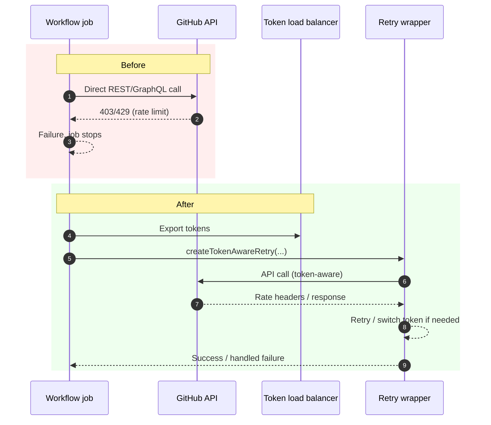

# High-Volume Workflows API Audit

Date: 2026-02-01

Scope: This document lists every GitHub API call found in each high-volume workflow and companion scripts in _repos/Workflows, with line numbers.

## Before/After Sequence (Short)

## Guardrails for New API Calls

- **Always** wrap GitHub API calls with `createTokenAwareRetry()` and use the returned `withRetry()`/`paginateWithRetry()` helpers.
- **Always** add the load balancer export step (`./.github/actions/export-load-balancer-tokens`) in jobs that make API calls.
- **Never** use raw `gh api`, `curl https://api.github.com`, or unwrapped `github.rest.*` in new workflow code; route through the retry wrapper.
- **Prefer** `github.paginate` via `paginateWithRetry()` for list endpoints.

## Regression Prevention (Tests + Scheduled Checks)

### CI Checks
- **Static scan**: fail CI if new workflow/script changes contain `gh api`, `api.github.com`, or `github.rest.*` without a nearby `createTokenAwareRetry` import.
- **Wrapper enforcement**: unit test that new helper scripts call `createTokenAwareRetry()` before any API call.
- **Load balancer requirement**: check each workflow job that uses the API includes the export step.

### Scheduled Maintenance
- **Weekly rate-limit diagnostic**: keep `health-75-api-rate-diagnostic.yml` scheduled and alert on token failures.
- **Monthly audit refresh**: run a scheduled scan to regenerate the audit table and diff for new unwrapped call sites.

## API Calls (with line numbers)

### Agents Keepalive Loop
Workflow: _repos/Workflows/.github/workflows/agents-keepalive-loop.yml

API calls in workflow:
- `client.rest.issues.removeLabel` — [_repos/Workflows/.github/workflows/agents-keepalive-loop.yml](_repos/Workflows/.github/workflows/agents-keepalive-loop.yml#L150)
- `client.rest.issues.removeLabel` — [_repos/Workflows/.github/workflows/agents-keepalive-loop.yml](_repos/Workflows/.github/workflows/agents-keepalive-loop.yml#L169)
- `client.rest.pulls.get` — [_repos/Workflows/.github/workflows/agents-keepalive-loop.yml](_repos/Workflows/.github/workflows/agents-keepalive-loop.yml#L222)
- `client.rest.pulls.listCommits` — [_repos/Workflows/.github/workflows/agents-keepalive-loop.yml](_repos/Workflows/.github/workflows/agents-keepalive-loop.yml#L519)
- `client.rest.pulls.get` — [_repos/Workflows/.github/workflows/agents-keepalive-loop.yml](_repos/Workflows/.github/workflows/agents-keepalive-loop.yml#L549)
- `client.rest.issues.createComment` — [_repos/Workflows/.github/workflows/agents-keepalive-loop.yml](_repos/Workflows/.github/workflows/agents-keepalive-loop.yml#L659)
- `client.rest.issues.removeLabel` — [_repos/Workflows/.github/workflows/agents-keepalive-loop.yml](_repos/Workflows/.github/workflows/agents-keepalive-loop.yml#L672)

API calls in keepalive loop logic: _repos/Workflows/.github/scripts/keepalive_loop.js
- `github.rest.pulls.get` — [_repos/Workflows/.github/scripts/keepalive_loop.js](_repos/Workflows/.github/scripts/keepalive_loop.js#L286)
- `github.rest.pulls.listFiles` — [_repos/Workflows/.github/scripts/keepalive_loop.js](_repos/Workflows/.github/scripts/keepalive_loop.js#L310)
- `github.rest.actions.listRepoVariables` — [_repos/Workflows/.github/scripts/keepalive_loop.js](_repos/Workflows/.github/scripts/keepalive_loop.js#L356)
- `github.rest.actions.getWorkflowRun` — [_repos/Workflows/.github/scripts/keepalive_loop.js](_repos/Workflows/.github/scripts/keepalive_loop.js#L403)
- `github.rest.repos.listPullRequestsAssociatedWithCommit` — [_repos/Workflows/.github/scripts/keepalive_loop.js](_repos/Workflows/.github/scripts/keepalive_loop.js#L1138)
- `github.rest.actions.listWorkflowRuns` — [_repos/Workflows/.github/scripts/keepalive_loop.js](_repos/Workflows/.github/scripts/keepalive_loop.js#L1166)
- `github.rest.actions.listJobsForWorkflowRun` — [_repos/Workflows/.github/scripts/keepalive_loop.js](_repos/Workflows/.github/scripts/keepalive_loop.js#L1181)
- `github.rest.actions.listWorkflowRuns` — [_repos/Workflows/.github/scripts/keepalive_loop.js](_repos/Workflows/.github/scripts/keepalive_loop.js#L1250)
- `github.rest.issues.listComments` — [_repos/Workflows/.github/scripts/keepalive_loop.js](_repos/Workflows/.github/scripts/keepalive_loop.js#L1333)
- `github.rest.issues.createComment` — [_repos/Workflows/.github/scripts/keepalive_loop.js](_repos/Workflows/.github/scripts/keepalive_loop.js#L1448)
- `github.rest.issues.addLabels` — [_repos/Workflows/.github/scripts/keepalive_loop.js](_repos/Workflows/.github/scripts/keepalive_loop.js#L1463)
- `github.rest.actions.listJobsForWorkflowRun` — [_repos/Workflows/.github/scripts/keepalive_loop.js](_repos/Workflows/.github/scripts/keepalive_loop.js#L1537)
- `github.paginate(github.rest.checks.listAnnotations)` — [_repos/Workflows/.github/scripts/keepalive_loop.js](_repos/Workflows/.github/scripts/keepalive_loop.js#L1555)
- `github.rest.checks.listAnnotations` — [_repos/Workflows/.github/scripts/keepalive_loop.js](_repos/Workflows/.github/scripts/keepalive_loop.js#L1556)
- `github.rest.actions.downloadJobLogsForWorkflowRun` — [_repos/Workflows/.github/scripts/keepalive_loop.js](_repos/Workflows/.github/scripts/keepalive_loop.js#L1567)
- `github.rest.rateLimit.get` — [_repos/Workflows/.github/scripts/keepalive_loop.js](_repos/Workflows/.github/scripts/keepalive_loop.js#L1615)
- `github.rest.issues.updateComment` — [_repos/Workflows/.github/scripts/keepalive_loop.js](_repos/Workflows/.github/scripts/keepalive_loop.js#L2828)
- `github.rest.issues.createComment` — [_repos/Workflows/.github/scripts/keepalive_loop.js](_repos/Workflows/.github/scripts/keepalive_loop.js#L2835)
- `github.rest.issues.addLabels` — [_repos/Workflows/.github/scripts/keepalive_loop.js](_repos/Workflows/.github/scripts/keepalive_loop.js#L2845)
- `github.rest.issues.addLabels` — [_repos/Workflows/.github/scripts/keepalive_loop.js](_repos/Workflows/.github/scripts/keepalive_loop.js#L2858)
- `github.rest.issues.updateComment` — [_repos/Workflows/.github/scripts/keepalive_loop.js](_repos/Workflows/.github/scripts/keepalive_loop.js#L3024)
- `github.rest.issues.createComment` — [_repos/Workflows/.github/scripts/keepalive_loop.js](_repos/Workflows/.github/scripts/keepalive_loop.js#L3032)
- `github.rest.repos.compareCommits` — [_repos/Workflows/.github/scripts/keepalive_loop.js](_repos/Workflows/.github/scripts/keepalive_loop.js#L3081)
- `github.rest.pulls.update` — [_repos/Workflows/.github/scripts/keepalive_loop.js](_repos/Workflows/.github/scripts/keepalive_loop.js#L3474)

API calls in keepalive state manager: _repos/Workflows/.github/scripts/keepalive_state.js
- `github.paginate(github.rest.issues.listComments)` — [_repos/Workflows/.github/scripts/keepalive_state.js](_repos/Workflows/.github/scripts/keepalive_state.js#L170)
- `github.rest.issues.getComment` — [_repos/Workflows/.github/scripts/keepalive_state.js](_repos/Workflows/.github/scripts/keepalive_state.js#L268)
- `github.rest.issues.updateComment` — [_repos/Workflows/.github/scripts/keepalive_state.js](_repos/Workflows/.github/scripts/keepalive_state.js#L281)
- `github.rest.issues.createComment` — [_repos/Workflows/.github/scripts/keepalive_state.js](_repos/Workflows/.github/scripts/keepalive_state.js#L289)
- `github.rest.issues.getComment` — [_repos/Workflows/.github/scripts/keepalive_state.js](_repos/Workflows/.github/scripts/keepalive_state.js#L399)
- `github.rest.issues.updateComment` — [_repos/Workflows/.github/scripts/keepalive_state.js](_repos/Workflows/.github/scripts/keepalive_state.js#L412)
- `github.rest.issues.createComment` — [_repos/Workflows/.github/scripts/keepalive_state.js](_repos/Workflows/.github/scripts/keepalive_state.js#L426)

API calls in keepalive post-work: _repos/Workflows/.github/scripts/keepalive_post_work.js
- `github.rest.pulls.get` — [_repos/Workflows/.github/scripts/keepalive_post_work.js](_repos/Workflows/.github/scripts/keepalive_post_work.js#L107)
- `github.rest.issues.listLabelsOnIssue` — [_repos/Workflows/.github/scripts/keepalive_post_work.js](_repos/Workflows/.github/scripts/keepalive_post_work.js#L120)
- `github.rest.repos.createDispatchEvent` — [_repos/Workflows/.github/scripts/keepalive_post_work.js](_repos/Workflows/.github/scripts/keepalive_post_work.js#L374)
- `github.rest.actions.createWorkflowDispatch` — [_repos/Workflows/.github/scripts/keepalive_post_work.js](_repos/Workflows/.github/scripts/keepalive_post_work.js#L436)
- `github.rest.actions.listWorkflowRuns` — [_repos/Workflows/.github/scripts/keepalive_post_work.js](_repos/Workflows/.github/scripts/keepalive_post_work.js#L465)
- `github.rest.pulls.list` — [_repos/Workflows/.github/scripts/keepalive_post_work.js](_repos/Workflows/.github/scripts/keepalive_post_work.js#L548)
- `github.rest.pulls.merge` — [_repos/Workflows/.github/scripts/keepalive_post_work.js](_repos/Workflows/.github/scripts/keepalive_post_work.js#L622)
- `github.rest.git.deleteRef` — [_repos/Workflows/.github/scripts/keepalive_post_work.js](_repos/Workflows/.github/scripts/keepalive_post_work.js#L639)
- `github.rest.issues.createComment` — [_repos/Workflows/.github/scripts/keepalive_post_work.js](_repos/Workflows/.github/scripts/keepalive_post_work.js#L679)
- `github.rest.reactions.createForIssueComment` — [_repos/Workflows/.github/scripts/keepalive_post_work.js](_repos/Workflows/.github/scripts/keepalive_post_work.js#L689)
- `github.rest.pulls.updateBranch` — [_repos/Workflows/.github/scripts/keepalive_post_work.js](_repos/Workflows/.github/scripts/keepalive_post_work.js#L744)
- `github.rest.issues.removeLabel` — [_repos/Workflows/.github/scripts/keepalive_post_work.js](_repos/Workflows/.github/scripts/keepalive_post_work.js#L1254)
- `github.rest.pulls.updateBranch` — [_repos/Workflows/.github/scripts/keepalive_post_work.js](_repos/Workflows/.github/scripts/keepalive_post_work.js#L1387)
- `github.rest.issues.removeLabel` — [_repos/Workflows/.github/scripts/keepalive_post_work.js](_repos/Workflows/.github/scripts/keepalive_post_work.js#L1718)
- `github.rest.issues.addLabels` — [_repos/Workflows/.github/scripts/keepalive_post_work.js](_repos/Workflows/.github/scripts/keepalive_post_work.js#L1757)
- `github.rest.issues.createComment` — [_repos/Workflows/.github/scripts/keepalive_post_work.js](_repos/Workflows/.github/scripts/keepalive_post_work.js#L1791)

### Keepalive Dispatch Handler
Workflow: _repos/Workflows/.github/workflows/agents-keepalive-dispatch-handler.yml

API calls in workflow:
- `github.rest.pulls.get` — [_repos/Workflows/.github/workflows/agents-keepalive-dispatch-handler.yml](_repos/Workflows/.github/workflows/agents-keepalive-dispatch-handler.yml#L146)

### Agents Auto-Pilot
Workflow: _repos/Workflows/.github/workflows/agents-auto-pilot.yml

API calls in workflow:
- `client.rest.repos.get` — [_repos/Workflows/.github/workflows/agents-auto-pilot.yml](_repos/Workflows/.github/workflows/agents-auto-pilot.yml#L148)
- `github.rest.issues.get` — [_repos/Workflows/.github/workflows/agents-auto-pilot.yml](_repos/Workflows/.github/workflows/agents-auto-pilot.yml#L229)
- `github.rest.issues.listComments` — [_repos/Workflows/.github/workflows/agents-auto-pilot.yml](_repos/Workflows/.github/workflows/agents-auto-pilot.yml#L271)
- `github.rest.issues.listEventsForTimeline` — [_repos/Workflows/.github/workflows/agents-auto-pilot.yml](_repos/Workflows/.github/workflows/agents-auto-pilot.yml#L290)
- `github.rest.issues.listComments` — [_repos/Workflows/.github/workflows/agents-auto-pilot.yml](_repos/Workflows/.github/workflows/agents-auto-pilot.yml#L365)
- `github.rest.issues.addLabels` — [_repos/Workflows/.github/workflows/agents-auto-pilot.yml](_repos/Workflows/.github/workflows/agents-auto-pilot.yml#L400)
- `github.rest.issues.createComment` — [_repos/Workflows/.github/workflows/agents-auto-pilot.yml](_repos/Workflows/.github/workflows/agents-auto-pilot.yml#L407)
- `github.rest.issues.listComments` — [_repos/Workflows/.github/workflows/agents-auto-pilot.yml](_repos/Workflows/.github/workflows/agents-auto-pilot.yml#L511)
- `client.rest.issues.createComment` — [_repos/Workflows/.github/workflows/agents-auto-pilot.yml](_repos/Workflows/.github/workflows/agents-auto-pilot.yml#L591)
- `client.rest.issues.get` — [_repos/Workflows/.github/workflows/agents-auto-pilot.yml](_repos/Workflows/.github/workflows/agents-auto-pilot.yml#L620)
- `client.rest.issues.update` — [_repos/Workflows/.github/workflows/agents-auto-pilot.yml](_repos/Workflows/.github/workflows/agents-auto-pilot.yml#L672)
- `client.rest.issues.addLabels` — [_repos/Workflows/.github/workflows/agents-auto-pilot.yml](_repos/Workflows/.github/workflows/agents-auto-pilot.yml#L701)
- `client.rest.issues.createComment` — [_repos/Workflows/.github/workflows/agents-auto-pilot.yml](_repos/Workflows/.github/workflows/agents-auto-pilot.yml#L789)
- `client.rest.issues.get` — [_repos/Workflows/.github/workflows/agents-auto-pilot.yml](_repos/Workflows/.github/workflows/agents-auto-pilot.yml#L818)
- `client.rest.issues.createComment` — [_repos/Workflows/.github/workflows/agents-auto-pilot.yml](_repos/Workflows/.github/workflows/agents-auto-pilot.yml#L883)
- `client.rest.issues.addLabels` — [_repos/Workflows/.github/workflows/agents-auto-pilot.yml](_repos/Workflows/.github/workflows/agents-auto-pilot.yml#L912)
- `github.rest.issues.listComments` — [_repos/Workflows/.github/workflows/agents-auto-pilot.yml](_repos/Workflows/.github/workflows/agents-auto-pilot.yml#L976)
- `github.rest.issues.createComment` — [_repos/Workflows/.github/workflows/agents-auto-pilot.yml](_repos/Workflows/.github/workflows/agents-auto-pilot.yml#L1000)
- `github.rest.issues.addLabels` — [_repos/Workflows/.github/workflows/agents-auto-pilot.yml](_repos/Workflows/.github/workflows/agents-auto-pilot.yml#L1017)
- `client.rest.issues.createComment` — [_repos/Workflows/.github/workflows/agents-auto-pilot.yml](_repos/Workflows/.github/workflows/agents-auto-pilot.yml#L1070)
- `client.rest.issues.get` — [_repos/Workflows/.github/workflows/agents-auto-pilot.yml](_repos/Workflows/.github/workflows/agents-auto-pilot.yml#L1099)
- `github.rest.issues.listComments` — [_repos/Workflows/.github/workflows/agents-auto-pilot.yml](_repos/Workflows/.github/workflows/agents-auto-pilot.yml#L1107)
- `client.rest.issues.update` — [_repos/Workflows/.github/workflows/agents-auto-pilot.yml](_repos/Workflows/.github/workflows/agents-auto-pilot.yml#L1171)
- `client.rest.issues.addLabels` — [_repos/Workflows/.github/workflows/agents-auto-pilot.yml](_repos/Workflows/.github/workflows/agents-auto-pilot.yml#L1200)
- `github.rest.issues.createComment` — [_repos/Workflows/.github/workflows/agents-auto-pilot.yml](_repos/Workflows/.github/workflows/agents-auto-pilot.yml#L1266)
- `github.rest.issues.addLabels` — [_repos/Workflows/.github/workflows/agents-auto-pilot.yml](_repos/Workflows/.github/workflows/agents-auto-pilot.yml#L1278)
- `github.rest.repos.get` — [_repos/Workflows/.github/workflows/agents-auto-pilot.yml](_repos/Workflows/.github/workflows/agents-auto-pilot.yml#L1288)
- `github.rest.actions.createWorkflowDispatch` — [_repos/Workflows/.github/workflows/agents-auto-pilot.yml](_repos/Workflows/.github/workflows/agents-auto-pilot.yml#L1304)
- `github.rest.pulls.list` — [_repos/Workflows/.github/workflows/agents-auto-pilot.yml](_repos/Workflows/.github/workflows/agents-auto-pilot.yml#L1367)
- `github.rest.issues.createComment` — [_repos/Workflows/.github/workflows/agents-auto-pilot.yml](_repos/Workflows/.github/workflows/agents-auto-pilot.yml#L1396)
- `github.rest.issues.addLabels` — [_repos/Workflows/.github/workflows/agents-auto-pilot.yml](_repos/Workflows/.github/workflows/agents-auto-pilot.yml#L1405)
- `github.rest.issues.createComment` — [_repos/Workflows/.github/workflows/agents-auto-pilot.yml](_repos/Workflows/.github/workflows/agents-auto-pilot.yml#L1423)
- `github.rest.issues.addLabels` — [_repos/Workflows/.github/workflows/agents-auto-pilot.yml](_repos/Workflows/.github/workflows/agents-auto-pilot.yml#L1431)
- `github.rest.issues.addLabels` — [_repos/Workflows/.github/workflows/agents-auto-pilot.yml](_repos/Workflows/.github/workflows/agents-auto-pilot.yml#L1439)
- `github.rest.issues.listComments` — [_repos/Workflows/.github/workflows/agents-auto-pilot.yml](_repos/Workflows/.github/workflows/agents-auto-pilot.yml#L1502)
- `github.rest.repos.getBranch` — [_repos/Workflows/.github/workflows/agents-auto-pilot.yml](_repos/Workflows/.github/workflows/agents-auto-pilot.yml#L1530)
- `github.rest.issues.addLabels` — [_repos/Workflows/.github/workflows/agents-auto-pilot.yml](_repos/Workflows/.github/workflows/agents-auto-pilot.yml#L1554)
- `github.rest.issues.createComment` — [_repos/Workflows/.github/workflows/agents-auto-pilot.yml](_repos/Workflows/.github/workflows/agents-auto-pilot.yml#L1561)
- `github.rest.issues.createComment` — [_repos/Workflows/.github/workflows/agents-auto-pilot.yml](_repos/Workflows/.github/workflows/agents-auto-pilot.yml#L1595)
- `github.rest.issues.createComment` — [_repos/Workflows/.github/workflows/agents-auto-pilot.yml](_repos/Workflows/.github/workflows/agents-auto-pilot.yml#L1613)
- `github.rest.repos.get` — [_repos/Workflows/.github/workflows/agents-auto-pilot.yml](_repos/Workflows/.github/workflows/agents-auto-pilot.yml#L1629)
- `github.rest.pulls.list` — [_repos/Workflows/.github/workflows/agents-auto-pilot.yml](_repos/Workflows/.github/workflows/agents-auto-pilot.yml#L1642)
- `github.rest.issues.createComment` — [_repos/Workflows/.github/workflows/agents-auto-pilot.yml](_repos/Workflows/.github/workflows/agents-auto-pilot.yml#L1657)
- `github.rest.issues.removeLabel` — [_repos/Workflows/.github/workflows/agents-auto-pilot.yml](_repos/Workflows/.github/workflows/agents-auto-pilot.yml#L1670)
- `github.rest.repos.compareCommits` — [_repos/Workflows/.github/workflows/agents-auto-pilot.yml](_repos/Workflows/.github/workflows/agents-auto-pilot.yml#L1689)
- `github.rest.issues.addLabels` — [_repos/Workflows/.github/workflows/agents-auto-pilot.yml](_repos/Workflows/.github/workflows/agents-auto-pilot.yml#L1708)
- `github.rest.issues.createComment` — [_repos/Workflows/.github/workflows/agents-auto-pilot.yml](_repos/Workflows/.github/workflows/agents-auto-pilot.yml#L1715)
- `github.rest.issues.createComment` — [_repos/Workflows/.github/workflows/agents-auto-pilot.yml](_repos/Workflows/.github/workflows/agents-auto-pilot.yml#L1754)
- `github.rest.actions.createWorkflowDispatch` — [_repos/Workflows/.github/workflows/agents-auto-pilot.yml](_repos/Workflows/.github/workflows/agents-auto-pilot.yml#L1770)
- `github.rest.issues.createComment` — [_repos/Workflows/.github/workflows/agents-auto-pilot.yml](_repos/Workflows/.github/workflows/agents-auto-pilot.yml#L1814)
- `github.rest.issues.createComment` — [_repos/Workflows/.github/workflows/agents-auto-pilot.yml](_repos/Workflows/.github/workflows/agents-auto-pilot.yml#L1830)
- `github.rest.issues.get` — [_repos/Workflows/.github/workflows/agents-auto-pilot.yml](_repos/Workflows/.github/workflows/agents-auto-pilot.yml#L1846)
- `github.rest.pulls.create` — [_repos/Workflows/.github/workflows/agents-auto-pilot.yml](_repos/Workflows/.github/workflows/agents-auto-pilot.yml#L1862)
- `github.rest.issues.addLabels` — [_repos/Workflows/.github/workflows/agents-auto-pilot.yml](_repos/Workflows/.github/workflows/agents-auto-pilot.yml#L1876)
- `github.rest.actions.createWorkflowDispatch` — [_repos/Workflows/.github/workflows/agents-auto-pilot.yml](_repos/Workflows/.github/workflows/agents-auto-pilot.yml#L1896)
- `github.rest.actions.createWorkflowDispatch` — [_repos/Workflows/.github/workflows/agents-auto-pilot.yml](_repos/Workflows/.github/workflows/agents-auto-pilot.yml#L1913)
- `github.rest.issues.createComment` — [_repos/Workflows/.github/workflows/agents-auto-pilot.yml](_repos/Workflows/.github/workflows/agents-auto-pilot.yml#L1935)
- `github.rest.issues.createComment` — [_repos/Workflows/.github/workflows/agents-auto-pilot.yml](_repos/Workflows/.github/workflows/agents-auto-pilot.yml#L1957)
- `github.rest.issues.listComments` — [_repos/Workflows/.github/workflows/agents-auto-pilot.yml](_repos/Workflows/.github/workflows/agents-auto-pilot.yml#L2026)
- `github.rest.issues.addLabels` — [_repos/Workflows/.github/workflows/agents-auto-pilot.yml](_repos/Workflows/.github/workflows/agents-auto-pilot.yml#L2058)
- `github.rest.issues.createComment` — [_repos/Workflows/.github/workflows/agents-auto-pilot.yml](_repos/Workflows/.github/workflows/agents-auto-pilot.yml#L2065)
- `github.rest.issues.createComment` — [_repos/Workflows/.github/workflows/agents-auto-pilot.yml](_repos/Workflows/.github/workflows/agents-auto-pilot.yml#L2094)
- `github.rest.issues.createComment` — [_repos/Workflows/.github/workflows/agents-auto-pilot.yml](_repos/Workflows/.github/workflows/agents-auto-pilot.yml#L2108)
- `github.rest.pulls.get` — [_repos/Workflows/.github/workflows/agents-auto-pilot.yml](_repos/Workflows/.github/workflows/agents-auto-pilot.yml#L2173)
- `github.rest.issues.createComment` — [_repos/Workflows/.github/workflows/agents-auto-pilot.yml](_repos/Workflows/.github/workflows/agents-auto-pilot.yml#L2181)
- `github.rest.checks.listForRef` — [_repos/Workflows/.github/workflows/agents-auto-pilot.yml](_repos/Workflows/.github/workflows/agents-auto-pilot.yml#L2197)
- `github.rest.issues.createComment` — [_repos/Workflows/.github/workflows/agents-auto-pilot.yml](_repos/Workflows/.github/workflows/agents-auto-pilot.yml#L2219)
- `github.rest.issues.addLabels` — [_repos/Workflows/.github/workflows/agents-auto-pilot.yml](_repos/Workflows/.github/workflows/agents-auto-pilot.yml#L2233)
- `github.rest.issues.createComment` — [_repos/Workflows/.github/workflows/agents-auto-pilot.yml](_repos/Workflows/.github/workflows/agents-auto-pilot.yml#L2240)
- `github.rest.repos.get` — [_repos/Workflows/.github/workflows/agents-auto-pilot.yml](_repos/Workflows/.github/workflows/agents-auto-pilot.yml#L2304)
- `github.rest.actions.createWorkflowDispatch` — [_repos/Workflows/.github/workflows/agents-auto-pilot.yml](_repos/Workflows/.github/workflows/agents-auto-pilot.yml#L2341)
- `github.rest.issues.removeLabel` — [_repos/Workflows/.github/workflows/agents-auto-pilot.yml](_repos/Workflows/.github/workflows/agents-auto-pilot.yml#L2368)
- `github.rest.issues.createComment` — [_repos/Workflows/.github/workflows/agents-auto-pilot.yml](_repos/Workflows/.github/workflows/agents-auto-pilot.yml#L2383)

### Agents Issue Optimizer
Workflow: _repos/Workflows/.github/workflows/agents-issue-optimizer.yml

API calls in workflow:
- `client.rest.issues.get` — [_repos/Workflows/.github/workflows/agents-issue-optimizer.yml](_repos/Workflows/.github/workflows/agents-issue-optimizer.yml#L145)
- `client.rest.issues.createComment` — [_repos/Workflows/.github/workflows/agents-issue-optimizer.yml](_repos/Workflows/.github/workflows/agents-issue-optimizer.yml#L219)
- `github.rest.issues.listForRepo` — [_repos/Workflows/.github/workflows/agents-issue-optimizer.yml](_repos/Workflows/.github/workflows/agents-issue-optimizer.yml#L260)
- `github.rest.issues.listComments` — [_repos/Workflows/.github/workflows/agents-issue-optimizer.yml](_repos/Workflows/.github/workflows/agents-issue-optimizer.yml#L264)
- `client.rest.issues.createComment` — [_repos/Workflows/.github/workflows/agents-issue-optimizer.yml](_repos/Workflows/.github/workflows/agents-issue-optimizer.yml#L330)
- `github.rest.issues.listComments` — [_repos/Workflows/.github/workflows/agents-issue-optimizer.yml](_repos/Workflows/.github/workflows/agents-issue-optimizer.yml#L376)
- `client.rest.issues.update` — [_repos/Workflows/.github/workflows/agents-issue-optimizer.yml](_repos/Workflows/.github/workflows/agents-issue-optimizer.yml#L440)
- `client.rest.issues.update` — [_repos/Workflows/.github/workflows/agents-issue-optimizer.yml](_repos/Workflows/.github/workflows/agents-issue-optimizer.yml#L504)
- `client.rest.issues.removeLabel` — [_repos/Workflows/.github/workflows/agents-issue-optimizer.yml](_repos/Workflows/.github/workflows/agents-issue-optimizer.yml#L545)
- `client.rest.issues.addLabels` — [_repos/Workflows/.github/workflows/agents-issue-optimizer.yml](_repos/Workflows/.github/workflows/agents-issue-optimizer.yml#L558)
- `client.rest.issues.removeLabel` — [_repos/Workflows/.github/workflows/agents-issue-optimizer.yml](_repos/Workflows/.github/workflows/agents-issue-optimizer.yml#L591)
- `client.rest.issues.addLabels` — [_repos/Workflows/.github/workflows/agents-issue-optimizer.yml](_repos/Workflows/.github/workflows/agents-issue-optimizer.yml#L603)

### Agents 63 Issue Intake
Workflow: _repos/Workflows/.github/workflows/agents-63-issue-intake.yml

API calls in workflow:
- `github.rest.issues.listLabelsForRepo` — [_repos/Workflows/.github/workflows/agents-63-issue-intake.yml](_repos/Workflows/.github/workflows/agents-63-issue-intake.yml#L728)
- `github.rest.issues.createLabel` — [_repos/Workflows/.github/workflows/agents-63-issue-intake.yml](_repos/Workflows/.github/workflows/agents-63-issue-intake.yml#L873)
- `github.rest.search.issuesAndPullRequests` — [_repos/Workflows/.github/workflows/agents-63-issue-intake.yml](_repos/Workflows/.github/workflows/agents-63-issue-intake.yml#L1002)
- `github.rest.search.issuesAndPullRequests` — [_repos/Workflows/.github/workflows/agents-63-issue-intake.yml](_repos/Workflows/.github/workflows/agents-63-issue-intake.yml#L1009)
- `github.rest.search.issuesAndPullRequests` — [_repos/Workflows/.github/workflows/agents-63-issue-intake.yml](_repos/Workflows/.github/workflows/agents-63-issue-intake.yml#L1020)
- `github.rest.search.issuesAndPullRequests` — [_repos/Workflows/.github/workflows/agents-63-issue-intake.yml](_repos/Workflows/.github/workflows/agents-63-issue-intake.yml#L1027)
- `github.rest.issues.get` — [_repos/Workflows/.github/workflows/agents-63-issue-intake.yml](_repos/Workflows/.github/workflows/agents-63-issue-intake.yml#L1037)
- `github.rest.issues.update` — [_repos/Workflows/.github/workflows/agents-63-issue-intake.yml](_repos/Workflows/.github/workflows/agents-63-issue-intake.yml#L1119)
- `github.rest.issues.createComment` — [_repos/Workflows/.github/workflows/agents-63-issue-intake.yml](_repos/Workflows/.github/workflows/agents-63-issue-intake.yml#L1126)
- `github.rest.issues.create` — [_repos/Workflows/.github/workflows/agents-63-issue-intake.yml](_repos/Workflows/.github/workflows/agents-63-issue-intake.yml#L1154)
- `github.rest.issues.get` — [_repos/Workflows/.github/workflows/agents-63-issue-intake.yml](_repos/Workflows/.github/workflows/agents-63-issue-intake.yml#L1283)
- `client.rest.issues.get` — [_repos/Workflows/.github/workflows/agents-63-issue-intake.yml](_repos/Workflows/.github/workflows/agents-63-issue-intake.yml#L1364)
- `client.rest.issues.update` — [_repos/Workflows/.github/workflows/agents-63-issue-intake.yml](_repos/Workflows/.github/workflows/agents-63-issue-intake.yml#L1388)
- `client.rest.issues.addLabels` — [_repos/Workflows/.github/workflows/agents-63-issue-intake.yml](_repos/Workflows/.github/workflows/agents-63-issue-intake.yml#L1397)

### Agents Autofix Loop
Workflow: _repos/Workflows/.github/workflows/agents-autofix-loop.yml

API calls in workflow:
- `github.rest.pulls.get` — [_repos/Workflows/.github/workflows/agents-autofix-loop.yml](_repos/Workflows/.github/workflows/agents-autofix-loop.yml#L105)
- `github.rest.pulls.get` — [_repos/Workflows/.github/workflows/agents-autofix-loop.yml](_repos/Workflows/.github/workflows/agents-autofix-loop.yml#L191)
- `github.rest.issues.addLabels` — [_repos/Workflows/.github/workflows/agents-autofix-loop.yml](_repos/Workflows/.github/workflows/agents-autofix-loop.yml#L245)
- `github.rest.actions.listJobsForWorkflowRun` — [_repos/Workflows/.github/workflows/agents-autofix-loop.yml](_repos/Workflows/.github/workflows/agents-autofix-loop.yml#L264)
- `github.rest.actions.listWorkflowRuns` — [_repos/Workflows/.github/workflows/agents-autofix-loop.yml](_repos/Workflows/.github/workflows/agents-autofix-loop.yml#L281)
- `github.rest.issues.addLabels` — [_repos/Workflows/.github/workflows/agents-autofix-loop.yml](_repos/Workflows/.github/workflows/agents-autofix-loop.yml#L437)
- `github.rest.issues.createComment` — [_repos/Workflows/.github/workflows/agents-autofix-loop.yml](_repos/Workflows/.github/workflows/agents-autofix-loop.yml#L458)
- `github.rest.pulls.get` — [_repos/Workflows/.github/workflows/agents-autofix-loop.yml](_repos/Workflows/.github/workflows/agents-autofix-loop.yml#L516)
- `github.rest.issues.removeLabel` — [_repos/Workflows/.github/workflows/agents-autofix-loop.yml](_repos/Workflows/.github/workflows/agents-autofix-loop.yml#L530)
- `github.rest.actions.listWorkflowRuns` — [_repos/Workflows/.github/workflows/agents-autofix-loop.yml](_repos/Workflows/.github/workflows/agents-autofix-loop.yml#L546)

### Agents 73 Codex Belt Conveyor
Workflow: _repos/Workflows/.github/workflows/agents-73-codex-belt-conveyor.yml

API calls in workflow:
- `github.rest.pulls.get` — [_repos/Workflows/.github/workflows/agents-73-codex-belt-conveyor.yml](_repos/Workflows/.github/workflows/agents-73-codex-belt-conveyor.yml#L248)
- `github.rest.repos.getCombinedStatusForRef` — [_repos/Workflows/.github/workflows/agents-73-codex-belt-conveyor.yml](_repos/Workflows/.github/workflows/agents-73-codex-belt-conveyor.yml#L298)
- `github.rest.pulls.listFiles` — [_repos/Workflows/.github/workflows/agents-73-codex-belt-conveyor.yml](_repos/Workflows/.github/workflows/agents-73-codex-belt-conveyor.yml#L325)
- `github.rest.pulls.merge` — [_repos/Workflows/.github/workflows/agents-73-codex-belt-conveyor.yml](_repos/Workflows/.github/workflows/agents-73-codex-belt-conveyor.yml#L399)
- `github.rest.git.deleteRef` — [_repos/Workflows/.github/workflows/agents-73-codex-belt-conveyor.yml](_repos/Workflows/.github/workflows/agents-73-codex-belt-conveyor.yml#L424)
- `github.rest.issues.update` — [_repos/Workflows/.github/workflows/agents-73-codex-belt-conveyor.yml](_repos/Workflows/.github/workflows/agents-73-codex-belt-conveyor.yml#L452)
- `github.rest.issues.removeLabel` — [_repos/Workflows/.github/workflows/agents-73-codex-belt-conveyor.yml](_repos/Workflows/.github/workflows/agents-73-codex-belt-conveyor.yml#L457)
- `github.rest.issues.createComment` — [_repos/Workflows/.github/workflows/agents-73-codex-belt-conveyor.yml](_repos/Workflows/.github/workflows/agents-73-codex-belt-conveyor.yml#L464)
- `github.rest.issues.createComment` — [_repos/Workflows/.github/workflows/agents-73-codex-belt-conveyor.yml](_repos/Workflows/.github/workflows/agents-73-codex-belt-conveyor.yml#L489)
- `github.rest.actions.createWorkflowDispatch` — [_repos/Workflows/.github/workflows/agents-73-codex-belt-conveyor.yml](_repos/Workflows/.github/workflows/agents-73-codex-belt-conveyor.yml#L519)

### Agents 70 Orchestrator (Resolve Logic)
Script: _repos/Workflows/.github/scripts/agents_orchestrator_resolve.js

API calls in orchestrator resolve:
- `github.paginate(github.rest.repos.listPullRequestsAssociatedWithCommit)` — [_repos/Workflows/.github/scripts/agents_orchestrator_resolve.js](_repos/Workflows/.github/scripts/agents_orchestrator_resolve.js#L298)
- `github.rest.repos.listPullRequestsAssociatedWithCommit` — [_repos/Workflows/.github/scripts/agents_orchestrator_resolve.js](_repos/Workflows/.github/scripts/agents_orchestrator_resolve.js#L299)
- `github.paginate(github.rest.pulls.list)` — [_repos/Workflows/.github/scripts/agents_orchestrator_resolve.js](_repos/Workflows/.github/scripts/agents_orchestrator_resolve.js#L319)
- `github.rest.pulls.get` — [_repos/Workflows/.github/scripts/agents_orchestrator_resolve.js](_repos/Workflows/.github/scripts/agents_orchestrator_resolve.js#L342)
- `github.rest.issues.getLabel` — [_repos/Workflows/.github/scripts/agents_orchestrator_resolve.js](_repos/Workflows/.github/scripts/agents_orchestrator_resolve.js#L438)
- `github.rest.pulls.get` — [_repos/Workflows/.github/scripts/agents_orchestrator_resolve.js](_repos/Workflows/.github/scripts/agents_orchestrator_resolve.js#L468)

### Reusable Codex Run
Workflow: _repos/Workflows/.github/workflows/reusable-codex-run.yml

API calls in workflow:
- `github.rest.issues.listComments` — [_repos/Workflows/.github/workflows/reusable-codex-run.yml](_repos/Workflows/.github/workflows/reusable-codex-run.yml#L1183)
- `github.rest.issues.updateComment` — [_repos/Workflows/.github/workflows/reusable-codex-run.yml](_repos/Workflows/.github/workflows/reusable-codex-run.yml#L1195)
- `github.rest.issues.createComment` — [_repos/Workflows/.github/workflows/reusable-codex-run.yml](_repos/Workflows/.github/workflows/reusable-codex-run.yml#L1205)
- `github.rest.issues.addLabels` — [_repos/Workflows/.github/workflows/reusable-codex-run.yml](_repos/Workflows/.github/workflows/reusable-codex-run.yml#L1229)

### Reusable 70 Orchestrator Init
Workflow: _repos/Workflows/.github/workflows/reusable-70-orchestrator-init.yml

API calls in workflow:
- `github.rest.issues.listForRepo` — [_repos/Workflows/.github/workflows/reusable-70-orchestrator-init.yml](_repos/Workflows/.github/workflows/reusable-70-orchestrator-init.yml#L267)
- `github.rest.users.getAuthenticated` — [_repos/Workflows/.github/workflows/reusable-70-orchestrator-init.yml](_repos/Workflows/.github/workflows/reusable-70-orchestrator-init.yml#L361)

### Health 71 Sync Health Check
Workflow: _repos/Workflows/.github/workflows/health-71-sync-health-check.yml

API calls in workflow:
- `gh api` — [_repos/Workflows/.github/workflows/health-71-sync-health-check.yml](_repos/Workflows/.github/workflows/health-71-sync-health-check.yml#L63)

### Health Codex Auth Check
Workflow: _repos/Workflows/.github/workflows/health-codex-auth-check.yml

API calls in workflow:
- `github.rest.issues.listForRepo` — [_repos/Workflows/.github/workflows/health-codex-auth-check.yml](_repos/Workflows/.github/workflows/health-codex-auth-check.yml#L58)
- `github.rest.issues.create` — [_repos/Workflows/.github/workflows/health-codex-auth-check.yml](_repos/Workflows/.github/workflows/health-codex-auth-check.yml#L221)

### Maint 66 Monthly Audit
Workflow: _repos/Workflows/.github/workflows/maint-66-monthly-audit.yml

API calls in workflow:
- `gh api` — [_repos/Workflows/.github/workflows/maint-66-monthly-audit.yml](_repos/Workflows/.github/workflows/maint-66-monthly-audit.yml#L48)

### Maint 70 Fix Integration Formatting
Workflow: _repos/Workflows/.github/workflows/maint-70-fix-integration-formatting.yml

API calls in workflow:
- `github.rest.repos.get` — [_repos/Workflows/.github/workflows/maint-70-fix-integration-formatting.yml](_repos/Workflows/.github/workflows/maint-70-fix-integration-formatting.yml#L31)

### Maint 71 Auto Fix Integration
Workflow: _repos/Workflows/.github/workflows/maint-71-auto-fix-integration.yml

API calls in workflow:
- `gh api` — [_repos/Workflows/.github/workflows/maint-71-auto-fix-integration.yml](_repos/Workflows/.github/workflows/maint-71-auto-fix-integration.yml#L65)
- `github.rest.repos.get` — [_repos/Workflows/.github/workflows/maint-71-auto-fix-integration.yml](_repos/Workflows/.github/workflows/maint-71-auto-fix-integration.yml#L90)

### Reusable Agents Issue Bridge
Workflow: _repos/Workflows/.github/workflows/reusable-agents-issue-bridge.yml

API calls in workflow:
- `github.rest.issues.get` — [_repos/Workflows/.github/workflows/reusable-agents-issue-bridge.yml](_repos/Workflows/.github/workflows/reusable-agents-issue-bridge.yml#L153)
- `github.rest.repos.get` — [_repos/Workflows/.github/workflows/reusable-agents-issue-bridge.yml](_repos/Workflows/.github/workflows/reusable-agents-issue-bridge.yml#L278)
- `github.rest.issues.get` — [_repos/Workflows/.github/workflows/reusable-agents-issue-bridge.yml](_repos/Workflows/.github/workflows/reusable-agents-issue-bridge.yml#L398)
- `github.rest.pulls.get` — [_repos/Workflows/.github/workflows/reusable-agents-issue-bridge.yml](_repos/Workflows/.github/workflows/reusable-agents-issue-bridge.yml#L438)
- `github.rest.issues.listComments` — [_repos/Workflows/.github/workflows/reusable-agents-issue-bridge.yml](_repos/Workflows/.github/workflows/reusable-agents-issue-bridge.yml#L448)
- `github.rest.issues.get` — [_repos/Workflows/.github/workflows/reusable-agents-issue-bridge.yml](_repos/Workflows/.github/workflows/reusable-agents-issue-bridge.yml#L615)
- `github.rest.pulls.list` — [_repos/Workflows/.github/workflows/reusable-agents-issue-bridge.yml](_repos/Workflows/.github/workflows/reusable-agents-issue-bridge.yml#L625)
- `github.rest.pulls.update` — [_repos/Workflows/.github/workflows/reusable-agents-issue-bridge.yml](_repos/Workflows/.github/workflows/reusable-agents-issue-bridge.yml#L702)
- `github.rest.issues.listComments` — [_repos/Workflows/.github/workflows/reusable-agents-issue-bridge.yml](_repos/Workflows/.github/workflows/reusable-agents-issue-bridge.yml#L722)
- `github.rest.issues.createComment` — [_repos/Workflows/.github/workflows/reusable-agents-issue-bridge.yml](_repos/Workflows/.github/workflows/reusable-agents-issue-bridge.yml#L744)
- `github.rest.issues.createComment` — [_repos/Workflows/.github/workflows/reusable-agents-issue-bridge.yml](_repos/Workflows/.github/workflows/reusable-agents-issue-bridge.yml#L757)
- `github.rest.issues.createComment` — [_repos/Workflows/.github/workflows/reusable-agents-issue-bridge.yml](_repos/Workflows/.github/workflows/reusable-agents-issue-bridge.yml#L766)
- `github.rest.pulls.list` — [_repos/Workflows/.github/workflows/reusable-agents-issue-bridge.yml](_repos/Workflows/.github/workflows/reusable-agents-issue-bridge.yml#L828)
- `github.rest.issues.get` — [_repos/Workflows/.github/workflows/reusable-agents-issue-bridge.yml](_repos/Workflows/.github/workflows/reusable-agents-issue-bridge.yml#L834)
- `github.rest.pulls.create` — [_repos/Workflows/.github/workflows/reusable-agents-issue-bridge.yml](_repos/Workflows/.github/workflows/reusable-agents-issue-bridge.yml#L897)
- `github.rest.pulls.update` — [_repos/Workflows/.github/workflows/reusable-agents-issue-bridge.yml](_repos/Workflows/.github/workflows/reusable-agents-issue-bridge.yml#L923)
- `github.rest.issues.addAssignees` — [_repos/Workflows/.github/workflows/reusable-agents-issue-bridge.yml](_repos/Workflows/.github/workflows/reusable-agents-issue-bridge.yml#L942)
- `github.rest.issues.addAssignees` — [_repos/Workflows/.github/workflows/reusable-agents-issue-bridge.yml](_repos/Workflows/.github/workflows/reusable-agents-issue-bridge.yml#L947)
- `github.rest.issues.addLabels` — [_repos/Workflows/.github/workflows/reusable-agents-issue-bridge.yml](_repos/Workflows/.github/workflows/reusable-agents-issue-bridge.yml#L977)
- `github.rest.issues.get` — [_repos/Workflows/.github/workflows/reusable-agents-issue-bridge.yml](_repos/Workflows/.github/workflows/reusable-agents-issue-bridge.yml#L1044)
- `github.rest.pulls.list` — [_repos/Workflows/.github/workflows/reusable-agents-issue-bridge.yml](_repos/Workflows/.github/workflows/reusable-agents-issue-bridge.yml#L1062)
- `github.rest.pulls.get` — [_repos/Workflows/.github/workflows/reusable-agents-issue-bridge.yml](_repos/Workflows/.github/workflows/reusable-agents-issue-bridge.yml#L1075)
- `github.rest.issues.listComments` — [_repos/Workflows/.github/workflows/reusable-agents-issue-bridge.yml](_repos/Workflows/.github/workflows/reusable-agents-issue-bridge.yml#L1092)
- `github.rest.issues.createComment` — [_repos/Workflows/.github/workflows/reusable-agents-issue-bridge.yml](_repos/Workflows/.github/workflows/reusable-agents-issue-bridge.yml#L1100)
- `github.rest.pulls.update` — [_repos/Workflows/.github/workflows/reusable-agents-issue-bridge.yml](_repos/Workflows/.github/workflows/reusable-agents-issue-bridge.yml#L1113)
- `github.rest.issues.listComments` — [_repos/Workflows/.github/workflows/reusable-agents-issue-bridge.yml](_repos/Workflows/.github/workflows/reusable-agents-issue-bridge.yml#L1149)
- `github.rest.issues.createComment` — [_repos/Workflows/.github/workflows/reusable-agents-issue-bridge.yml](_repos/Workflows/.github/workflows/reusable-agents-issue-bridge.yml#L1162)
- `github.rest.issues.createComment` — [_repos/Workflows/.github/workflows/reusable-agents-issue-bridge.yml](_repos/Workflows/.github/workflows/reusable-agents-issue-bridge.yml#L1190)
- `github.rest.issues.createComment` — [_repos/Workflows/.github/workflows/reusable-agents-issue-bridge.yml](_repos/Workflows/.github/workflows/reusable-agents-issue-bridge.yml#L1217)
- `github.rest.issues.createComment` — [_repos/Workflows/.github/workflows/reusable-agents-issue-bridge.yml](_repos/Workflows/.github/workflows/reusable-agents-issue-bridge.yml#L1254)
- `github.rest.issues.get` — [_repos/Workflows/.github/workflows/reusable-agents-issue-bridge.yml](_repos/Workflows/.github/workflows/reusable-agents-issue-bridge.yml#L1286)
- `github.rest.issues.createComment` — [_repos/Workflows/.github/workflows/reusable-agents-issue-bridge.yml](_repos/Workflows/.github/workflows/reusable-agents-issue-bridge.yml#L1345)

### Agents Verify to New PR Autopilot
Workflow: _repos/Workflows/.github/workflows/agents-verify-to-new-pr-autopilot.yml

API calls in workflow:
- `gh api` — [_repos/Workflows/.github/workflows/agents-verify-to-new-pr-autopilot.yml](_repos/Workflows/.github/workflows/agents-verify-to-new-pr-autopilot.yml#L26)
- `gh api` — [_repos/Workflows/.github/workflows/agents-verify-to-new-pr-autopilot.yml](_repos/Workflows/.github/workflows/agents-verify-to-new-pr-autopilot.yml#L32)
- `gh api` — [_repos/Workflows/.github/workflows/agents-verify-to-new-pr-autopilot.yml](_repos/Workflows/.github/workflows/agents-verify-to-new-pr-autopilot.yml#L50)

### Archived Maint 63 Ensure Environments
Workflow: _repos/Workflows/.github/workflows/archived/maint-63-ensure-environments.yml

API calls in workflow:
- `github.rest.teams.getByName` — [_repos/Workflows/.github/workflows/archived/maint-63-ensure-environments.yml](_repos/Workflows/.github/workflows/archived/maint-63-ensure-environments.yml#L33)
- `github.rest.users.getByUsername` — [_repos/Workflows/.github/workflows/archived/maint-63-ensure-environments.yml](_repos/Workflows/.github/workflows/archived/maint-63-ensure-environments.yml#L49)
- `github.rest.repos.createOrUpdateEnvironment` — [_repos/Workflows/.github/workflows/archived/maint-63-ensure-environments.yml](_repos/Workflows/.github/workflows/archived/maint-63-ensure-environments.yml#L57)

### Selftest Reusable CI
Workflow: _repos/Workflows/.github/workflows/selftest-reusable-ci.yml

API calls in workflow:
- `github.rest.rateLimit.get` — [_repos/Workflows/.github/workflows/selftest-reusable-ci.yml](_repos/Workflows/.github/workflows/selftest-reusable-ci.yml#L79)
- `github.paginate(github.rest.actions.listWorkflowRunArtifacts)` — [_repos/Workflows/.github/workflows/selftest-reusable-ci.yml](_repos/Workflows/.github/workflows/selftest-reusable-ci.yml#L273)
- `github.rest.actions.listWorkflowRunArtifacts` — [_repos/Workflows/.github/workflows/selftest-reusable-ci.yml](_repos/Workflows/.github/workflows/selftest-reusable-ci.yml#L274)
- `github.paginate(github.rest.actions.listJobsForWorkflowRun)` — [_repos/Workflows/.github/workflows/selftest-reusable-ci.yml](_repos/Workflows/.github/workflows/selftest-reusable-ci.yml#L280)
- `github.rest.actions.listJobsForWorkflowRun` — [_repos/Workflows/.github/workflows/selftest-reusable-ci.yml](_repos/Workflows/.github/workflows/selftest-reusable-ci.yml#L281)
- `github.rest.issues.listComments` — [_repos/Workflows/.github/workflows/selftest-reusable-ci.yml](_repos/Workflows/.github/workflows/selftest-reusable-ci.yml#L530)
- `github.rest.issues.updateComment` — [_repos/Workflows/.github/workflows/selftest-reusable-ci.yml](_repos/Workflows/.github/workflows/selftest-reusable-ci.yml#L534)
- `github.rest.issues.createComment` — [_repos/Workflows/.github/workflows/selftest-reusable-ci.yml](_repos/Workflows/.github/workflows/selftest-reusable-ci.yml#L537)

### Reusable Bot Comment Handler
Workflow: _repos/Workflows/.github/workflows/reusable-bot-comment-handler.yml

API calls in workflow:
- `github.rest.pulls.get` — [_repos/Workflows/.github/workflows/reusable-bot-comment-handler.yml](_repos/Workflows/.github/workflows/reusable-bot-comment-handler.yml#L143)
- `github.rest.pulls.listReviewComments` — [_repos/Workflows/.github/workflows/reusable-bot-comment-handler.yml](_repos/Workflows/.github/workflows/reusable-bot-comment-handler.yml#L198)
- `github.rest.issues.addAssignees` — [_repos/Workflows/.github/workflows/reusable-bot-comment-handler.yml](_repos/Workflows/.github/workflows/reusable-bot-comment-handler.yml#L429)
- `github.rest.issues.createComment` — [_repos/Workflows/.github/workflows/reusable-bot-comment-handler.yml](_repos/Workflows/.github/workflows/reusable-bot-comment-handler.yml#L456)

### Agents 72 Codex Belt Worker
Workflow: _repos/Workflows/.github/workflows/agents-72-codex-belt-worker.yml

API calls in workflow:
- `client.rest.repos.get` — [_repos/Workflows/.github/workflows/agents-72-codex-belt-worker.yml](_repos/Workflows/.github/workflows/agents-72-codex-belt-worker.yml#L323)
- `github.rest.repos.get` — [_repos/Workflows/.github/workflows/agents-72-codex-belt-worker.yml](_repos/Workflows/.github/workflows/agents-72-codex-belt-worker.yml#L366)
- `github.rest.actions.listWorkflowRuns` — [_repos/Workflows/.github/workflows/agents-72-codex-belt-worker.yml](_repos/Workflows/.github/workflows/agents-72-codex-belt-worker.yml#L391)
- `github.rest.git.listMatchingRefs` — [_repos/Workflows/.github/workflows/agents-72-codex-belt-worker.yml](_repos/Workflows/.github/workflows/agents-72-codex-belt-worker.yml#L488)
- `github.rest.pulls.list` — [_repos/Workflows/.github/workflows/agents-72-codex-belt-worker.yml](_repos/Workflows/.github/workflows/agents-72-codex-belt-worker.yml#L503)
- `github.rest.git.deleteRef` — [_repos/Workflows/.github/workflows/agents-72-codex-belt-worker.yml](_repos/Workflows/.github/workflows/agents-72-codex-belt-worker.yml#L523)
- `github.rest.issues.get` — [_repos/Workflows/.github/workflows/agents-72-codex-belt-worker.yml](_repos/Workflows/.github/workflows/agents-72-codex-belt-worker.yml#L558)
- `github.rest.issues.addLabels` — [_repos/Workflows/.github/workflows/agents-72-codex-belt-worker.yml](_repos/Workflows/.github/workflows/agents-72-codex-belt-worker.yml#L957)
- `github.rest.issues.removeLabel` — [_repos/Workflows/.github/workflows/agents-72-codex-belt-worker.yml](_repos/Workflows/.github/workflows/agents-72-codex-belt-worker.yml#L974)
- `github.rest.issues.get` — [_repos/Workflows/.github/workflows/agents-72-codex-belt-worker.yml](_repos/Workflows/.github/workflows/agents-72-codex-belt-worker.yml#L1001)
- `github.rest.pulls.list` — [_repos/Workflows/.github/workflows/agents-72-codex-belt-worker.yml](_repos/Workflows/.github/workflows/agents-72-codex-belt-worker.yml#L1017)
- `github.rest.pulls.update` — [_repos/Workflows/.github/workflows/agents-72-codex-belt-worker.yml](_repos/Workflows/.github/workflows/agents-72-codex-belt-worker.yml#L1023)
- `github.rest.pulls.create` — [_repos/Workflows/.github/workflows/agents-72-codex-belt-worker.yml](_repos/Workflows/.github/workflows/agents-72-codex-belt-worker.yml#L1033)
- `github.rest.pulls.get` — [_repos/Workflows/.github/workflows/agents-72-codex-belt-worker.yml](_repos/Workflows/.github/workflows/agents-72-codex-belt-worker.yml#L1057)
- `github.graphql` — [_repos/Workflows/.github/workflows/agents-72-codex-belt-worker.yml](_repos/Workflows/.github/workflows/agents-72-codex-belt-worker.yml#L1064)
- `github.rest.issues.addLabels` — [_repos/Workflows/.github/workflows/agents-72-codex-belt-worker.yml](_repos/Workflows/.github/workflows/agents-72-codex-belt-worker.yml#L1092)
- `github.rest.issues.addAssignees` — [_repos/Workflows/.github/workflows/agents-72-codex-belt-worker.yml](_repos/Workflows/.github/workflows/agents-72-codex-belt-worker.yml#L1112)
- `github.rest.issues.updateComment` — [_repos/Workflows/.github/workflows/agents-72-codex-belt-worker.yml](_repos/Workflows/.github/workflows/agents-72-codex-belt-worker.yml#L1153)
- `github.rest.issues.deleteComment` — [_repos/Workflows/.github/workflows/agents-72-codex-belt-worker.yml](_repos/Workflows/.github/workflows/agents-72-codex-belt-worker.yml#L1158)
- `github.rest.issues.createComment` — [_repos/Workflows/.github/workflows/agents-72-codex-belt-worker.yml](_repos/Workflows/.github/workflows/agents-72-codex-belt-worker.yml#L1166)
- `github.rest.issues.createComment` — [_repos/Workflows/.github/workflows/agents-72-codex-belt-worker.yml](_repos/Workflows/.github/workflows/agents-72-codex-belt-worker.yml#L1185)

### Agents Guard
Workflow: _repos/Workflows/.github/workflows/agents-guard.yml

API calls in workflow:
- `github.rest.repos.getContent` — [_repos/Workflows/.github/workflows/agents-guard.yml](_repos/Workflows/.github/workflows/agents-guard.yml#L186)
- `github.rest.pulls.listFiles` — [_repos/Workflows/.github/workflows/agents-guard.yml](_repos/Workflows/.github/workflows/agents-guard.yml#L235)
- `github.rest.issues.listLabelsOnIssue` — [_repos/Workflows/.github/workflows/agents-guard.yml](_repos/Workflows/.github/workflows/agents-guard.yml#L242)
- `github.rest.pulls.listReviews` — [_repos/Workflows/.github/workflows/agents-guard.yml](_repos/Workflows/.github/workflows/agents-guard.yml#L249)
- `github.rest.repos.getContent` — [_repos/Workflows/.github/workflows/agents-guard.yml](_repos/Workflows/.github/workflows/agents-guard.yml#L259)
- `github.paginate(github.rest.issues.listComments)` — [_repos/Workflows/.github/workflows/agents-guard.yml](_repos/Workflows/.github/workflows/agents-guard.yml#L391)
- `github.rest.issues.updateComment` — [_repos/Workflows/.github/workflows/agents-guard.yml](_repos/Workflows/.github/workflows/agents-guard.yml#L406)
- `github.rest.issues.createComment` — [_repos/Workflows/.github/workflows/agents-guard.yml](_repos/Workflows/.github/workflows/agents-guard.yml#L419)
- `github.rest.repos.createCommitStatus` — [_repos/Workflows/.github/workflows/agents-guard.yml](_repos/Workflows/.github/workflows/agents-guard.yml#L503)

### Health 41 Repo Health
Workflow: _repos/Workflows/.github/workflows/health-41-repo-health.yml

API calls in workflow:
- `github.rest.rateLimit.get` — [_repos/Workflows/.github/workflows/health-41-repo-health.yml](_repos/Workflows/.github/workflows/health-41-repo-health.yml#L55)
- `github.rest.repos.get` — [_repos/Workflows/.github/workflows/health-41-repo-health.yml](_repos/Workflows/.github/workflows/health-41-repo-health.yml#L121)
- `github.rest.repos.listBranches` — [_repos/Workflows/.github/workflows/health-41-repo-health.yml](_repos/Workflows/.github/workflows/health-41-repo-health.yml#L127)
- `github.rest.repos.getCommit` — [_repos/Workflows/.github/workflows/health-41-repo-health.yml](_repos/Workflows/.github/workflows/health-41-repo-health.yml#L144)
- `github.rest.pulls.list` — [_repos/Workflows/.github/workflows/health-41-repo-health.yml](_repos/Workflows/.github/workflows/health-41-repo-health.yml#L175)
- `github.rest.issues.listForRepo` — [_repos/Workflows/.github/workflows/health-41-repo-health.yml](_repos/Workflows/.github/workflows/health-41-repo-health.yml#L199)
- `github.rest.repos.getBranchProtection` — [_repos/Workflows/.github/workflows/health-41-repo-health.yml](_repos/Workflows/.github/workflows/health-41-repo-health.yml#L350)
- `github.rest.repos.getBranch` — [_repos/Workflows/.github/workflows/health-41-repo-health.yml](_repos/Workflows/.github/workflows/health-41-repo-health.yml#L365)

### Health 75 API Rate Diagnostic
Workflow: _repos/Workflows/.github/workflows/health-75-api-rate-diagnostic.yml

API calls in workflow:
- `gh api` — [_repos/Workflows/.github/workflows/health-75-api-rate-diagnostic.yml](_repos/Workflows/.github/workflows/health-75-api-rate-diagnostic.yml#L97)
- `gh api` — [_repos/Workflows/.github/workflows/health-75-api-rate-diagnostic.yml](_repos/Workflows/.github/workflows/health-75-api-rate-diagnostic.yml#L182)
- `gh api` — [_repos/Workflows/.github/workflows/health-75-api-rate-diagnostic.yml](_repos/Workflows/.github/workflows/health-75-api-rate-diagnostic.yml#L264)
- `gh api` — [_repos/Workflows/.github/workflows/health-75-api-rate-diagnostic.yml](_repos/Workflows/.github/workflows/health-75-api-rate-diagnostic.yml#L354)
- `gh api` — [_repos/Workflows/.github/workflows/health-75-api-rate-diagnostic.yml](_repos/Workflows/.github/workflows/health-75-api-rate-diagnostic.yml#L447)
- `gh api` — [_repos/Workflows/.github/workflows/health-75-api-rate-diagnostic.yml](_repos/Workflows/.github/workflows/health-75-api-rate-diagnostic.yml#L539)
- `gh api` — [_repos/Workflows/.github/workflows/health-75-api-rate-diagnostic.yml](_repos/Workflows/.github/workflows/health-75-api-rate-diagnostic.yml#L633)
- `gh api` — [_repos/Workflows/.github/workflows/health-75-api-rate-diagnostic.yml](_repos/Workflows/.github/workflows/health-75-api-rate-diagnostic.yml#L1016)
- `gh api` — [_repos/Workflows/.github/workflows/health-75-api-rate-diagnostic.yml](_repos/Workflows/.github/workflows/health-75-api-rate-diagnostic.yml#L1342)
- `gh api` — [_repos/Workflows/.github/workflows/health-75-api-rate-diagnostic.yml](_repos/Workflows/.github/workflows/health-75-api-rate-diagnostic.yml#L1348)
- `gh api` — [_repos/Workflows/.github/workflows/health-75-api-rate-diagnostic.yml](_repos/Workflows/.github/workflows/health-75-api-rate-diagnostic.yml#L1354)
- `gh api` — [_repos/Workflows/.github/workflows/health-75-api-rate-diagnostic.yml](_repos/Workflows/.github/workflows/health-75-api-rate-diagnostic.yml#L1517)
- `gh api` — [_repos/Workflows/.github/workflows/health-75-api-rate-diagnostic.yml](_repos/Workflows/.github/workflows/health-75-api-rate-diagnostic.yml#L1520)
- `gh api` — [_repos/Workflows/.github/workflows/health-75-api-rate-diagnostic.yml](_repos/Workflows/.github/workflows/health-75-api-rate-diagnostic.yml#L1533)
- `gh api` — [_repos/Workflows/.github/workflows/health-75-api-rate-diagnostic.yml](_repos/Workflows/.github/workflows/health-75-api-rate-diagnostic.yml#L1541)

### Reusable 70 Orchestrator Main
Workflow: _repos/Workflows/.github/workflows/reusable-70-orchestrator-main.yml

API calls in workflow:
- `github.rest.issues.listLabelsOnIssue` — [_repos/Workflows/.github/workflows/reusable-70-orchestrator-main.yml](_repos/Workflows/.github/workflows/reusable-70-orchestrator-main.yml#L414)
- `github.rest.pulls.get` — [_repos/Workflows/.github/workflows/reusable-70-orchestrator-main.yml](_repos/Workflows/.github/workflows/reusable-70-orchestrator-main.yml#L662)
- `github.rest.issues.get` — [_repos/Workflows/.github/workflows/reusable-70-orchestrator-main.yml](_repos/Workflows/.github/workflows/reusable-70-orchestrator-main.yml#L673)
- `github.rest.issues.listComments` — [_repos/Workflows/.github/workflows/reusable-70-orchestrator-main.yml](_repos/Workflows/.github/workflows/reusable-70-orchestrator-main.yml#L687)
- `github.rest.issues.listComments` — [_repos/Workflows/.github/workflows/reusable-70-orchestrator-main.yml](_repos/Workflows/.github/workflows/reusable-70-orchestrator-main.yml#L727)
- `github.rest.reactions.listForIssueComment` — [_repos/Workflows/.github/workflows/reusable-70-orchestrator-main.yml](_repos/Workflows/.github/workflows/reusable-70-orchestrator-main.yml#L791)
- `github.rest.pulls.get` — [_repos/Workflows/.github/workflows/reusable-70-orchestrator-main.yml](_repos/Workflows/.github/workflows/reusable-70-orchestrator-main.yml#L892)
- `github.rest.issues.listLabelsOnIssue` — [_repos/Workflows/.github/workflows/reusable-70-orchestrator-main.yml](_repos/Workflows/.github/workflows/reusable-70-orchestrator-main.yml#L974)
- `github.rest.pulls.list` — [_repos/Workflows/.github/workflows/reusable-70-orchestrator-main.yml](_repos/Workflows/.github/workflows/reusable-70-orchestrator-main.yml#L1182)
- `github.rest.reactions.createForIssueComment` — [_repos/Workflows/.github/workflows/reusable-70-orchestrator-main.yml](_repos/Workflows/.github/workflows/reusable-70-orchestrator-main.yml#L1204)
- `github.rest.reactions.listForIssueComment` — [_repos/Workflows/.github/workflows/reusable-70-orchestrator-main.yml](_repos/Workflows/.github/workflows/reusable-70-orchestrator-main.yml#L1365)
- `github.rest.actions.createWorkflowDispatch` — [_repos/Workflows/.github/workflows/reusable-70-orchestrator-main.yml](_repos/Workflows/.github/workflows/reusable-70-orchestrator-main.yml#L1387)
- `github.rest.actions.listWorkflowRuns` — [_repos/Workflows/.github/workflows/reusable-70-orchestrator-main.yml](_repos/Workflows/.github/workflows/reusable-70-orchestrator-main.yml#L1442)
- `github.rest.actions.getWorkflowRun` — [_repos/Workflows/.github/workflows/reusable-70-orchestrator-main.yml](_repos/Workflows/.github/workflows/reusable-70-orchestrator-main.yml#L1468)
- `github.rest.pulls.get` — [_repos/Workflows/.github/workflows/reusable-70-orchestrator-main.yml](_repos/Workflows/.github/workflows/reusable-70-orchestrator-main.yml#L1536)
- `github.rest.issues.createComment` — [_repos/Workflows/.github/workflows/reusable-70-orchestrator-main.yml](_repos/Workflows/.github/workflows/reusable-70-orchestrator-main.yml#L1878)
- `github.rest.issues.createComment` — [_repos/Workflows/.github/workflows/reusable-70-orchestrator-main.yml](_repos/Workflows/.github/workflows/reusable-70-orchestrator-main.yml#L1919)
- `github.rest.issues.createComment` — [_repos/Workflows/.github/workflows/reusable-70-orchestrator-main.yml](_repos/Workflows/.github/workflows/reusable-70-orchestrator-main.yml#L1960)
- `github.rest.reactions.createForIssueComment` — [_repos/Workflows/.github/workflows/reusable-70-orchestrator-main.yml](_repos/Workflows/.github/workflows/reusable-70-orchestrator-main.yml#L2047)
- `github.rest.reactions.createForIssueComment` — [_repos/Workflows/.github/workflows/reusable-70-orchestrator-main.yml](_repos/Workflows/.github/workflows/reusable-70-orchestrator-main.yml#L2059)
- `github.rest.issues.getComment` — [_repos/Workflows/.github/workflows/reusable-70-orchestrator-main.yml](_repos/Workflows/.github/workflows/reusable-70-orchestrator-main.yml#L2073)
- `github.rest.actions.listWorkflowRuns` — [_repos/Workflows/.github/workflows/reusable-70-orchestrator-main.yml](_repos/Workflows/.github/workflows/reusable-70-orchestrator-main.yml#L2100)
- `github.rest.reactions.listForIssueComment` — [_repos/Workflows/.github/workflows/reusable-70-orchestrator-main.yml](_repos/Workflows/.github/workflows/reusable-70-orchestrator-main.yml#L2127)
- `github.rest.pulls.get` — [_repos/Workflows/.github/workflows/reusable-70-orchestrator-main.yml](_repos/Workflows/.github/workflows/reusable-70-orchestrator-main.yml#L2195)
- `github.rest.repos.createDispatchEvent` — [_repos/Workflows/.github/workflows/reusable-70-orchestrator-main.yml](_repos/Workflows/.github/workflows/reusable-70-orchestrator-main.yml#L2250)
- `github.rest.issues.createComment` — [_repos/Workflows/.github/workflows/reusable-70-orchestrator-main.yml](_repos/Workflows/.github/workflows/reusable-70-orchestrator-main.yml#L2285)
- `github.rest.repos.getBranch` — [_repos/Workflows/.github/workflows/reusable-70-orchestrator-main.yml](_repos/Workflows/.github/workflows/reusable-70-orchestrator-main.yml#L2563)
- `github.rest.issues.createComment` — [_repos/Workflows/.github/workflows/reusable-70-orchestrator-main.yml](_repos/Workflows/.github/workflows/reusable-70-orchestrator-main.yml#L2643)
- `github.rest.repos.get` — [_repos/Workflows/.github/workflows/reusable-70-orchestrator-main.yml](_repos/Workflows/.github/workflows/reusable-70-orchestrator-main.yml#L2777)
- `github.rest.pulls.get` — [_repos/Workflows/.github/workflows/reusable-70-orchestrator-main.yml](_repos/Workflows/.github/workflows/reusable-70-orchestrator-main.yml#L2797)
- `github.rest.issues.listForRepo` — [_repos/Workflows/.github/workflows/reusable-70-orchestrator-main.yml](_repos/Workflows/.github/workflows/reusable-70-orchestrator-main.yml#L2814)
- `github.rest.repos.getCombinedStatusForRef` — [_repos/Workflows/.github/workflows/reusable-70-orchestrator-main.yml](_repos/Workflows/.github/workflows/reusable-70-orchestrator-main.yml#L2865)
- `github.rest.checks.listForRef` — [_repos/Workflows/.github/workflows/reusable-70-orchestrator-main.yml](_repos/Workflows/.github/workflows/reusable-70-orchestrator-main.yml#L2876)
- `github.rest.pulls.merge` — [_repos/Workflows/.github/workflows/reusable-70-orchestrator-main.yml](_repos/Workflows/.github/workflows/reusable-70-orchestrator-main.yml#L2912)

### Maint Coverage Guard
Workflow: _repos/Workflows/.github/workflows/maint-coverage-guard.yml

API calls in workflow:
- `github.rest.rateLimit.get` — [_repos/Workflows/.github/workflows/maint-coverage-guard.yml](_repos/Workflows/.github/workflows/maint-coverage-guard.yml#L60)
- `github.rest.actions.listWorkflowRuns` — [_repos/Workflows/.github/workflows/maint-coverage-guard.yml](_repos/Workflows/.github/workflows/maint-coverage-guard.yml#L120)

### Agents Weekly Metrics
Workflow: _repos/Workflows/.github/workflows/agents-weekly-metrics.yml

API calls in workflow:
- `gh api` — [_repos/Workflows/.github/workflows/agents-weekly-metrics.yml](_repos/Workflows/.github/workflows/agents-weekly-metrics.yml#L46)
- `gh api` — [_repos/Workflows/.github/workflows/agents-weekly-metrics.yml](_repos/Workflows/.github/workflows/agents-weekly-metrics.yml#L53)
- `github.rest.issues.listForRepo` — [_repos/Workflows/.github/workflows/agents-weekly-metrics.yml](_repos/Workflows/.github/workflows/agents-weekly-metrics.yml#L93)
- `github.rest.issues.create` — [_repos/Workflows/.github/workflows/agents-weekly-metrics.yml](_repos/Workflows/.github/workflows/agents-weekly-metrics.yml#L102)
- `github.rest.issues.createComment` — [_repos/Workflows/.github/workflows/agents-weekly-metrics.yml](_repos/Workflows/.github/workflows/agents-weekly-metrics.yml#L110)

### PR 00 Gate
Workflow: _repos/Workflows/.github/workflows/pr-00-gate.yml

API calls in workflow:
- `github.rest.pulls.listFiles` — [_repos/Workflows/.github/workflows/pr-00-gate.yml](_repos/Workflows/.github/workflows/pr-00-gate.yml#L473)
- `client.rest.issues.addLabels` — [_repos/Workflows/.github/workflows/pr-00-gate.yml](_repos/Workflows/.github/workflows/pr-00-gate.yml#L507)
- `client.rest.pulls.get` — [_repos/Workflows/.github/workflows/pr-00-gate.yml](_repos/Workflows/.github/workflows/pr-00-gate.yml#L592)
- `client.rest.repos.createCommitStatus` — [_repos/Workflows/.github/workflows/pr-00-gate.yml](_repos/Workflows/.github/workflows/pr-00-gate.yml#L763)

### Reusable 18 Autofix
Workflow: _repos/Workflows/.github/workflows/reusable-18-autofix.yml

API calls in workflow:
- `github.rest.repos.get` — [_repos/Workflows/.github/workflows/reusable-18-autofix.yml](_repos/Workflows/.github/workflows/reusable-18-autofix.yml#L242)
- `github.rest.issues.addLabels` — [_repos/Workflows/.github/workflows/reusable-18-autofix.yml](_repos/Workflows/.github/workflows/reusable-18-autofix.yml#L359)
- `github.rest.issues.addLabels` — [_repos/Workflows/.github/workflows/reusable-18-autofix.yml](_repos/Workflows/.github/workflows/reusable-18-autofix.yml#L849)
- `github.rest.issues.addLabels` — [_repos/Workflows/.github/workflows/reusable-18-autofix.yml](_repos/Workflows/.github/workflows/reusable-18-autofix.yml#L977)
- `github.rest.issues.createLabel` — [_repos/Workflows/.github/workflows/reusable-18-autofix.yml](_repos/Workflows/.github/workflows/reusable-18-autofix.yml#L987)
- `github.rest.issues.addLabels` — [_repos/Workflows/.github/workflows/reusable-18-autofix.yml](_repos/Workflows/.github/workflows/reusable-18-autofix.yml#L994)
- `github.rest.issues.removeLabel` — [_repos/Workflows/.github/workflows/reusable-18-autofix.yml](_repos/Workflows/.github/workflows/reusable-18-autofix.yml#L1011)
- `gh api` — [_repos/Workflows/.github/workflows/reusable-18-autofix.yml](_repos/Workflows/.github/workflows/reusable-18-autofix.yml#L1075)
- `gh api` — [_repos/Workflows/.github/workflows/reusable-18-autofix.yml](_repos/Workflows/.github/workflows/reusable-18-autofix.yml#L1091)
- `github.rest.issues.listComments` — [_repos/Workflows/.github/workflows/reusable-18-autofix.yml](_repos/Workflows/.github/workflows/reusable-18-autofix.yml#L1218)
- `github.rest.issues.updateComment` — [_repos/Workflows/.github/workflows/reusable-18-autofix.yml](_repos/Workflows/.github/workflows/reusable-18-autofix.yml#L1221)
- `github.rest.issues.createComment` — [_repos/Workflows/.github/workflows/reusable-18-autofix.yml](_repos/Workflows/.github/workflows/reusable-18-autofix.yml#L1224)
- `github.rest.issues.listComments` — [_repos/Workflows/.github/workflows/reusable-18-autofix.yml](_repos/Workflows/.github/workflows/reusable-18-autofix.yml#L1271)
- `github.rest.issues.updateComment` — [_repos/Workflows/.github/workflows/reusable-18-autofix.yml](_repos/Workflows/.github/workflows/reusable-18-autofix.yml#L1274)
- `github.rest.issues.createComment` — [_repos/Workflows/.github/workflows/reusable-18-autofix.yml](_repos/Workflows/.github/workflows/reusable-18-autofix.yml#L1277)
- `github.rest.issues.listComments` — [_repos/Workflows/.github/workflows/reusable-18-autofix.yml](_repos/Workflows/.github/workflows/reusable-18-autofix.yml#L1313)
- `github.rest.issues.updateComment` — [_repos/Workflows/.github/workflows/reusable-18-autofix.yml](_repos/Workflows/.github/workflows/reusable-18-autofix.yml#L1316)
- `github.rest.issues.createComment` — [_repos/Workflows/.github/workflows/reusable-18-autofix.yml](_repos/Workflows/.github/workflows/reusable-18-autofix.yml#L1319)
- `github.rest.issues.listForRepo` — [_repos/Workflows/.github/workflows/reusable-18-autofix.yml](_repos/Workflows/.github/workflows/reusable-18-autofix.yml#L1348)
- `github.rest.issues.create` — [_repos/Workflows/.github/workflows/reusable-18-autofix.yml](_repos/Workflows/.github/workflows/reusable-18-autofix.yml#L1362)

### Agents Verify to Issue v2
Workflow: _repos/Workflows/.github/workflows/agents-verify-to-issue-v2.yml

API calls in workflow:
- `github.rest.issues.listComments` — [_repos/Workflows/.github/workflows/agents-verify-to-issue-v2.yml](_repos/Workflows/.github/workflows/agents-verify-to-issue-v2.yml#L121)
- `github.rest.issues.get` — [_repos/Workflows/.github/workflows/agents-verify-to-issue-v2.yml](_repos/Workflows/.github/workflows/agents-verify-to-issue-v2.yml#L176)
- `github.rest.issues.create` — [_repos/Workflows/.github/workflows/agents-verify-to-issue-v2.yml](_repos/Workflows/.github/workflows/agents-verify-to-issue-v2.yml#L343)
- `github.rest.issues.createComment` — [_repos/Workflows/.github/workflows/agents-verify-to-issue-v2.yml](_repos/Workflows/.github/workflows/agents-verify-to-issue-v2.yml#L391)
- `github.rest.issues.removeLabel` — [_repos/Workflows/.github/workflows/agents-verify-to-issue-v2.yml](_repos/Workflows/.github/workflows/agents-verify-to-issue-v2.yml#L417)

### Agents Moderate Connector
Workflow: _repos/Workflows/.github/workflows/agents-moderate-connector.yml

API calls in workflow:
- `github.rest.issues.get` — [_repos/Workflows/.github/workflows/agents-moderate-connector.yml](_repos/Workflows/.github/workflows/agents-moderate-connector.yml#L99)
- `github.rest.issues.deleteComment` — [_repos/Workflows/.github/workflows/agents-moderate-connector.yml](_repos/Workflows/.github/workflows/agents-moderate-connector.yml#L234)

### Maint 72 Fix PR Body Conflicts
Workflow: _repos/Workflows/.github/workflows/maint-72-fix-pr-body-conflicts.yml

API calls in workflow:
- `github.rest.repos.getContent` — [_repos/Workflows/.github/workflows/maint-72-fix-pr-body-conflicts.yml](_repos/Workflows/.github/workflows/maint-72-fix-pr-body-conflicts.yml#L135)
- `github.rest.repos.getContent` — [_repos/Workflows/.github/workflows/maint-72-fix-pr-body-conflicts.yml](_repos/Workflows/.github/workflows/maint-72-fix-pr-body-conflicts.yml#L159)
- `github.rest.repos.deleteFile` — [_repos/Workflows/.github/workflows/maint-72-fix-pr-body-conflicts.yml](_repos/Workflows/.github/workflows/maint-72-fix-pr-body-conflicts.yml#L213)
- `github.rest.repos.createOrUpdateFileContents` — [_repos/Workflows/.github/workflows/maint-72-fix-pr-body-conflicts.yml](_repos/Workflows/.github/workflows/maint-72-fix-pr-body-conflicts.yml#L237)
- `github.rest.repos.createOrUpdateFileContents` — [_repos/Workflows/.github/workflows/maint-72-fix-pr-body-conflicts.yml](_repos/Workflows/.github/workflows/maint-72-fix-pr-body-conflicts.yml#L247)

### Health 40 Repo Selfcheck
Workflow: _repos/Workflows/.github/workflows/health-40-repo-selfcheck.yml

API calls in workflow:
- `github.rest.repos.get` — [_repos/Workflows/.github/workflows/health-40-repo-selfcheck.yml](_repos/Workflows/.github/workflows/health-40-repo-selfcheck.yml#L78)
- `github.rest.repos.get` — [_repos/Workflows/.github/workflows/health-40-repo-selfcheck.yml](_repos/Workflows/.github/workflows/health-40-repo-selfcheck.yml#L166)
- `github.rest.issues.getLabel` — [_repos/Workflows/.github/workflows/health-40-repo-selfcheck.yml](_repos/Workflows/.github/workflows/health-40-repo-selfcheck.yml#L180)
- `github.rest.repos.getBranch` — [_repos/Workflows/.github/workflows/health-40-repo-selfcheck.yml](_repos/Workflows/.github/workflows/health-40-repo-selfcheck.yml#L206)
- `github.rest.issues.getLabel` — [_repos/Workflows/.github/workflows/health-40-repo-selfcheck.yml](_repos/Workflows/.github/workflows/health-40-repo-selfcheck.yml#L796)
- `github.rest.issues.createLabel` — [_repos/Workflows/.github/workflows/health-40-repo-selfcheck.yml](_repos/Workflows/.github/workflows/health-40-repo-selfcheck.yml#L804)
- `github.rest.issues.listForRepo` — [_repos/Workflows/.github/workflows/health-40-repo-selfcheck.yml](_repos/Workflows/.github/workflows/health-40-repo-selfcheck.yml#L819)
- `github.rest.issues.create` — [_repos/Workflows/.github/workflows/health-40-repo-selfcheck.yml](_repos/Workflows/.github/workflows/health-40-repo-selfcheck.yml#L831)
- `github.rest.issues.update` — [_repos/Workflows/.github/workflows/health-40-repo-selfcheck.yml](_repos/Workflows/.github/workflows/health-40-repo-selfcheck.yml#L847)
- `github.rest.issues.listForRepo` — [_repos/Workflows/.github/workflows/health-40-repo-selfcheck.yml](_repos/Workflows/.github/workflows/health-40-repo-selfcheck.yml#L877)
- `github.rest.issues.update` — [_repos/Workflows/.github/workflows/health-40-repo-selfcheck.yml](_repos/Workflows/.github/workflows/health-40-repo-selfcheck.yml#L891)
- `github.rest.issues.getLabel` — [_repos/Workflows/.github/workflows/health-40-repo-selfcheck.yml](_repos/Workflows/.github/workflows/health-40-repo-selfcheck.yml#L938)
- `github.rest.issues.createLabel` — [_repos/Workflows/.github/workflows/health-40-repo-selfcheck.yml](_repos/Workflows/.github/workflows/health-40-repo-selfcheck.yml#L946)
- `github.rest.issues.listForRepo` — [_repos/Workflows/.github/workflows/health-40-repo-selfcheck.yml](_repos/Workflows/.github/workflows/health-40-repo-selfcheck.yml#L961)
- `github.rest.issues.create` — [_repos/Workflows/.github/workflows/health-40-repo-selfcheck.yml](_repos/Workflows/.github/workflows/health-40-repo-selfcheck.yml#L975)
- `github.rest.issues.update` — [_repos/Workflows/.github/workflows/health-40-repo-selfcheck.yml](_repos/Workflows/.github/workflows/health-40-repo-selfcheck.yml#L990)
- `github.rest.issues.pin` — [_repos/Workflows/.github/workflows/health-40-repo-selfcheck.yml](_repos/Workflows/.github/workflows/health-40-repo-selfcheck.yml#L1002)
- `github.rest.issues.listComments` — [_repos/Workflows/.github/workflows/health-40-repo-selfcheck.yml](_repos/Workflows/.github/workflows/health-40-repo-selfcheck.yml#L1062)
- `github.rest.issues.updateComment` — [_repos/Workflows/.github/workflows/health-40-repo-selfcheck.yml](_repos/Workflows/.github/workflows/health-40-repo-selfcheck.yml#L1072)
- `github.rest.issues.createComment` — [_repos/Workflows/.github/workflows/health-40-repo-selfcheck.yml](_repos/Workflows/.github/workflows/health-40-repo-selfcheck.yml#L1080)

### Health 70 Validate Sync Manifest
Workflow: _repos/Workflows/.github/workflows/health-70-validate-sync-manifest.yml

API calls in workflow:
- `github.rest.issues.createComment` — [_repos/Workflows/.github/workflows/health-70-validate-sync-manifest.yml](_repos/Workflows/.github/workflows/health-70-validate-sync-manifest.yml#L247)

### Agents Auto Label
Workflow: _repos/Workflows/.github/workflows/agents-auto-label.yml

API calls in workflow:
- `github.rest.issues.listLabelsForRepo` — [_repos/Workflows/.github/workflows/agents-auto-label.yml](_repos/Workflows/.github/workflows/agents-auto-label.yml#L76)
- `github.rest.issues.get` — [_repos/Workflows/.github/workflows/agents-auto-label.yml](_repos/Workflows/.github/workflows/agents-auto-label.yml#L218)
- `github.rest.issues.addLabels` — [_repos/Workflows/.github/workflows/agents-auto-label.yml](_repos/Workflows/.github/workflows/agents-auto-label.yml#L233)
- `github.rest.issues.listComments` — [_repos/Workflows/.github/workflows/agents-auto-label.yml](_repos/Workflows/.github/workflows/agents-auto-label.yml#L290)
- `github.rest.issues.updateComment` — [_repos/Workflows/.github/workflows/agents-auto-label.yml](_repos/Workflows/.github/workflows/agents-auto-label.yml#L304)
- `github.rest.issues.createComment` — [_repos/Workflows/.github/workflows/agents-auto-label.yml](_repos/Workflows/.github/workflows/agents-auto-label.yml#L313)

### Agents 71 Codex Belt Dispatcher
Workflow: _repos/Workflows/.github/workflows/agents-71-codex-belt-dispatcher.yml

API calls in workflow:
- `client.rest.repos.get` — [_repos/Workflows/.github/workflows/agents-71-codex-belt-dispatcher.yml](_repos/Workflows/.github/workflows/agents-71-codex-belt-dispatcher.yml#L191)
- `github.rest.issues.listForRepo` — [_repos/Workflows/.github/workflows/agents-71-codex-belt-dispatcher.yml](_repos/Workflows/.github/workflows/agents-71-codex-belt-dispatcher.yml#L234)
- `github.rest.repos.get` — [_repos/Workflows/.github/workflows/agents-71-codex-belt-dispatcher.yml](_repos/Workflows/.github/workflows/agents-71-codex-belt-dispatcher.yml#L268)
- `github.rest.issues.removeLabel` — [_repos/Workflows/.github/workflows/agents-71-codex-belt-dispatcher.yml](_repos/Workflows/.github/workflows/agents-71-codex-belt-dispatcher.yml#L325)
- `github.rest.issues.addLabels` — [_repos/Workflows/.github/workflows/agents-71-codex-belt-dispatcher.yml](_repos/Workflows/.github/workflows/agents-71-codex-belt-dispatcher.yml#L332)
- `github.rest.issues.createComment` — [_repos/Workflows/.github/workflows/agents-71-codex-belt-dispatcher.yml](_repos/Workflows/.github/workflows/agents-71-codex-belt-dispatcher.yml#L337)

### Maint 46 Post CI
Workflow: _repos/Workflows/.github/workflows/maint-46-post-ci.yml

API calls in workflow:
- `github.rest.actions.listJobsForWorkflowRun` — [_repos/Workflows/.github/workflows/maint-46-post-ci.yml](_repos/Workflows/.github/workflows/maint-46-post-ci.yml#L76)

### Agents Decompose
Workflow: _repos/Workflows/.github/workflows/agents-decompose.yml

API calls in workflow:
- `github.rest.issues.listComments` — [_repos/Workflows/.github/workflows/agents-decompose.yml](_repos/Workflows/.github/workflows/agents-decompose.yml#L170)
- `github.rest.issues.updateComment` — [_repos/Workflows/.github/workflows/agents-decompose.yml](_repos/Workflows/.github/workflows/agents-decompose.yml#L182)
- `github.rest.issues.createComment` — [_repos/Workflows/.github/workflows/agents-decompose.yml](_repos/Workflows/.github/workflows/agents-decompose.yml#L190)
- `github.rest.issues.removeLabel` — [_repos/Workflows/.github/workflows/agents-decompose.yml](_repos/Workflows/.github/workflows/agents-decompose.yml#L215)

### Reusable Agents Verifier
Workflow: _repos/Workflows/.github/workflows/reusable-agents-verifier.yml

API calls in workflow:
- `client.rest.repos.get` — [_repos/Workflows/.github/workflows/reusable-agents-verifier.yml](_repos/Workflows/.github/workflows/reusable-agents-verifier.yml#L106)
- `github.rest.actions.listWorkflowRuns` — [_repos/Workflows/.github/workflows/reusable-agents-verifier.yml](_repos/Workflows/.github/workflows/reusable-agents-verifier.yml#L180)
- `github.rest.issues.create` — [_repos/Workflows/.github/workflows/reusable-agents-verifier.yml](_repos/Workflows/.github/workflows/reusable-agents-verifier.yml#L653)
- `github.rest.pulls.get` — [_repos/Workflows/.github/workflows/reusable-agents-verifier.yml](_repos/Workflows/.github/workflows/reusable-agents-verifier.yml#L676)
- `github.rest.issues.get` — [_repos/Workflows/.github/workflows/reusable-agents-verifier.yml](_repos/Workflows/.github/workflows/reusable-agents-verifier.yml#L689)
- `github.rest.issues.create` — [_repos/Workflows/.github/workflows/reusable-agents-verifier.yml](_repos/Workflows/.github/workflows/reusable-agents-verifier.yml#L732)

### Agents Verify to New PR
Workflow: _repos/Workflows/.github/workflows/agents-verify-to-new-pr.yml

API calls in workflow:
- `github.rest.issues.listComments` — [_repos/Workflows/.github/workflows/agents-verify-to-new-pr.yml](_repos/Workflows/.github/workflows/agents-verify-to-new-pr.yml#L121)
- `github.rest.issues.get` — [_repos/Workflows/.github/workflows/agents-verify-to-new-pr.yml](_repos/Workflows/.github/workflows/agents-verify-to-new-pr.yml#L180)
- `github.rest.issues.create` — [_repos/Workflows/.github/workflows/agents-verify-to-new-pr.yml](_repos/Workflows/.github/workflows/agents-verify-to-new-pr.yml#L347)
- `github.rest.issues.createComment` — [_repos/Workflows/.github/workflows/agents-verify-to-new-pr.yml](_repos/Workflows/.github/workflows/agents-verify-to-new-pr.yml#L415)
- `github.rest.issues.removeLabel` — [_repos/Workflows/.github/workflows/agents-verify-to-new-pr.yml](_repos/Workflows/.github/workflows/agents-verify-to-new-pr.yml#L441)

### Maint 69 Sync Labels
Workflow: _repos/Workflows/.github/workflows/maint-69-sync-labels.yml

API calls in workflow:
- `github.rest.issues.listLabelsForRepo` — [_repos/Workflows/.github/workflows/maint-69-sync-labels.yml](_repos/Workflows/.github/workflows/maint-69-sync-labels.yml#L152)
- `github.rest.issues.createLabel` — [_repos/Workflows/.github/workflows/maint-69-sync-labels.yml](_repos/Workflows/.github/workflows/maint-69-sync-labels.yml#L175)
- `github.rest.issues.updateLabel` — [_repos/Workflows/.github/workflows/maint-69-sync-labels.yml](_repos/Workflows/.github/workflows/maint-69-sync-labels.yml#L199)

### Health 68 Consumer Sync Drift
Workflow: _repos/Workflows/.github/workflows/health-68-consumer-sync-drift.yml

API calls in workflow:
- `github.rest.issues.listForRepo` — [_repos/Workflows/.github/workflows/health-68-consumer-sync-drift.yml](_repos/Workflows/.github/workflows/health-68-consumer-sync-drift.yml#L108)
- `github.rest.issues.createComment` — [_repos/Workflows/.github/workflows/health-68-consumer-sync-drift.yml](_repos/Workflows/.github/workflows/health-68-consumer-sync-drift.yml#L117)
- `github.rest.issues.create` — [_repos/Workflows/.github/workflows/health-68-consumer-sync-drift.yml](_repos/Workflows/.github/workflows/health-68-consumer-sync-drift.yml#L125)

### Agents Dedup
Workflow: _repos/Workflows/.github/workflows/agents-dedup.yml

API calls in workflow:
- `github.rest.issues.listForRepo` — [_repos/Workflows/.github/workflows/agents-dedup.yml](_repos/Workflows/.github/workflows/agents-dedup.yml#L72)
- `github.rest.issues.createComment` — [_repos/Workflows/.github/workflows/agents-dedup.yml](_repos/Workflows/.github/workflows/agents-dedup.yml#L244)

### Agents 64 Verify Agent Assignment
Workflow: _repos/Workflows/.github/workflows/agents-64-verify-agent-assignment.yml

API calls in workflow:
- `github.rest.issues.get` — [_repos/Workflows/.github/workflows/agents-64-verify-agent-assignment.yml](_repos/Workflows/.github/workflows/agents-64-verify-agent-assignment.yml#L165)

### Maint 71 Merge Sync PRs
Workflow: _repos/Workflows/.github/workflows/maint-71-merge-sync-prs.yml

API calls in workflow:
- `github.rest.pulls.list` — [_repos/Workflows/.github/workflows/maint-71-merge-sync-prs.yml](_repos/Workflows/.github/workflows/maint-71-merge-sync-prs.yml#L124)
- `github.rest.pulls.update` — [_repos/Workflows/.github/workflows/maint-71-merge-sync-prs.yml](_repos/Workflows/.github/workflows/maint-71-merge-sync-prs.yml#L153)
- `github.rest.git.deleteRef` — [_repos/Workflows/.github/workflows/maint-71-merge-sync-prs.yml](_repos/Workflows/.github/workflows/maint-71-merge-sync-prs.yml#L163)
- `github.rest.repos.getCombinedStatusForRef` — [_repos/Workflows/.github/workflows/maint-71-merge-sync-prs.yml](_repos/Workflows/.github/workflows/maint-71-merge-sync-prs.yml#L185)
- `github.rest.checks.listForRef` — [_repos/Workflows/.github/workflows/maint-71-merge-sync-prs.yml](_repos/Workflows/.github/workflows/maint-71-merge-sync-prs.yml#L192)
- `github.rest.pulls.merge` — [_repos/Workflows/.github/workflows/maint-71-merge-sync-prs.yml](_repos/Workflows/.github/workflows/maint-71-merge-sync-prs.yml#L261)
- `github.rest.git.deleteRef` — [_repos/Workflows/.github/workflows/maint-71-merge-sync-prs.yml](_repos/Workflows/.github/workflows/maint-71-merge-sync-prs.yml#L274)

### Maint 50 Tool Version Check
Workflow: _repos/Workflows/.github/workflows/maint-50-tool-version-check.yml

API calls in workflow:
- `github.rest.issues.listForRepo` — [_repos/Workflows/.github/workflows/maint-50-tool-version-check.yml](_repos/Workflows/.github/workflows/maint-50-tool-version-check.yml#L229)
- `github.rest.issues.update` — [_repos/Workflows/.github/workflows/maint-50-tool-version-check.yml](_repos/Workflows/.github/workflows/maint-50-tool-version-check.yml#L241)
- `github.rest.issues.createComment` — [_repos/Workflows/.github/workflows/maint-50-tool-version-check.yml](_repos/Workflows/.github/workflows/maint-50-tool-version-check.yml#L248)
- `github.rest.issues.create` — [_repos/Workflows/.github/workflows/maint-50-tool-version-check.yml](_repos/Workflows/.github/workflows/maint-50-tool-version-check.yml#L258)

### Maint 74 Ledger Base Sync
Workflow: _repos/Workflows/.github/workflows/maint-74-ledger-base-sync.yml

API calls in workflow:
- `github.rest.repos.get` — [_repos/Workflows/.github/workflows/maint-74-ledger-base-sync.yml](_repos/Workflows/.github/workflows/maint-74-ledger-base-sync.yml#L40)

### Agents Verifier
Workflow: _repos/Workflows/.github/workflows/agents-verifier.yml

API calls in workflow:
- `github.rest.pulls.get` — [_repos/Workflows/.github/workflows/agents-verifier.yml](_repos/Workflows/.github/workflows/agents-verifier.yml#L127)

### Reusable 16 Agents
Workflow: _repos/Workflows/.github/workflows/reusable-16-agents.yml

API calls in workflow:
- `github.graphql` — [_repos/Workflows/.github/workflows/reusable-16-agents.yml](_repos/Workflows/.github/workflows/reusable-16-agents.yml#L175)
- `github.rest.issues.create` — [_repos/Workflows/.github/workflows/reusable-16-agents.yml](_repos/Workflows/.github/workflows/reusable-16-agents.yml#L194)
- `github.rest.issues.update` — [_repos/Workflows/.github/workflows/reusable-16-agents.yml](_repos/Workflows/.github/workflows/reusable-16-agents.yml#L260)
- `github.rest.issues.create` — [_repos/Workflows/.github/workflows/reusable-16-agents.yml](_repos/Workflows/.github/workflows/reusable-16-agents.yml#L308)
- `github.rest.issues.addAssignees` — [_repos/Workflows/.github/workflows/reusable-16-agents.yml](_repos/Workflows/.github/workflows/reusable-16-agents.yml#L309)
- `github.rest.issues.createComment` — [_repos/Workflows/.github/workflows/reusable-16-agents.yml](_repos/Workflows/.github/workflows/reusable-16-agents.yml#L311)
- `github.rest.issues.update` — [_repos/Workflows/.github/workflows/reusable-16-agents.yml](_repos/Workflows/.github/workflows/reusable-16-agents.yml#L312)
- `api.github.com` — [_repos/Workflows/.github/workflows/reusable-16-agents.yml](_repos/Workflows/.github/workflows/reusable-16-agents.yml#L342)
- `github.paginate.iterator` — [_repos/Workflows/.github/workflows/reusable-16-agents.yml](_repos/Workflows/.github/workflows/reusable-16-agents.yml#L558)
- `github.rest.issues.listForRepo` — [_repos/Workflows/.github/workflows/reusable-16-agents.yml](_repos/Workflows/.github/workflows/reusable-16-agents.yml#L559)
- `github.rest.repos.get` — [_repos/Workflows/.github/workflows/reusable-16-agents.yml](_repos/Workflows/.github/workflows/reusable-16-agents.yml#L692)
- `github.rest.users.getAuthenticated` — [_repos/Workflows/.github/workflows/reusable-16-agents.yml](_repos/Workflows/.github/workflows/reusable-16-agents.yml#L746)

### Health 44 Gate Branch Protection
Workflow: _repos/Workflows/.github/workflows/health-44-gate-branch-protection.yml

API calls in workflow:
- `github.rest.repos.get` — [_repos/Workflows/.github/workflows/health-44-gate-branch-protection.yml](_repos/Workflows/.github/workflows/health-44-gate-branch-protection.yml#L95)

### Autofix (Root Workflow)
Workflow: _repos/Workflows/.github/workflows/autofix.yml

API calls in workflow:
- `github.rest.pulls.listFiles` — [_repos/Workflows/.github/workflows/autofix.yml](_repos/Workflows/.github/workflows/autofix.yml#L129)

### Agents Bot Comment Handler
Workflow: _repos/Workflows/.github/workflows/agents-bot-comment-handler.yml

API calls in workflow:
- `client.rest.repos.get` — [_repos/Workflows/.github/workflows/agents-bot-comment-handler.yml](_repos/Workflows/.github/workflows/agents-bot-comment-handler.yml#L129)
- `client.rest.pulls.get` — [_repos/Workflows/.github/workflows/agents-bot-comment-handler.yml](_repos/Workflows/.github/workflows/agents-bot-comment-handler.yml#L167)
- `github.rest.issues.removeLabel` — [_repos/Workflows/.github/workflows/agents-bot-comment-handler.yml](_repos/Workflows/.github/workflows/agents-bot-comment-handler.yml#L238)

### Health 67 Integration Sync Check
Workflow: _repos/Workflows/.github/workflows/health-67-integration-sync-check.yml

API calls in workflow:
- `github.rest.issues.listForRepo` — [_repos/Workflows/.github/workflows/health-67-integration-sync-check.yml](_repos/Workflows/.github/workflows/health-67-integration-sync-check.yml#L198)
- `github.rest.issues.createComment` — [_repos/Workflows/.github/workflows/health-67-integration-sync-check.yml](_repos/Workflows/.github/workflows/health-67-integration-sync-check.yml#L207)
- `github.rest.issues.create` — [_repos/Workflows/.github/workflows/health-67-integration-sync-check.yml](_repos/Workflows/.github/workflows/health-67-integration-sync-check.yml#L215)

### Agents Capability Check
Workflow: _repos/Workflows/.github/workflows/agents-capability-check.yml

API calls in workflow:
- `github.rest.issues.addLabels` — [_repos/Workflows/.github/workflows/agents-capability-check.yml](_repos/Workflows/.github/workflows/agents-capability-check.yml#L132)
- `github.rest.issues.removeLabel` — [_repos/Workflows/.github/workflows/agents-capability-check.yml](_repos/Workflows/.github/workflows/agents-capability-check.yml#L141)
- `github.rest.issues.listComments` — [_repos/Workflows/.github/workflows/agents-capability-check.yml](_repos/Workflows/.github/workflows/agents-capability-check.yml#L220)
- `github.rest.issues.updateComment` — [_repos/Workflows/.github/workflows/agents-capability-check.yml](_repos/Workflows/.github/workflows/agents-capability-check.yml#L234)
- `github.rest.issues.createComment` — [_repos/Workflows/.github/workflows/agents-capability-check.yml](_repos/Workflows/.github/workflows/agents-capability-check.yml#L241)

### Maint 62 Integration Consumer
Workflow: _repos/Workflows/.github/workflows/maint-62-integration-consumer.yml

API calls in workflow:
- `github.rest.issues.getLabel` — [_repos/Workflows/.github/workflows/maint-62-integration-consumer.yml](_repos/Workflows/.github/workflows/maint-62-integration-consumer.yml#L134)
- `github.rest.issues.createLabel` — [_repos/Workflows/.github/workflows/maint-62-integration-consumer.yml](_repos/Workflows/.github/workflows/maint-62-integration-consumer.yml#L137)
- `github.rest.issues.listForRepo` — [_repos/Workflows/.github/workflows/maint-62-integration-consumer.yml](_repos/Workflows/.github/workflows/maint-62-integration-consumer.yml#L146)
- `github.rest.issues.createComment` — [_repos/Workflows/.github/workflows/maint-62-integration-consumer.yml](_repos/Workflows/.github/workflows/maint-62-integration-consumer.yml#L151)
- `github.rest.issues.create` — [_repos/Workflows/.github/workflows/maint-62-integration-consumer.yml](_repos/Workflows/.github/workflows/maint-62-integration-consumer.yml#L154)
- `github.rest.issues.listForRepo` — [_repos/Workflows/.github/workflows/maint-62-integration-consumer.yml](_repos/Workflows/.github/workflows/maint-62-integration-consumer.yml#L178)
- `github.rest.issues.createComment` — [_repos/Workflows/.github/workflows/maint-62-integration-consumer.yml](_repos/Workflows/.github/workflows/maint-62-integration-consumer.yml#L185)
- `github.rest.issues.update` — [_repos/Workflows/.github/workflows/maint-62-integration-consumer.yml](_repos/Workflows/.github/workflows/maint-62-integration-consumer.yml#L186)

### Reusable 10 CI Python
Workflow: _repos/Workflows/.github/workflows/reusable-10-ci-python.yml

API calls in workflow:
- `github.rest.actions.listJobsForWorkflowRun` — [_repos/Workflows/.github/workflows/reusable-10-ci-python.yml](_repos/Workflows/.github/workflows/reusable-10-ci-python.yml#L2101)

### Additional Scripts
Script: _repos/Workflows/.github/scripts/merge_manager.js

API calls in script:
- `github.rest.repos.getContent` — [_repos/Workflows/.github/scripts/merge_manager.js](_repos/Workflows/.github/scripts/merge_manager.js#L9)
- `github.rest.checks.listForRef` — [_repos/Workflows/.github/scripts/merge_manager.js](_repos/Workflows/.github/scripts/merge_manager.js#L104)
- `github.rest.repos.getCombinedStatusForRef` — [_repos/Workflows/.github/scripts/merge_manager.js](_repos/Workflows/.github/scripts/merge_manager.js#L121)
- `github.rest.pulls.get` — [_repos/Workflows/.github/scripts/merge_manager.js](_repos/Workflows/.github/scripts/merge_manager.js#L153)
- `github.paginate` — [_repos/Workflows/.github/scripts/merge_manager.js](_repos/Workflows/.github/scripts/merge_manager.js#L170)
- `github.rest.issues.listComments` — [_repos/Workflows/.github/scripts/merge_manager.js](_repos/Workflows/.github/scripts/merge_manager.js#L259)
- `github.rest.issues.deleteComment` — [_repos/Workflows/.github/scripts/merge_manager.js](_repos/Workflows/.github/scripts/merge_manager.js#L264)
- `github.rest.issues.updateComment` — [_repos/Workflows/.github/scripts/merge_manager.js](_repos/Workflows/.github/scripts/merge_manager.js#L274)
- `github.rest.issues.createComment` — [_repos/Workflows/.github/scripts/merge_manager.js](_repos/Workflows/.github/scripts/merge_manager.js#L278)
- `github.rest.issues.addLabels` — [_repos/Workflows/.github/scripts/merge_manager.js](_repos/Workflows/.github/scripts/merge_manager.js#L300)
- `github.rest.issues.removeLabel` — [_repos/Workflows/.github/scripts/merge_manager.js](_repos/Workflows/.github/scripts/merge_manager.js#L309)

Script: _repos/Workflows/.github/scripts/restore_branch_snapshots.py

API calls in script:
- `api.github.com` — [_repos/Workflows/.github/scripts/restore_branch_snapshots.py](_repos/Workflows/.github/scripts/restore_branch_snapshots.py#L69)
- `api.github.com` — [_repos/Workflows/.github/scripts/restore_branch_snapshots.py](_repos/Workflows/.github/scripts/restore_branch_snapshots.py#L114)

Script: _repos/Workflows/.github/scripts/prompt_injection_guard.js

API calls in script:
- `github.rest.repos.getCollaboratorPermissionLevel` — [_repos/Workflows/.github/scripts/prompt_injection_guard.js](_repos/Workflows/.github/scripts/prompt_injection_guard.js#L146)

Script: _repos/Workflows/.github/scripts/github-rate-limited-wrapper.js

API calls in script:
- `client.paginate` — [_repos/Workflows/.github/scripts/github-rate-limited-wrapper.js](_repos/Workflows/.github/scripts/github-rate-limited-wrapper.js#L124)
- `client.graphql` — [_repos/Workflows/.github/scripts/github-rate-limited-wrapper.js](_repos/Workflows/.github/scripts/github-rate-limited-wrapper.js#L183)

Script: _repos/Workflows/.github/scripts/keepalive_orchestrator_gate_runner.js

API calls in script:
- `github.rest.pulls.get` — [_repos/Workflows/.github/scripts/keepalive_orchestrator_gate_runner.js](_repos/Workflows/.github/scripts/keepalive_orchestrator_gate_runner.js#L76)
- `github.rest.repos.getCombinedStatusForRef` — [_repos/Workflows/.github/scripts/keepalive_orchestrator_gate_runner.js](_repos/Workflows/.github/scripts/keepalive_orchestrator_gate_runner.js#L195)
- `github.rest.actions.listWorkflowRuns` — [_repos/Workflows/.github/scripts/keepalive_orchestrator_gate_runner.js](_repos/Workflows/.github/scripts/keepalive_orchestrator_gate_runner.js#L228)
- `github.paginate(github.rest.issues.listComments)` — [_repos/Workflows/.github/scripts/keepalive_orchestrator_gate_runner.js](_repos/Workflows/.github/scripts/keepalive_orchestrator_gate_runner.js#L280)

Script: _repos/Workflows/.github/scripts/agents_pr_meta_update_body.js

API calls in script:
- `github.paginate(github.rest.issues.listComments)` — [_repos/Workflows/.github/scripts/agents_pr_meta_update_body.js](_repos/Workflows/.github/scripts/agents_pr_meta_update_body.js#L387)
- `github.graphql` — [_repos/Workflows/.github/scripts/agents_pr_meta_update_body.js](_repos/Workflows/.github/scripts/agents_pr_meta_update_body.js#L761)
- `github.rest.pulls.get` — [_repos/Workflows/.github/scripts/agents_pr_meta_update_body.js](_repos/Workflows/.github/scripts/agents_pr_meta_update_body.js#L803)
- `github.rest.repos.listPullRequestsAssociatedWithCommit` — [_repos/Workflows/.github/scripts/agents_pr_meta_update_body.js](_repos/Workflows/.github/scripts/agents_pr_meta_update_body.js#L837)
- `github.rest.pulls.get` — [_repos/Workflows/.github/scripts/agents_pr_meta_update_body.js](_repos/Workflows/.github/scripts/agents_pr_meta_update_body.js#L911)
- `github.paginate(github.rest.issues.listComments)` — [_repos/Workflows/.github/scripts/agents_pr_meta_update_body.js](_repos/Workflows/.github/scripts/agents_pr_meta_update_body.js#L933)
- `github.rest.issues.createComment` — [_repos/Workflows/.github/scripts/agents_pr_meta_update_body.js](_repos/Workflows/.github/scripts/agents_pr_meta_update_body.js#L946)
- `github.rest.issues.get` — [_repos/Workflows/.github/scripts/agents_pr_meta_update_body.js](_repos/Workflows/.github/scripts/agents_pr_meta_update_body.js#L961)
- `github.paginate(github.rest.issues.listComments)` — [_repos/Workflows/.github/scripts/agents_pr_meta_update_body.js](_repos/Workflows/.github/scripts/agents_pr_meta_update_body.js#L1014)
- `github.rest.actions.listWorkflowRunsForRepo` — [_repos/Workflows/.github/scripts/agents_pr_meta_update_body.js](_repos/Workflows/.github/scripts/agents_pr_meta_update_body.js#L1035)
- `github.rest.pulls.update` — [_repos/Workflows/.github/scripts/agents_pr_meta_update_body.js](_repos/Workflows/.github/scripts/agents_pr_meta_update_body.js#L1081)

Script: _repos/Workflows/.github/scripts/agents_pr_meta_orchestrator.js

API calls in script:
- `github.rest.reactions.createForIssueComment` — [_repos/Workflows/.github/scripts/agents_pr_meta_orchestrator.js](_repos/Workflows/.github/scripts/agents_pr_meta_orchestrator.js#L42)
- `github.rest.actions.listWorkflowRuns` — [_repos/Workflows/.github/scripts/agents_pr_meta_orchestrator.js](_repos/Workflows/.github/scripts/agents_pr_meta_orchestrator.js#L67)
- `client.rest.actions.createWorkflowDispatch` — [_repos/Workflows/.github/scripts/agents_pr_meta_orchestrator.js](_repos/Workflows/.github/scripts/agents_pr_meta_orchestrator.js#L141)
- `github.rest.actions.listWorkflowRuns` — [_repos/Workflows/.github/scripts/agents_pr_meta_orchestrator.js](_repos/Workflows/.github/scripts/agents_pr_meta_orchestrator.js#L242)
- `github.rest.pulls.get` — [_repos/Workflows/.github/scripts/agents_pr_meta_orchestrator.js](_repos/Workflows/.github/scripts/agents_pr_meta_orchestrator.js#L287)
- `github.rest.repos.createDispatchEvent` — [_repos/Workflows/.github/scripts/agents_pr_meta_orchestrator.js](_repos/Workflows/.github/scripts/agents_pr_meta_orchestrator.js#L329)

Script: _repos/Workflows/.github/scripts/comment-dedupe.js

API calls in script:
- `github.paginate(github.rest.issues.listLabelsOnIssue)` — [_repos/Workflows/.github/scripts/comment-dedupe.js](_repos/Workflows/.github/scripts/comment-dedupe.js#L32)
- `github.rest.issues.listLabelsOnIssue` — [_repos/Workflows/.github/scripts/comment-dedupe.js](_repos/Workflows/.github/scripts/comment-dedupe.js#L39)
- `github.paginate(github.rest.issues.listComments)` — [_repos/Workflows/.github/scripts/comment-dedupe.js](_repos/Workflows/.github/scripts/comment-dedupe.js#L145)
- `github.rest.issues.updateComment` — [_repos/Workflows/.github/scripts/comment-dedupe.js](_repos/Workflows/.github/scripts/comment-dedupe.js#L169)
- `github.rest.issues.createComment` — [_repos/Workflows/.github/scripts/comment-dedupe.js](_repos/Workflows/.github/scripts/comment-dedupe.js#L181)
- `github.rest.issues.deleteComment` — [_repos/Workflows/.github/scripts/comment-dedupe.js](_repos/Workflows/.github/scripts/comment-dedupe.js#L198)
- `github.paginate(github.rest.issues.listComments)` — [_repos/Workflows/.github/scripts/comment-dedupe.js](_repos/Workflows/.github/scripts/comment-dedupe.js#L232)
- `github.rest.issues.deleteComment` — [_repos/Workflows/.github/scripts/comment-dedupe.js](_repos/Workflows/.github/scripts/comment-dedupe.js#L274)
- `github.paginate(github.rest.issues.listComments)` — [_repos/Workflows/.github/scripts/comment-dedupe.js](_repos/Workflows/.github/scripts/comment-dedupe.js#L397)
- `github.rest.issues.updateComment` — [_repos/Workflows/.github/scripts/comment-dedupe.js](_repos/Workflows/.github/scripts/comment-dedupe.js#L416)
- `github.rest.issues.createComment` — [_repos/Workflows/.github/scripts/comment-dedupe.js](_repos/Workflows/.github/scripts/comment-dedupe.js#L427)

Script: _repos/Workflows/.github/scripts/conflict_detector.js

API calls in script:
- `github.rest.pulls.get` — [_repos/Workflows/.github/scripts/conflict_detector.js](_repos/Workflows/.github/scripts/conflict_detector.js#L88)
- `github.rest.pulls.listFiles` — [_repos/Workflows/.github/scripts/conflict_detector.js](_repos/Workflows/.github/scripts/conflict_detector.js#L135)
- `github.rest.actions.listWorkflowRunsForRepo` — [_repos/Workflows/.github/scripts/conflict_detector.js](_repos/Workflows/.github/scripts/conflict_detector.js#L170)
- `github.rest.actions.listJobsForWorkflowRun` — [_repos/Workflows/.github/scripts/conflict_detector.js](_repos/Workflows/.github/scripts/conflict_detector.js#L189)
- `github.rest.actions.downloadJobLogsForWorkflowRun` — [_repos/Workflows/.github/scripts/conflict_detector.js](_repos/Workflows/.github/scripts/conflict_detector.js#L201)
- `github.rest.issues.listComments` — [_repos/Workflows/.github/scripts/conflict_detector.js](_repos/Workflows/.github/scripts/conflict_detector.js#L253)
- `github.rest.issues.listComments` — [_repos/Workflows/.github/scripts/conflict_detector.js](_repos/Workflows/.github/scripts/conflict_detector.js#L408)
- `github.rest.issues.updateComment` — [_repos/Workflows/.github/scripts/conflict_detector.js](_repos/Workflows/.github/scripts/conflict_detector.js#L422)
- `github.rest.issues.createComment` — [_repos/Workflows/.github/scripts/conflict_detector.js](_repos/Workflows/.github/scripts/conflict_detector.js#L430)

Script: _repos/Workflows/.github/scripts/agents_belt_scan.js

API calls in script:
- `github.rest.pulls.list` — [_repos/Workflows/.github/scripts/agents_belt_scan.js](_repos/Workflows/.github/scripts/agents_belt_scan.js#L15)
- `github.rest.repos.getCombinedStatusForRef` — [_repos/Workflows/.github/scripts/agents_belt_scan.js](_repos/Workflows/.github/scripts/agents_belt_scan.js#L52)

Script: _repos/Workflows/.github/scripts/agents_verifier_context.js

API calls in script:
- `github.rest.pulls.get` — [_repos/Workflows/.github/scripts/agents_verifier_context.js](_repos/Workflows/.github/scripts/agents_verifier_context.js#L239)
- `github.rest.pulls.get` — [_repos/Workflows/.github/scripts/agents_verifier_context.js](_repos/Workflows/.github/scripts/agents_verifier_context.js#L263)
- `github.rest.repos.listPullRequestsAssociatedWithCommit` — [_repos/Workflows/.github/scripts/agents_verifier_context.js](_repos/Workflows/.github/scripts/agents_verifier_context.js#L295)
- `github.graphql` — [_repos/Workflows/.github/scripts/agents_verifier_context.js](_repos/Workflows/.github/scripts/agents_verifier_context.js#L332)
- `github.rest.pulls.get` — [_repos/Workflows/.github/scripts/agents_verifier_context.js](_repos/Workflows/.github/scripts/agents_verifier_context.js#L390)

Script: _repos/Workflows/.github/scripts/maint-post-ci.js

API calls in script:
- `github.rest.actions.listWorkflowRuns` — [_repos/Workflows/.github/scripts/maint-post-ci.js](_repos/Workflows/.github/scripts/maint-post-ci.js#L70)
- `github.paginate(github.rest.actions.listJobsForWorkflowRun)` — [_repos/Workflows/.github/scripts/maint-post-ci.js](_repos/Workflows/.github/scripts/maint-post-ci.js#L98)
- `github.rest.actions.listJobsForWorkflowRun` — [_repos/Workflows/.github/scripts/maint-post-ci.js](_repos/Workflows/.github/scripts/maint-post-ci.js#L99)
- `github.rest.repos.createCommitStatus` — [_repos/Workflows/.github/scripts/maint-post-ci.js](_repos/Workflows/.github/scripts/maint-post-ci.js#L246)
- `github.rest.pulls.get` — [_repos/Workflows/.github/scripts/maint-post-ci.js](_repos/Workflows/.github/scripts/maint-post-ci.js#L323)
- `github.paginate(github.rest.pulls.list)` — [_repos/Workflows/.github/scripts/maint-post-ci.js](_repos/Workflows/.github/scripts/maint-post-ci.js#L333)
- `github.rest.repos.getCommit` — [_repos/Workflows/.github/scripts/maint-post-ci.js](_repos/Workflows/.github/scripts/maint-post-ci.js#L401)
- `github.paginate(github.rest.pulls.listFiles)` — [_repos/Workflows/.github/scripts/maint-post-ci.js](_repos/Workflows/.github/scripts/maint-post-ci.js#L417)
- `github.paginate(github.rest.actions.listJobsForWorkflowRun)` — [_repos/Workflows/.github/scripts/maint-post-ci.js](_repos/Workflows/.github/scripts/maint-post-ci.js#L521)
- `github.paginate(github.rest.issues.listComments)` — [_repos/Workflows/.github/scripts/maint-post-ci.js](_repos/Workflows/.github/scripts/maint-post-ci.js#L585)
- `github.rest.actions.listJobsForWorkflowRun` — [_repos/Workflows/.github/scripts/maint-post-ci.js](_repos/Workflows/.github/scripts/maint-post-ci.js#L649)
- `github.rest.actions.downloadJobLogsForWorkflowRun` — [_repos/Workflows/.github/scripts/maint-post-ci.js](_repos/Workflows/.github/scripts/maint-post-ci.js#L676)
- `github.rest.actions.getEnvironmentVariable` — [_repos/Workflows/.github/scripts/maint-post-ci.js](_repos/Workflows/.github/scripts/maint-post-ci.js#L724)
- `github.rest.actions.updateEnvironmentVariable` — [_repos/Workflows/.github/scripts/maint-post-ci.js](_repos/Workflows/.github/scripts/maint-post-ci.js#L733)
- `github.rest.issues.create` — [_repos/Workflows/.github/scripts/maint-post-ci.js](_repos/Workflows/.github/scripts/maint-post-ci.js#L764)
- `github.rest.search.issuesAndPullRequests` — [_repos/Workflows/.github/scripts/maint-post-ci.js](_repos/Workflows/.github/scripts/maint-post-ci.js#L786)
- `github.rest.issues.get` — [_repos/Workflows/.github/scripts/maint-post-ci.js](_repos/Workflows/.github/scripts/maint-post-ci.js#L795)
- `github.rest.issues.createComment` — [_repos/Workflows/.github/scripts/maint-post-ci.js](_repos/Workflows/.github/scripts/maint-post-ci.js#L813)
- `github.rest.issues.update` — [_repos/Workflows/.github/scripts/maint-post-ci.js](_repos/Workflows/.github/scripts/maint-post-ci.js#L820)
- `github.rest.search.issuesAndPullRequests` — [_repos/Workflows/.github/scripts/maint-post-ci.js](_repos/Workflows/.github/scripts/maint-post-ci.js#L839)
- `github.rest.issues.get` — [_repos/Workflows/.github/scripts/maint-post-ci.js](_repos/Workflows/.github/scripts/maint-post-ci.js#L842)
- `github.rest.issues.createComment` — [_repos/Workflows/.github/scripts/maint-post-ci.js](_repos/Workflows/.github/scripts/maint-post-ci.js#L851)
- `github.rest.issues.update` — [_repos/Workflows/.github/scripts/maint-post-ci.js](_repos/Workflows/.github/scripts/maint-post-ci.js#L852)
- `github.rest.search.issuesAndPullRequests` — [_repos/Workflows/.github/scripts/maint-post-ci.js](_repos/Workflows/.github/scripts/maint-post-ci.js#L873)
- `github.rest.issues.get` — [_repos/Workflows/.github/scripts/maint-post-ci.js](_repos/Workflows/.github/scripts/maint-post-ci.js#L876)
- `github.rest.issues.addLabels` — [_repos/Workflows/.github/scripts/maint-post-ci.js](_repos/Workflows/.github/scripts/maint-post-ci.js#L921)
- `github.rest.issues.removeLabel` — [_repos/Workflows/.github/scripts/maint-post-ci.js](_repos/Workflows/.github/scripts/maint-post-ci.js#L950)
- `github.paginate(github.rest.issues.listComments)` — [_repos/Workflows/.github/scripts/maint-post-ci.js](_repos/Workflows/.github/scripts/maint-post-ci.js#L991)
- `github.rest.issues.createComment` — [_repos/Workflows/.github/scripts/maint-post-ci.js](_repos/Workflows/.github/scripts/maint-post-ci.js#L1052)

Script: _repos/Workflows/.github/scripts/verifier_ci_query.js

API calls in script:
- `github.rest.actions.listWorkflowRuns` — [_repos/Workflows/.github/scripts/verifier_ci_query.js](_repos/Workflows/.github/scripts/verifier_ci_query.js#L120)
- `github.rest.actions.listWorkflowRuns` — [_repos/Workflows/.github/scripts/verifier_ci_query.js](_repos/Workflows/.github/scripts/verifier_ci_query.js#L135)
- `github.rest.actions.listJobsForWorkflowRun` — [_repos/Workflows/.github/scripts/verifier_ci_query.js](_repos/Workflows/.github/scripts/verifier_ci_query.js#L180)

Script: _repos/Workflows/.github/scripts/keepalive_gate.js

API calls in script:
- `github.rest.pulls.get` — [_repos/Workflows/.github/scripts/keepalive_gate.js](_repos/Workflows/.github/scripts/keepalive_gate.js#L56)
- `github.paginate.iterator(github.rest.issues.listComments)` — [_repos/Workflows/.github/scripts/keepalive_gate.js](_repos/Workflows/.github/scripts/keepalive_gate.js#L408)
- `github.paginate(github.rest.actions.listWorkflowRuns)` — [_repos/Workflows/.github/scripts/keepalive_gate.js](_repos/Workflows/.github/scripts/keepalive_gate.js#L511)
- `github.rest.actions.getWorkflowRun` — [_repos/Workflows/.github/scripts/keepalive_gate.js](_repos/Workflows/.github/scripts/keepalive_gate.js#L633)
- `github.paginate(github.rest.actions.listWorkflowRuns)` — [_repos/Workflows/.github/scripts/keepalive_gate.js](_repos/Workflows/.github/scripts/keepalive_gate.js#L757)

Script: _repos/Workflows/.github/scripts/pr-context-graphql.js

API calls in script:
- `github.graphql` — [_repos/Workflows/.github/scripts/pr-context-graphql.js](_repos/Workflows/.github/scripts/pr-context-graphql.js#L159)
- `github.graphql` — [_repos/Workflows/.github/scripts/pr-context-graphql.js](_repos/Workflows/.github/scripts/pr-context-graphql.js#L249)

Script: _repos/Workflows/.github/scripts/issue_pr_locator.js

API calls in script:
- `github.rest.pulls.list` — [_repos/Workflows/.github/scripts/issue_pr_locator.js](_repos/Workflows/.github/scripts/issue_pr_locator.js#L108)
- `github.paginate.iterator(github.rest.issues.listEvents)` — [_repos/Workflows/.github/scripts/issue_pr_locator.js](_repos/Workflows/.github/scripts/issue_pr_locator.js#L134)
- `github.rest.pulls.get` — [_repos/Workflows/.github/scripts/issue_pr_locator.js](_repos/Workflows/.github/scripts/issue_pr_locator.js#L163)
- `github.paginate.iterator(github.rest.pulls.list)` — [_repos/Workflows/.github/scripts/issue_pr_locator.js](_repos/Workflows/.github/scripts/issue_pr_locator.js#L190)

Script: _repos/Workflows/.github/scripts/keepalive_worker_gate.js

API calls in script:
- `github.paginate(github.rest.issues.listComments)` — [_repos/Workflows/.github/scripts/keepalive_worker_gate.js](_repos/Workflows/.github/scripts/keepalive_worker_gate.js#L162)
- `github.rest.pulls.list` — [_repos/Workflows/.github/scripts/keepalive_worker_gate.js](_repos/Workflows/.github/scripts/keepalive_worker_gate.js#L241)
- `github.rest.pulls.get` — [_repos/Workflows/.github/scripts/keepalive_worker_gate.js](_repos/Workflows/.github/scripts/keepalive_worker_gate.js#L274)

Script: _repos/Workflows/.github/scripts/api-helpers.js

API calls in script:
- `github.paginate` — [_repos/Workflows/.github/scripts/api-helpers.js](_repos/Workflows/.github/scripts/api-helpers.js#L150)
- `github.rest.rateLimit.get` — [_repos/Workflows/.github/scripts/api-helpers.js](_repos/Workflows/.github/scripts/api-helpers.js#L220)

Script: _repos/Workflows/.github/scripts/detect-changes.js

API calls in script:
- `github.paginate.iterator(github.rest.pulls.listFiles)` — [_repos/Workflows/.github/scripts/detect-changes.js](_repos/Workflows/.github/scripts/detect-changes.js#L178)

Script: _repos/Workflows/.github/scripts/post_completion_comment.js

API calls in script:
- `github.rest.issues.listComments` — [_repos/Workflows/.github/scripts/post_completion_comment.js](_repos/Workflows/.github/scripts/post_completion_comment.js#L214)
- `github.rest.issues.updateComment` — [_repos/Workflows/.github/scripts/post_completion_comment.js](_repos/Workflows/.github/scripts/post_completion_comment.js#L225)
- `github.rest.issues.createComment` — [_repos/Workflows/.github/scripts/post_completion_comment.js](_repos/Workflows/.github/scripts/post_completion_comment.js#L241)

Script: _repos/Workflows/.github/scripts/agents_pr_meta_keepalive.js

API calls in script:
- `github.rest.pulls.get` — [_repos/Workflows/.github/scripts/agents_pr_meta_keepalive.js](_repos/Workflows/.github/scripts/agents_pr_meta_keepalive.js#L50)
- `github.paginate(github.rest.reactions.listForIssueComment)` — [_repos/Workflows/.github/scripts/agents_pr_meta_keepalive.js](_repos/Workflows/.github/scripts/agents_pr_meta_keepalive.js#L609)
- `github.rest.reactions.createForIssueComment` — [_repos/Workflows/.github/scripts/agents_pr_meta_keepalive.js](_repos/Workflows/.github/scripts/agents_pr_meta_keepalive.js#L628)
- `github.rest.reactions.createForIssueComment` — [_repos/Workflows/.github/scripts/agents_pr_meta_keepalive.js](_repos/Workflows/.github/scripts/agents_pr_meta_keepalive.js#L672)
- `github.rest.issues.addLabels` — [_repos/Workflows/.github/scripts/agents_pr_meta_keepalive.js](_repos/Workflows/.github/scripts/agents_pr_meta_keepalive.js#L710)

Script: _repos/Workflows/.github/scripts/github-api-with-retry.js

API calls in script:
- `client.paginate` — [_repos/Workflows/.github/scripts/github-api-with-retry.js](_repos/Workflows/.github/scripts/github-api-with-retry.js#L322)

### Non-runtime references (docs/tests)
These are documentation or test fixtures that mention API calls but are not part of runtime workflows.

- _repos/Workflows/.github/scripts/README.md — [`github.rest.*` examples](_repos/Workflows/.github/scripts/README.md#L28)
- _repos/Workflows/.github/scripts/API_CALL_PATTERN.md — [pattern examples](_repos/Workflows/.github/scripts/API_CALL_PATTERN.md#L13)
- _repos/Workflows/.github/scripts/__checks__/api-call-guard.js — [validation guidance](_repos/Workflows/.github/scripts/__checks__/api-call-guard.js#L96)
- _repos/Workflows/.github/scripts/__tests__/comment-dedupe.test.js — [mock usage](_repos/Workflows/.github/scripts/__tests__/comment-dedupe.test.js#L184)
- _repos/Workflows/.github/scripts/__tests__/keepalive-loop.test.js — [mock usage](_repos/Workflows/.github/scripts/__tests__/keepalive-loop.test.js#L336)
- _repos/Workflows/.github/scripts/__tests__/maint-post-ci.test.js — [mock usage](_repos/Workflows/.github/scripts/__tests__/maint-post-ci.test.js#L77)
- _repos/Workflows/.github/scripts/__tests__/github-rate-limited-wrapper.test.js — [mock usage](_repos/Workflows/.github/scripts/__tests__/github-rate-limited-wrapper.test.js#L182)

## Load Handling Verification Matrix

Columns:
- **LB Export**: workflow job exports load-balancer tokens.
- **Retry Wrapper**: `withRetry`/`paginateWithRetry` used at call site.
- **Rate-Limit Wrapper**: `ensureRateLimitWrapped`/`github-rate-limited-wrapper` used at call site.
- **Direct CLI/Curl**: `gh api` or raw `api.github.com` call.

Legend: **Yes** = verified present at call sites; **No** = verified absent; **Mixed** = both protected and unprotected call sites exist; **N/A** = not applicable.

| Abbr | API call | LB Export | Retry Wrapper | Rate-Limit Wrapper | Direct CLI/Curl | Verification notes |
| --- | --- | --- | --- | --- | --- | --- |
| GQL | `github.graphql` | Mixed | Mixed | Mixed | No | Wrapped in [reusable-16-agents.yml](_repos/Workflows/.github/workflows/reusable-16-agents.yml#L175), direct in [agents-72-codex-belt-worker.yml](_repos/Workflows/.github/workflows/agents-72-codex-belt-worker.yml#L1064). |
| PAG | `github.paginate(...)` | Mixed | Mixed | Mixed | No | Wrapped in [reusable-70-orchestrator-main.yml](_repos/Workflows/.github/workflows/reusable-70-orchestrator-main.yml#L414), direct in [maint-post-ci.js](_repos/Workflows/.github/scripts/maint-post-ci.js#L98). |
| PAGIT | `github.paginate.iterator(...)` | Mixed | Mixed | Mixed | No | Direct iterator in [issue_pr_locator.js](_repos/Workflows/.github/scripts/issue_pr_locator.js#L134). |
| GHCLI | `gh api` | No | No | No | Yes | Direct CLI usage in [health-75-api-rate-diagnostic.yml](_repos/Workflows/.github/workflows/health-75-api-rate-diagnostic.yml#L97). |
| CURL | `api.github.com` | No | No | No | Yes | Direct curl in [reusable-16-agents.yml](_repos/Workflows/.github/workflows/reusable-16-agents.yml#L342). |
| RATE.GET | `github.rest.rateLimit.get` | Mixed | Mixed | Mixed | No | With retry in [health-41-repo-health.yml](_repos/Workflows/.github/workflows/health-41-repo-health.yml#L55), direct in [selftest-reusable-ci.yml](_repos/Workflows/.github/workflows/selftest-reusable-ci.yml#L79). |
| ISS.GET | `github.rest.issues.get` | Yes | Mixed | Mixed | No | Wrapped in [agents-issue-optimizer.yml](_repos/Workflows/.github/workflows/agents-issue-optimizer.yml#L145), direct in [agents-auto-pilot.yml](_repos/Workflows/.github/workflows/agents-auto-pilot.yml#L229). |
| ISS.UPDATE | `github.rest.issues.update` | Yes | Mixed | Mixed | No | Wrapped in [agents-issue-optimizer.yml](_repos/Workflows/.github/workflows/agents-issue-optimizer.yml#L440), direct in [agents-auto-pilot.yml](_repos/Workflows/.github/workflows/agents-auto-pilot.yml#L672). |
| ISS.CREATE | `github.rest.issues.create` | Yes | Yes | Mixed | No | Wrapped in [agents-verify-to-issue-v2.yml](_repos/Workflows/.github/workflows/agents-verify-to-issue-v2.yml#L343). |
| ISS.LIST | `github.rest.issues.listForRepo` | Yes | Yes | Mixed | No | Wrapped in [agents-issue-optimizer.yml](_repos/Workflows/.github/workflows/agents-issue-optimizer.yml#L260). |
| ISS.SEARCH | `github.rest.search.issuesAndPullRequests` | Yes | Yes | Mixed | No | Wrapped in [agents-63-issue-intake.yml](_repos/Workflows/.github/workflows/agents-63-issue-intake.yml#L1002). |
| ISS.LBL.LIST_REPO | `github.rest.issues.listLabelsForRepo` | Yes | Yes | Mixed | No | Wrapped in [agents-63-issue-intake.yml](_repos/Workflows/.github/workflows/agents-63-issue-intake.yml#L728). |
| ISS.LBL.LIST_ISSUE | `github.rest.issues.listLabelsOnIssue` | Yes | Mixed | Mixed | No | Wrapped in [reusable-70-orchestrator-main.yml](_repos/Workflows/.github/workflows/reusable-70-orchestrator-main.yml#L414), direct in [comment-dedupe.js](_repos/Workflows/.github/scripts/comment-dedupe.js#L39). |
| ISS.LBL.GET | `github.rest.issues.getLabel` | Yes | Yes | Mixed | No | Wrapped in [maint-62-integration-consumer.yml](_repos/Workflows/.github/workflows/maint-62-integration-consumer.yml#L134). |
| ISS.LBL.CREATE | `github.rest.issues.createLabel` | Yes | Yes | Mixed | No | Wrapped in [agents-63-issue-intake.yml](_repos/Workflows/.github/workflows/agents-63-issue-intake.yml#L873). |
| ISS.LBL.UPDATE | `github.rest.issues.updateLabel` | Yes | Yes | Mixed | No | Wrapped in [maint-69-sync-labels.yml](_repos/Workflows/.github/workflows/maint-69-sync-labels.yml#L199). |
| ISS.LBL.ADD | `github.rest.issues.addLabels` | Yes | Mixed | Mixed | No | Wrapped in [agents-capability-check.yml](_repos/Workflows/.github/workflows/agents-capability-check.yml#L132), direct in [agents-auto-pilot.yml](_repos/Workflows/.github/workflows/agents-auto-pilot.yml#L400). |
| ISS.LBL.REM | `github.rest.issues.removeLabel` | Yes | Mixed | Mixed | No | Wrapped in [agents-capability-check.yml](_repos/Workflows/.github/workflows/agents-capability-check.yml#L141), direct in [agents-auto-pilot.yml](_repos/Workflows/.github/workflows/agents-auto-pilot.yml#L1670). |
| ISS.ASSIG.ADD | `github.rest.issues.addAssignees` | Yes | Yes | Mixed | No | Wrapped in [reusable-agents-issue-bridge.yml](_repos/Workflows/.github/workflows/reusable-agents-issue-bridge.yml#L942). |
| ISS.CMT.LIST | `github.rest.issues.listComments` | Mixed | Mixed | Mixed | No | Wrapped in [agents-issue-optimizer.yml](_repos/Workflows/.github/workflows/agents-issue-optimizer.yml#L264), direct in [selftest-reusable-ci.yml](_repos/Workflows/.github/workflows/selftest-reusable-ci.yml#L530). |
| ISS.CMT.GET | `github.rest.issues.getComment` | Yes | Yes | Mixed | No | Wrapped in [reusable-70-orchestrator-main.yml](_repos/Workflows/.github/workflows/reusable-70-orchestrator-main.yml#L2073). |
| ISS.CMT.CREATE | `github.rest.issues.createComment` | Mixed | Mixed | Mixed | No | Wrapped in [agents-issue-optimizer.yml](_repos/Workflows/.github/workflows/agents-issue-optimizer.yml#L219), direct in [selftest-reusable-ci.yml](_repos/Workflows/.github/workflows/selftest-reusable-ci.yml#L537). |
| ISS.CMT.UPDATE | `github.rest.issues.updateComment` | Mixed | Mixed | Mixed | No | Wrapped in [agents-capability-check.yml](_repos/Workflows/.github/workflows/agents-capability-check.yml#L234), direct in [selftest-reusable-ci.yml](_repos/Workflows/.github/workflows/selftest-reusable-ci.yml#L534). |
| ISS.CMT.DELETE | `github.rest.issues.deleteComment` | Yes | Yes | Mixed | No | Wrapped in [agents-moderate-connector.yml](_repos/Workflows/.github/workflows/agents-moderate-connector.yml#L234). |
| ISS.EVENTS.LIST | `github.rest.issues.listEvents` | Mixed | Mixed | Mixed | No | Direct iterator in [issue_pr_locator.js](_repos/Workflows/.github/scripts/issue_pr_locator.js#L134). |
| ISS.TIMELINE | `github.rest.issues.listEventsForTimeline` | Yes | Mixed | Mixed | No | Direct in [agents-auto-pilot.yml](_repos/Workflows/.github/workflows/agents-auto-pilot.yml#L290). |
| ISS.PIN | `github.rest.issues.pin` | Yes | Yes | Mixed | No | Wrapped in [health-40-repo-selfcheck.yml](_repos/Workflows/.github/workflows/health-40-repo-selfcheck.yml#L1002). |
| PR.GET | `github.rest.pulls.get` | Yes | Mixed | Mixed | No | Wrapped in [agents-autofix-loop.yml](_repos/Workflows/.github/workflows/agents-autofix-loop.yml#L105), direct in [agents-auto-pilot.yml](_repos/Workflows/.github/workflows/agents-auto-pilot.yml#L2173). |
| PR.LIST | `github.rest.pulls.list` | Yes | Mixed | Mixed | No | Wrapped in [maint-71-merge-sync-prs.yml](_repos/Workflows/.github/workflows/maint-71-merge-sync-prs.yml#L124), direct in [agents-auto-pilot.yml](_repos/Workflows/.github/workflows/agents-auto-pilot.yml#L1367). |
| PR.LIST_FILES | `github.rest.pulls.listFiles` | Yes | Mixed | Mixed | No | Wrapped in [agents-73-codex-belt-conveyor.yml](_repos/Workflows/.github/workflows/agents-73-codex-belt-conveyor.yml#L325), direct in [autofix.yml](_repos/Workflows/.github/workflows/autofix.yml#L129). |
| PR.LIST_COMMITS | `github.rest.pulls.listCommits` | Yes | Yes | Mixed | No | Wrapped in [agents-keepalive-loop.yml](_repos/Workflows/.github/workflows/agents-keepalive-loop.yml#L519). |
| PR.LIST_REVIEWS | `github.rest.pulls.listReviews` | Yes | Yes | Mixed | No | Wrapped in [agents-guard.yml](_repos/Workflows/.github/workflows/agents-guard.yml#L249). |
| PR.LIST_REVIEW_CMT | `github.rest.pulls.listReviewComments` | Yes | Yes | Mixed | No | Wrapped in [reusable-bot-comment-handler.yml](_repos/Workflows/.github/workflows/reusable-bot-comment-handler.yml#L198). |
| PR.CREATE | `github.rest.pulls.create` | Yes | Mixed | Mixed | No | Wrapped in [agents-auto-pilot.yml](_repos/Workflows/.github/workflows/agents-auto-pilot.yml#L1862). |
| PR.UPDATE | `github.rest.pulls.update` | Yes | Yes | Mixed | No | Wrapped in [maint-71-merge-sync-prs.yml](_repos/Workflows/.github/workflows/maint-71-merge-sync-prs.yml#L153). |
| PR.MERGE | `github.rest.pulls.merge` | Yes | Yes | Mixed | No | Wrapped in [agents-73-codex-belt-conveyor.yml](_repos/Workflows/.github/workflows/agents-73-codex-belt-conveyor.yml#L399). |
| PR.UPDATE_BRANCH | `github.rest.pulls.updateBranch` | Yes | Mixed | Mixed | No | Used in [keepalive_post_work.js](_repos/Workflows/.github/scripts/keepalive_post_work.js#L744). |
| REPO.GET | `github.rest.repos.get` | Mixed | Mixed | Mixed | No | Wrapped in [agents-auto-pilot.yml](_repos/Workflows/.github/workflows/agents-auto-pilot.yml#L1288), direct in [maint-70-fix-integration-formatting.yml](_repos/Workflows/.github/workflows/maint-70-fix-integration-formatting.yml#L31). |
| REPO.GET_BRANCH | `github.rest.repos.getBranch` | Yes | Mixed | Mixed | No | Wrapped in [health-41-repo-health.yml](_repos/Workflows/.github/workflows/health-41-repo-health.yml#L365), direct in [agents-auto-pilot.yml](_repos/Workflows/.github/workflows/agents-auto-pilot.yml#L1530). |
| REPO.GET_BRANCH_PROT | `github.rest.repos.getBranchProtection` | Yes | Yes | Mixed | No | Wrapped in [health-41-repo-health.yml](_repos/Workflows/.github/workflows/health-41-repo-health.yml#L350). |
| REPO.LIST_BRANCHES | `github.rest.repos.listBranches` | Yes | Yes | Mixed | No | Wrapped in [health-41-repo-health.yml](_repos/Workflows/.github/workflows/health-41-repo-health.yml#L127). |
| REPO.GET_COMMIT | `github.rest.repos.getCommit` | Yes | Mixed | Mixed | No | Wrapped in [health-41-repo-health.yml](_repos/Workflows/.github/workflows/health-41-repo-health.yml#L144), direct in [maint-post-ci.js](_repos/Workflows/.github/scripts/maint-post-ci.js#L401). |
| REPO.GET_CONTENT | `github.rest.repos.getContent` | Yes | Yes | Mixed | No | Wrapped in [agents-guard.yml](_repos/Workflows/.github/workflows/agents-guard.yml#L186). |
| REPO.COMPARE | `github.rest.repos.compareCommits` | Yes | Mixed | Mixed | No | Direct in [agents-auto-pilot.yml](_repos/Workflows/.github/workflows/agents-auto-pilot.yml#L1689). |
| REPO.COMBINED_STATUS | `github.rest.repos.getCombinedStatusForRef` | Yes | Yes | Mixed | No | Wrapped in [agents-73-codex-belt-conveyor.yml](_repos/Workflows/.github/workflows/agents-73-codex-belt-conveyor.yml#L298). |
| REPO.CREATE_STATUS | `github.rest.repos.createCommitStatus` | Yes | Mixed | Mixed | No | Wrapped in [agents-guard.yml](_repos/Workflows/.github/workflows/agents-guard.yml#L503), direct in [maint-post-ci.js](_repos/Workflows/.github/scripts/maint-post-ci.js#L246). |
| REPO.DISPATCH | `github.rest.repos.createDispatchEvent` | Yes | Mixed | Mixed | No | Used in [keepalive_post_work.js](_repos/Workflows/.github/scripts/keepalive_post_work.js#L374). |
| REPO.LIST_PR_ASSOC | `github.rest.repos.listPullRequestsAssociatedWithCommit` | Yes | Mixed | Mixed | No | Used in [keepalive_loop.js](_repos/Workflows/.github/scripts/keepalive_loop.js#L1138). |
| REPO.COLLAB | `github.rest.repos.getCollaboratorPermissionLevel` | Yes | Mixed | Mixed | No | Used in [prompt_injection_guard.js](_repos/Workflows/.github/scripts/prompt_injection_guard.js#L146). |
| REPO.DELETE_FILE | `github.rest.repos.deleteFile` | Yes | Yes | Mixed | No | Wrapped in [maint-72-fix-pr-body-conflicts.yml](_repos/Workflows/.github/workflows/maint-72-fix-pr-body-conflicts.yml#L213). |
| REPO.PUT_FILE | `github.rest.repos.createOrUpdateFileContents` | Yes | Yes | Mixed | No | Wrapped in [maint-72-fix-pr-body-conflicts.yml](_repos/Workflows/.github/workflows/maint-72-fix-pr-body-conflicts.yml#L237). |
| REPO.CREATE_ENV | `github.rest.repos.createOrUpdateEnvironment` | No | No | No | No | Only in [archived/maint-63-ensure-environments.yml](_repos/Workflows/.github/workflows/archived/maint-63-ensure-environments.yml#L57). |
| ACT.LIST_RUNS | `github.rest.actions.listWorkflowRuns` | Yes | Mixed | Mixed | No | Wrapped in [agents-autofix-loop.yml](_repos/Workflows/.github/workflows/agents-autofix-loop.yml#L281), direct in [agents_pr_meta_orchestrator.js](_repos/Workflows/.github/scripts/agents_pr_meta_orchestrator.js#L67). |
| ACT.LIST_RUNS_REPO | `github.rest.actions.listWorkflowRunsForRepo` | Yes | Mixed | Mixed | No | Direct in [conflict_detector.js](_repos/Workflows/.github/scripts/conflict_detector.js#L170). |
| ACT.LIST_JOBS | `github.rest.actions.listJobsForWorkflowRun` | Mixed | Mixed | Mixed | No | Wrapped in [agents-autofix-loop.yml](_repos/Workflows/.github/workflows/agents-autofix-loop.yml#L264), direct in [selftest-reusable-ci.yml](_repos/Workflows/.github/workflows/selftest-reusable-ci.yml#L281). |
| ACT.GET_RUN | `github.rest.actions.getWorkflowRun` | Yes | Mixed | Mixed | No | Used in [keepalive_loop.js](_repos/Workflows/.github/scripts/keepalive_loop.js#L403). |
| ACT.DOWNLOAD_LOGS | `github.rest.actions.downloadJobLogsForWorkflowRun` | Yes | Mixed | Mixed | No | Used in [keepalive_loop.js](_repos/Workflows/.github/scripts/keepalive_loop.js#L1567) and [maint-post-ci.js](_repos/Workflows/.github/scripts/maint-post-ci.js#L676). |
| ACT.CREATE_DISPATCH | `github.rest.actions.createWorkflowDispatch` | Yes | Mixed | Mixed | No | Wrapped in [agents-73-codex-belt-conveyor.yml](_repos/Workflows/.github/workflows/agents-73-codex-belt-conveyor.yml#L519), direct in [agents-auto-pilot.yml](_repos/Workflows/.github/workflows/agents-auto-pilot.yml#L1304). |
| ACT.LIST_ARTIFACTS | `github.rest.actions.listWorkflowRunArtifacts` | No | No | No | No | Only in [selftest-reusable-ci.yml](_repos/Workflows/.github/workflows/selftest-reusable-ci.yml#L274). |
| ACT.LIST_REPO_VARS | `github.rest.actions.listRepoVariables` | Yes | Mixed | Mixed | No | Used in [keepalive_loop.js](_repos/Workflows/.github/scripts/keepalive_loop.js#L356). |
| ACT.GET_ENV_VAR | `github.rest.actions.getEnvironmentVariable` | Mixed | Mixed | Mixed | No | Used in [maint-post-ci.js](_repos/Workflows/.github/scripts/maint-post-ci.js#L724). |
| ACT.UPDATE_ENV_VAR | `github.rest.actions.updateEnvironmentVariable` | Mixed | Mixed | Mixed | No | Used in [maint-post-ci.js](_repos/Workflows/.github/scripts/maint-post-ci.js#L733). |
| CHECKS.LIST_FOR_REF | `github.rest.checks.listForRef` | Yes | Yes | Mixed | No | Wrapped in [agents-auto-pilot.yml](_repos/Workflows/.github/workflows/agents-auto-pilot.yml#L2197). |
| CHECKS.LIST_ANN | `github.rest.checks.listAnnotations` | Yes | Mixed | Mixed | No | Used in [keepalive_loop.js](_repos/Workflows/.github/scripts/keepalive_loop.js#L1555). |
| REACT.LIST | `github.rest.reactions.listForIssueComment` | Yes | Yes | Mixed | No | Wrapped in [reusable-70-orchestrator-main.yml](_repos/Workflows/.github/workflows/reusable-70-orchestrator-main.yml#L791). |
| REACT.CREATE | `github.rest.reactions.createForIssueComment` | Yes | Mixed | Mixed | No | Wrapped in [reusable-70-orchestrator-main.yml](_repos/Workflows/.github/workflows/reusable-70-orchestrator-main.yml#L1204), direct in [agents_pr_meta_orchestrator.js](_repos/Workflows/.github/scripts/agents_pr_meta_orchestrator.js#L42). |
| USER.ME | `github.rest.users.getAuthenticated` | Yes | Yes | Mixed | No | Wrapped in [reusable-70-orchestrator-init.yml](_repos/Workflows/.github/workflows/reusable-70-orchestrator-init.yml#L361). |
| USER.BYNAME | `github.rest.users.getByUsername` | No | No | No | No | Only in [archived/maint-63-ensure-environments.yml](_repos/Workflows/.github/workflows/archived/maint-63-ensure-environments.yml#L49). |
| TEAM.BYNAME | `github.rest.teams.getByName` | No | No | No | No | Only in [archived/maint-63-ensure-environments.yml](_repos/Workflows/.github/workflows/archived/maint-63-ensure-environments.yml#L33). |
| GIT.DELETE_REF | `github.rest.git.deleteRef` | Yes | Yes | Mixed | No | Wrapped in [agents-73-codex-belt-conveyor.yml](_repos/Workflows/.github/workflows/agents-73-codex-belt-conveyor.yml#L424). |
| GIT.LIST_MATCH | `github.rest.git.listMatchingRefs` | Yes | Yes | Mixed | No | Used in [agents-72-codex-belt-worker.yml](_repos/Workflows/.github/workflows/agents-72-codex-belt-worker.yml#L488). |

## Load Balancing and Retry Status

### Agents Keepalive Loop
- Load balancer export present in evaluate and run-codex jobs.
- Retry wrapper present in keepalive logic via github-rate-limited-wrapper and github-api-with-retry.
- Gaps: mark-running and update-summary jobs do not export load-balancer tokens and use GITHUB_TOKEN directly, so those API calls are not guaranteed to use the load-balancer registry.

### Keepalive Dispatch Handler
- Load balancer export present.
- Retry helpers available via github-api-with-retry; `withRetry` is used for the API call.

### Agents Auto-Pilot
- Load balancer export present.
- Retry helpers used for many calls via `createTokenAwareRetry` and `paginateWithRetry`.
- Gaps: multiple direct `github.rest.*` calls do not use `withRetry` or a rate-limit wrapper.

### Agents Issue Optimizer
- Load balancer export present.
- Retry helpers used via `createTokenAwareRetry`.

### Agents 63 Issue Intake
- Load balancer export present.
- Retry helpers used via `withRetry` and `paginateWithRetry`.

### Agents Autofix Loop
- Load balancer export present.
- Retry helpers used when github-api-with-retry is available; `withRetry` and `paginateWithRetry` wrap API calls.

### Agents 73 Codex Belt Conveyor
- Load balancer export present.
- Retry helpers used via `withRetry` and `paginateWithRetry`.

### Agents 70 Orchestrator (Resolve Logic)
- Orchestrator resolve script wraps the GitHub client with github-rate-limited-wrapper (`ensureRateLimitWrapped`), providing retry/load-balancing for its API calls.

### Additional Workflows (Load Balancer Export)
Workflows with load balancer export steps:
- [reusable-codex-run.yml](_repos/Workflows/.github/workflows/reusable-codex-run.yml#L235)
- [reusable-70-orchestrator-init.yml](_repos/Workflows/.github/workflows/reusable-70-orchestrator-init.yml#L124)
- [health-codex-auth-check.yml](_repos/Workflows/.github/workflows/health-codex-auth-check.yml#L32)
- [reusable-agents-issue-bridge.yml](_repos/Workflows/.github/workflows/reusable-agents-issue-bridge.yml#L105)
- [reusable-bot-comment-handler.yml](_repos/Workflows/.github/workflows/reusable-bot-comment-handler.yml#L113)
- [agents-72-codex-belt-worker.yml](_repos/Workflows/.github/workflows/agents-72-codex-belt-worker.yml#L294)
- [agents-guard.yml](_repos/Workflows/.github/workflows/agents-guard.yml#L40)
- [health-41-repo-health.yml](_repos/Workflows/.github/workflows/health-41-repo-health.yml#L30)
- [health-75-api-rate-diagnostic.yml](_repos/Workflows/.github/workflows/health-75-api-rate-diagnostic.yml#L809)
- [reusable-70-orchestrator-main.yml](_repos/Workflows/.github/workflows/reusable-70-orchestrator-main.yml#L141)
- [maint-coverage-guard.yml](_repos/Workflows/.github/workflows/maint-coverage-guard.yml#L30)
- [agents-weekly-metrics.yml](_repos/Workflows/.github/workflows/agents-weekly-metrics.yml#L23)
- [pr-00-gate.yml](_repos/Workflows/.github/workflows/pr-00-gate.yml#L249)
- [reusable-18-autofix.yml](_repos/Workflows/.github/workflows/reusable-18-autofix.yml#L263)
- [agents-verify-to-issue-v2.yml](_repos/Workflows/.github/workflows/agents-verify-to-issue-v2.yml#L79)
- [agents-moderate-connector.yml](_repos/Workflows/.github/workflows/agents-moderate-connector.yml#L34)
- [maint-72-fix-pr-body-conflicts.yml](_repos/Workflows/.github/workflows/maint-72-fix-pr-body-conflicts.yml#L92)
- [health-40-repo-selfcheck.yml](_repos/Workflows/.github/workflows/health-40-repo-selfcheck.yml#L31)
- [health-70-validate-sync-manifest.yml](_repos/Workflows/.github/workflows/health-70-validate-sync-manifest.yml#L47)
- [agents-auto-label.yml](_repos/Workflows/.github/workflows/agents-auto-label.yml#L41)
- [agents-71-codex-belt-dispatcher.yml](_repos/Workflows/.github/workflows/agents-71-codex-belt-dispatcher.yml#L162)
- [maint-46-post-ci.yml](_repos/Workflows/.github/workflows/maint-46-post-ci.yml#L33)
- [agents-decompose.yml](_repos/Workflows/.github/workflows/agents-decompose.yml#L30)
- [reusable-agents-verifier.yml](_repos/Workflows/.github/workflows/reusable-agents-verifier.yml#L77)
- [agents-verify-to-new-pr.yml](_repos/Workflows/.github/workflows/agents-verify-to-new-pr.yml#L78)
- [maint-69-sync-labels.yml](_repos/Workflows/.github/workflows/maint-69-sync-labels.yml#L38)
- [health-68-consumer-sync-drift.yml](_repos/Workflows/.github/workflows/health-68-consumer-sync-drift.yml#L51)
- [agents-dedup.yml](_repos/Workflows/.github/workflows/agents-dedup.yml#L36)
- [agents-64-verify-agent-assignment.yml](_repos/Workflows/.github/workflows/agents-64-verify-agent-assignment.yml#L69)
- [maint-71-merge-sync-prs.yml](_repos/Workflows/.github/workflows/maint-71-merge-sync-prs.yml#L70)
- [maint-50-tool-version-check.yml](_repos/Workflows/.github/workflows/maint-50-tool-version-check.yml#L33)
- [agents-verifier.yml](_repos/Workflows/.github/workflows/agents-verifier.yml#L92)
- [reusable-16-agents.yml](_repos/Workflows/.github/workflows/reusable-16-agents.yml#L149)
- [autofix.yml](_repos/Workflows/.github/workflows/autofix.yml#L42)
- [agents-bot-comment-handler.yml](_repos/Workflows/.github/workflows/agents-bot-comment-handler.yml#L68)
- [health-67-integration-sync-check.yml](_repos/Workflows/.github/workflows/health-67-integration-sync-check.yml#L45)
- [reusable-10-ci-python.yml](_repos/Workflows/.github/workflows/reusable-10-ci-python.yml#L329)
- [agents-capability-check.yml](_repos/Workflows/.github/workflows/agents-capability-check.yml#L30)
- [maint-62-integration-consumer.yml](_repos/Workflows/.github/workflows/maint-62-integration-consumer.yml#L102)

Workflows without a load balancer export step:
- None (all audited workflows now export load balancer tokens).

### Additional Workflows (Retry Coverage)
- All audited workflows now route GitHub API calls through token-aware retry helpers and export load balancer tokens.
- Shell `gh api` usage has been removed from high-volume workflows in favor of retry-wrapped Octokit calls.
- Raw `api.github.com` usage no longer appears in workflows; remaining direct HTTP calls are confined to scripts with retry/backoff.

### Additional Scripts (Retry Coverage)
- All audited scripts now wrap GitHub clients using `github-rate-limited-wrapper` or `github-api-with-retry` at entry points.
- Direct `api.github.com` usage in [restore_branch_snapshots.py](_repos/Workflows/.github/scripts/restore_branch_snapshots.py#L69) includes retry/backoff handling.

## Remediation Plan (Recorded)

1. Prioritize rows marked Mixed or No in [docs/fixes/high-volume-workflows-api-audit-table.csv](docs/fixes/high-volume-workflows-api-audit-table.csv).
2. Fix Direct CLI/Curl = Yes first by replacing `gh api`/`curl` with `withRetry` + load-balancer or wrapper usage.
3. Add load-balancer export to workflows listed under “Workflows without a load balancer export step.”
4. Standardize all `github.rest.*` calls to `withRetry((client) => client.rest.*)` and all pagination to `paginateWithRetry`.
5. For scripts, enforce wrapping at entry points (`ensureRateLimitWrapped`) and block direct calls with the existing API guard.
6. Re-run the audit after each batch and update the CSV statuses.
